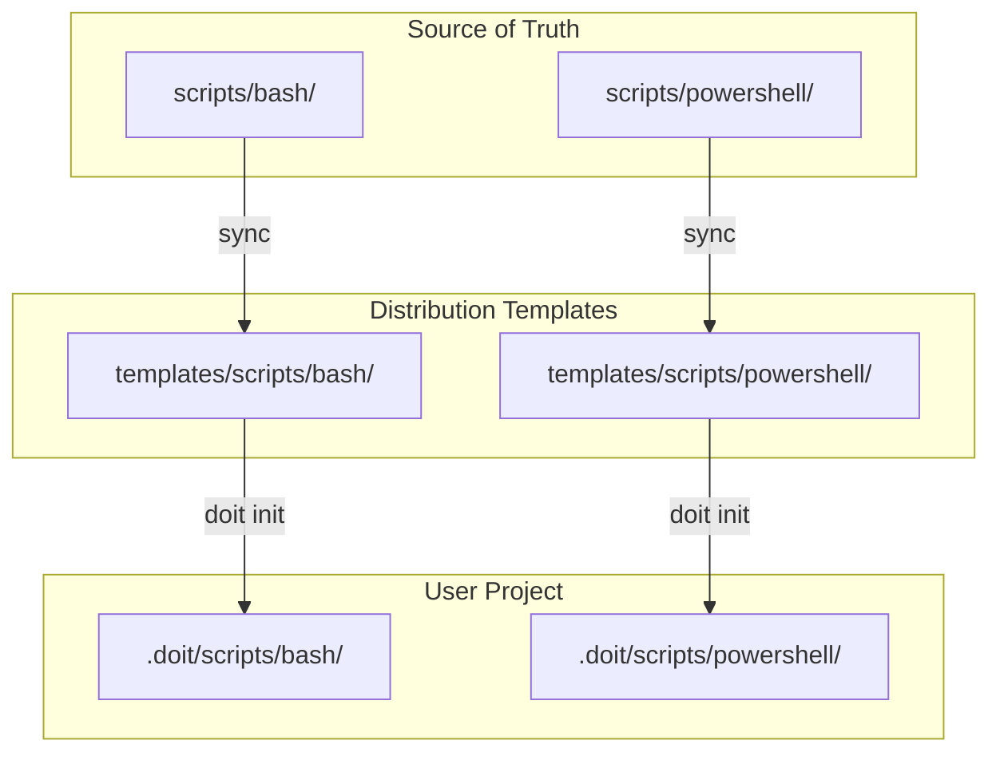

# Implementation Plan: Scripts Cleanup and Agent Support Standardization

**Branch**: `016-scripts-cleanup` | **Date**: 2026-01-12 | **Spec**: [spec.md](spec.md)
**Input**: Feature specification from `/specs/016-scripts-cleanup/spec.md`

## Summary

Clean up all Bash and PowerShell scripts to remove references to unsupported AI agents, keeping only Claude and GitHub Copilot support. Synchronize `scripts/` (source of truth) to `templates/scripts/` (distribution), create missing `templates/scripts/powershell/` directory, and verify CLI init/update commands work correctly.

## Technical Context

**Language/Version**: Bash 5.x, PowerShell 7.x
**Primary Dependencies**: Standard Unix utilities (grep, sed, diff, cp), Git CLI
**Storage**: N/A (file system only)
**Testing**: Manual grep verification, script execution tests, diff comparisons
**Target Platform**: Linux/macOS (Bash), Windows/Cross-platform (PowerShell)
**Project Type**: single (scripts collection)
**Performance Goals**: N/A (scripts are development tools, not production runtime)
**Constraints**: Scripts must work without dependencies beyond standard shell
**Scale/Scope**: 10 scripts (5 Bash + 5 PowerShell) across 2 source directories

## Architecture Overview

<!-- BEGIN:AUTO-GENERATED section="architecture" -->

<!-- END:AUTO-GENERATED -->

## Constitution Check

*GATE: Must pass before Phase 0 research. Re-check after Phase 1 design.*

- [x] No external dependencies beyond standard shell utilities
- [x] Simple file operations - no complex architecture
- [x] Changes are confined to scripts/ and templates/scripts/ directories
- [x] No database or cloud infrastructure needed

## Project Structure

### Documentation (this feature)

```text
specs/016-scripts-cleanup/
├── plan.md              # This file
├── spec.md              # Feature specification
├── research.md          # Phase 0 output
├── checklists/          # Quality validation
│   └── requirements.md  # Spec validation checklist
└── tasks.md             # Phase 2 output (/doit.taskit command)
```

### Source Code (repository root)

```text
scripts/                          # SOURCE OF TRUTH
├── bash/
│   ├── common.sh                 # Utility functions (no agent refs)
│   ├── check-prerequisites.sh    # Needs review
│   ├── create-new-feature.sh     # Needs review
│   ├── setup-plan.sh             # Needs review
│   └── update-agent-context.sh   # CLEANUP: 15+ unsupported agents
└── powershell/
    ├── common.ps1                # Utility functions (no agent refs)
    ├── check-prerequisites.ps1   # Needs review
    ├── create-new-feature.ps1    # Needs review
    ├── setup-plan.ps1            # Needs review
    └── update-agent-context.ps1  # CLEANUP: 15+ unsupported agents

templates/scripts/                # DISTRIBUTION (sync from scripts/)
├── bash/                         # EXISTS - needs sync
│   ├── common.sh
│   ├── check-prerequisites.sh
│   ├── create-new-feature.sh
│   ├── setup-plan.sh
│   └── update-agent-context.sh
└── powershell/                   # MISSING - needs creation (FR-009)
```

**Structure Decision**: Single project layout with scripts/ as source and templates/scripts/ as distribution copy.

## Agents to Remove

The following agent types must be removed from all scripts (keeping only `claude` and `copilot`):

| Agent Key | Display Name | File Path Variable |
|-----------|--------------|-------------------|
| gemini | Gemini CLI | GEMINI_FILE |
| cursor-agent | Cursor IDE | CURSOR_FILE |
| qwen | Qwen Code | QWEN_FILE |
| opencode | opencode | AGENTS_FILE |
| codex | Codex CLI | AGENTS_FILE |
| windsurf | Windsurf | WINDSURF_FILE |
| kilocode | Kilo Code | KILOCODE_FILE |
| auggie | Auggie CLI | AUGGIE_FILE |
| roo | Roo Code | ROO_FILE |
| codebuddy | CodeBuddy CLI | CODEBUDDY_FILE |
| qoder | Qoder CLI | QODER_FILE |
| amp | Amp | AMP_FILE |
| shai | SHAI | SHAI_FILE |
| q | Amazon Q Developer CLI | Q_FILE |
| bob | IBM Bob | BOB_FILE |

## Cleanup Areas by Script

### update-agent-context.sh / update-agent-context.ps1
**Cleanup Required**: Major - Most agent references are here

1. Remove agent file path variables (lines ~62-77 in .sh)
2. Remove unsupported agents from `update_specific_agent()` switch cases
3. Remove unsupported agents from `update_all_existing_agents()` checks
4. Update help text and usage examples
5. Update header comments listing supported agents
6. Remove ValidateSet entries in PowerShell param block

### common.sh / common.ps1
**Cleanup Required**: None - Only utility functions

### check-prerequisites.sh / check-prerequisites.ps1
**Cleanup Required**: Review needed - check for agent references

### create-new-feature.sh / create-new-feature.ps1
**Cleanup Required**: Review needed - check for agent references

### setup-plan.sh / setup-plan.ps1
**Cleanup Required**: Review needed - check for agent references

## Implementation Tasks Summary

1. **Phase 1**: Cleanup `update-agent-context.sh` (remove 15 agents)
2. **Phase 2**: Cleanup `update-agent-context.ps1` (mirror Bash changes)
3. **Phase 3**: Review and cleanup remaining 6 scripts
4. **Phase 4**: Create `templates/scripts/powershell/` directory
5. **Phase 5**: Sync scripts/ to templates/scripts/
6. **Phase 6**: Verify CLI init and update commands
7. **Phase 7**: Run validation (grep for removed agents, diff checks)

## Complexity Tracking

No constitution violations - this is a straightforward cleanup task.

| Item | Status | Notes |
|------|--------|-------|
| External dependencies | None | Standard shell only |
| Database changes | None | File operations only |
| New patterns | None | Following existing patterns |
