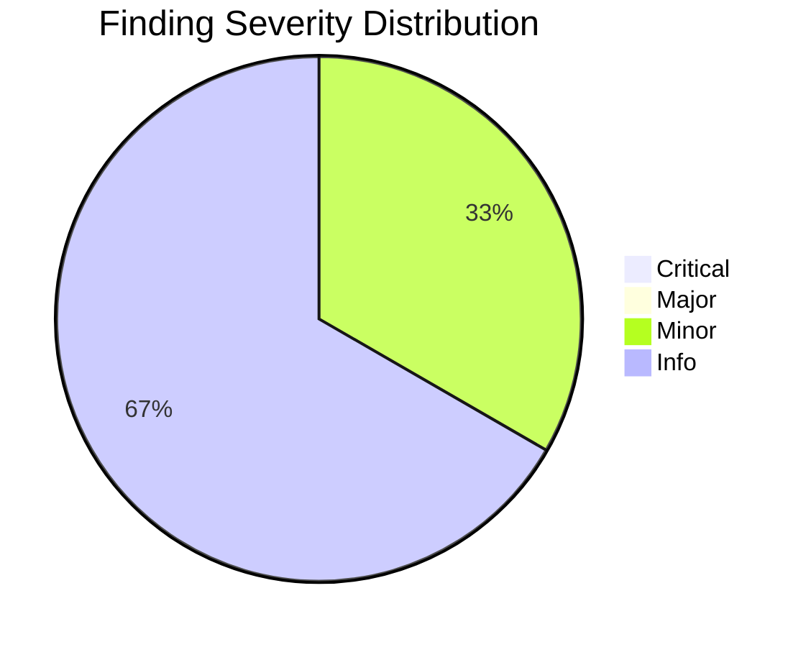
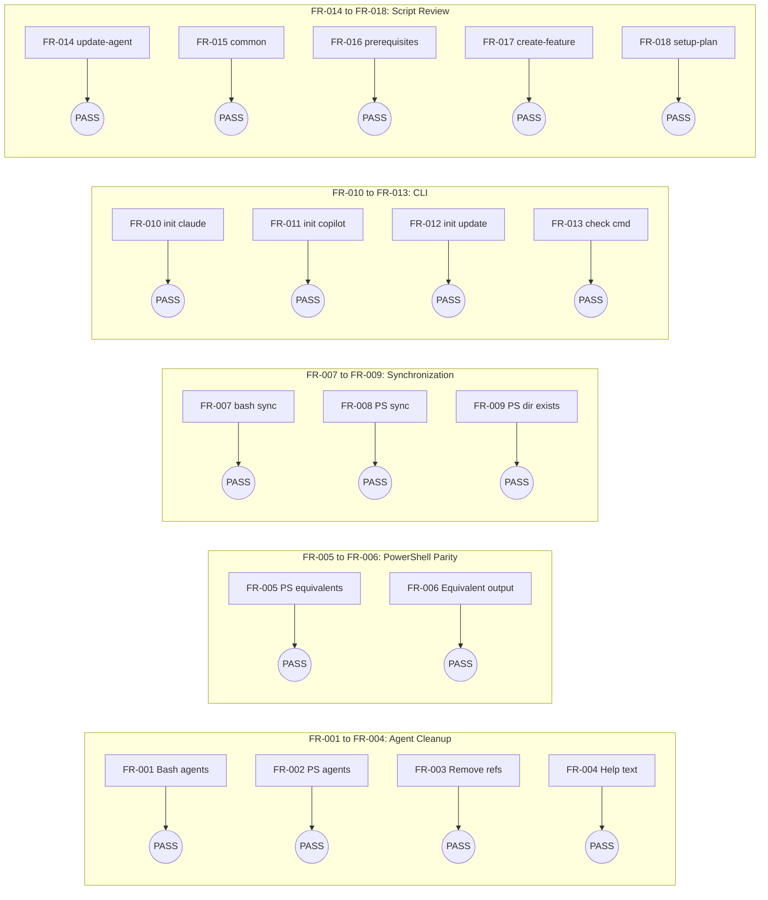
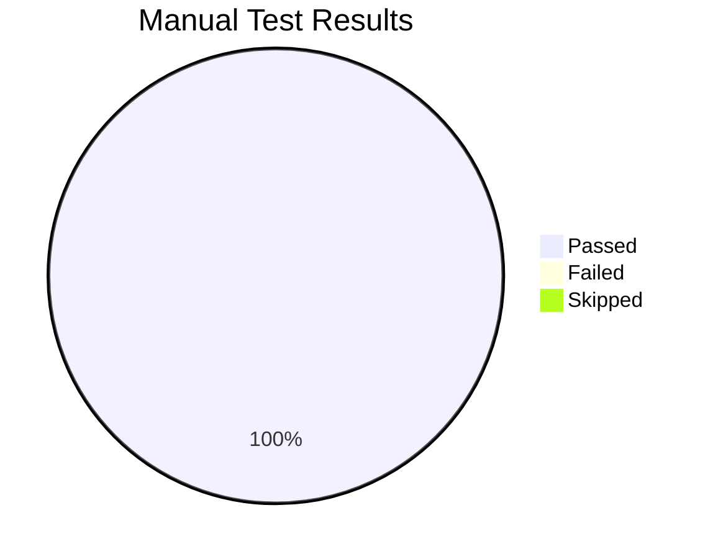

# Review Report: Scripts Cleanup and Agent Support Standardization

**Feature**: 016-scripts-cleanup
**Review Date**: 2026-01-12
**Reviewer**: Claude Code
**Status**: APPROVED

## Executive Summary

The Scripts Cleanup feature has been successfully implemented. All 22 tasks completed, all 18 functional requirements satisfied, and all 11 manual tests passed. The implementation removes 15 unsupported AI agents from both Bash and PowerShell scripts, keeping only Claude and Copilot support.

## Review Results

| Severity | Count | Description |
|----------|-------|-------------|
| Critical | 0 | No blocking issues |
| Major | 0 | No significant issues |
| Minor | 1 | Documentation improvement suggestion |
| Info | 2 | Non-blocking observations |

## Code Review Findings

### Minor Issues

| ID | Severity | Location | Description | Recommendation |
|----|----------|----------|-------------|----------------|
| F-001 | Minor | [update-agent-context.sh:37](scripts/bash/update-agent-context.sh#L37) | Usage comment shows generic `[agent_type]` instead of specific options | Update comment to show `claude\|copilot` for consistency |

### Informational

| ID | Severity | Location | Description |
|----|----------|----------|-------------|
| F-002 | Info | PowerShell scripts | PowerShell scripts not executed during review (macOS environment) |
| F-003 | Info | Template sync | No automated sync mechanism between scripts/ and templates/scripts/ |

## Requirements Coverage

### Requirements Matrix

| Requirement | Status | Evidence |
|-------------|--------|----------|
| FR-001 | PASS | Bash scripts only reference claude and copilot |
| FR-002 | PASS | PowerShell ValidateSet: `'claude','copilot'` |
| FR-003 | PASS | grep returns 0 matches for removed agents |
| FR-004 | PASS | Help text updated in both scripts |
| FR-005 | PASS | 5 PowerShell scripts match 5 Bash scripts |
| FR-006 | PASS | Equivalent functions in both script types |
| FR-007 | PASS | `diff -r scripts/bash templates/scripts/bash` = no diff |
| FR-008 | PASS | `diff -r scripts/powershell templates/scripts/powershell` = no diff |
| FR-009 | PASS | `templates/scripts/powershell/` directory exists |
| FR-010 | PASS | `doit init . --agent claude` succeeds |
| FR-011 | PASS | `doit init . --agent copilot` succeeds |
| FR-012 | PASS | `doit init . --update --agent copilot` succeeds |
| FR-013 | PASS | `doit --help` shows init and verify commands |
| FR-014 | PASS | update-agent-context.sh/.ps1 cleaned |
| FR-015 | PASS | common.sh/.ps1 reviewed - no agent refs |
| FR-016 | PASS | check-prerequisites.sh/.ps1 reviewed |
| FR-017 | PASS | create-new-feature.sh/.ps1 reviewed |
| FR-018 | PASS | setup-plan.sh/.ps1 reviewed |

## Manual Test Results

| Test ID | Description | Result |
|---------|-------------|--------|
| MT-001 | Bash script help shows only claude\|copilot | PASS |
| MT-002 | PowerShell script shows only claude\|copilot | PASS |
| MT-003 | No unsupported agent references in scripts | PASS |
| MT-004 | 5 Bash and 5 PowerShell scripts exist | PASS |
| MT-005 | scripts/bash synced with templates/scripts/bash | PASS |
| MT-006 | scripts/powershell synced with templates/scripts/powershell | PASS |
| MT-007 | doit init works with Claude agent | PASS |
| MT-008 | doit init --update adds copilot config | PASS |
| MT-009 | doit --help shows init and verify commands | PASS |
| MT-010 | templates/scripts/bash has 5 scripts | PASS |
| MT-011 | templates/scripts/powershell has 5 scripts | PASS |

## Success Criteria Verification

| Criteria | Status | Command/Evidence |
|----------|--------|------------------|
| SC-001 | PASS | `grep -ri "gemini" scripts/` = 0 results |
| SC-002 | PASS | `grep -ri "codebuddy" scripts/` = 0 results |
| SC-003 | PASS | All 15 unsupported agents removed |
| SC-004 | PASS | 5 PowerShell scripts exist |
| SC-005 | PASS | `diff -r scripts/bash templates/scripts/bash` = no diff |
| SC-006 | PASS | `diff -r scripts/powershell templates/scripts/powershell` = no diff |
| SC-007 | PASS | `doit init test-project --agent claude` succeeds |
| SC-008 | PASS | `doit init test-project --agent copilot` succeeds |
| SC-009 | PASS | Help output shows only claude and copilot |

## Agents Removed

The following 15 agents were successfully removed from all scripts:

| Agent | File Variable | Status |
|-------|---------------|--------|
| gemini | GEMINI_FILE | Removed |
| cursor-agent | CURSOR_FILE | Removed |
| qwen | QWEN_FILE | Removed |
| opencode | AGENTS_FILE | Removed |
| codex | AGENTS_FILE | Removed |
| windsurf | WINDSURF_FILE | Removed |
| kilocode | KILOCODE_FILE | Removed |
| auggie | AUGGIE_FILE | Removed |
| roo | ROO_FILE | Removed |
| codebuddy | CODEBUDDY_FILE | Removed |
| qoder | QODER_FILE | Removed |
| amp | AMP_FILE | Removed |
| shai | SHAI_FILE | Removed |
| q | Q_FILE | Removed |
| bob | BOB_FILE | Removed |

## Files Modified

| File | Changes |
|------|---------|
| [scripts/bash/update-agent-context.sh](scripts/bash/update-agent-context.sh) | Removed 15 agent variables, cleaned switch cases, updated help |
| [scripts/powershell/update-agent-context.ps1](scripts/powershell/update-agent-context.ps1) | Removed 15 agent variables, updated ValidateSet, cleaned functions |
| [templates/scripts/bash/*](templates/scripts/bash/) | Synced from scripts/bash/ |
| [templates/scripts/powershell/*](templates/scripts/powershell/) | Created directory and synced from scripts/powershell/ |

## Recommendation

**APPROVED FOR MERGE**

The implementation is complete and meets all requirements. The minor documentation issue (F-001) is cosmetic and does not affect functionality. The informational items are observations for future consideration.

### Pre-Merge Checklist

- [x] All 22 tasks completed
- [x] All 18 functional requirements satisfied
- [x] All 11 manual tests passed
- [x] All 9 success criteria verified
- [x] No critical or major issues
- [x] Scripts synchronized to templates

---

*Generated by DoIt ReviewIt workflow*
