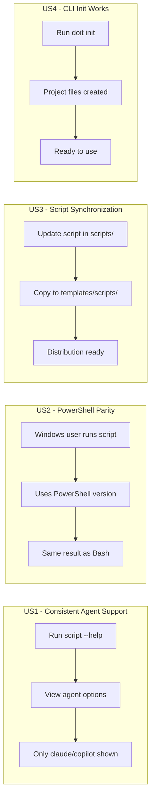

# Feature Specification: Scripts Cleanup and Agent Support Standardization

**Feature Branch**: `016-scripts-cleanup`
**Created**: 2026-01-12
**Status**: Complete
**Input**: User description: "we need to clean up the scripts folders and comments in the scripts. we should only be supporting claude and copilot and we need to make sure the powershell scripts and sh scripts all work as well as the install cli and update command in cli"

## Summary

Clean up all script files (Bash and PowerShell) to remove references to unsupported AI agents, keeping only Claude and GitHub Copilot support. The `scripts/` folder is the source of truth, and `templates/scripts/` must be synchronized from it. When users run `doit init`, scripts are copied from templates to their project's `.doit/scripts/` folder. Ensure both Bash and PowerShell scripts function correctly and verify the CLI init and update commands work properly.

## Architecture

```text
scripts/                    <- SOURCE OF TRUTH (maintained here)
    bash/                   <- Bash scripts
    powershell/             <- PowerShell scripts

templates/scripts/          <- Distribution templates (synced from scripts/)
    bash/                   <- Copied to user's .doit/scripts/bash/
    powershell/             <- Copied to user's .doit/scripts/powershell/

.doit/scripts/              <- Created during `doit init` (copies from templates)
```

## User Scenarios & Testing *(mandatory)*

### User Story 1 - Consistent Agent Support in Scripts (Priority: P1)

As a developer running initialization or update scripts, I want the scripts to only reference Claude and Copilot as supported agents so that I don't see confusing options for agents that aren't actually supported.

**Why this priority**: Scripts that reference unsupported agents (Gemini, Codebuddy, etc.) create user confusion and potential errors when users try to use those agents.

**Independent Test**: Can be fully tested by running `grep -ri "gemini\|codebuddy" scripts/ templates/scripts/` and verifying zero matches, then running the scripts with `--help` to confirm only claude and copilot are shown.

**Acceptance Scenarios**:

1. **Given** a user running `update-agent-context.sh --help`, **When** they view the help output, **Then** only `claude` and `copilot` are shown as valid agent options
2. **Given** a user running `update-agent-context.ps1 -Help`, **When** they view the help output, **Then** only `Claude` and `Copilot` are shown as valid agent options
3. **Given** any script file in the project, **When** searching for "gemini" or "codebuddy" (case-insensitive), **Then** zero results are found

---

### User Story 2 - PowerShell Scripts Parity (Priority: P1)

As a Windows developer, I want PowerShell equivalents of all Bash scripts so that I can use the doit toolkit on Windows without requiring WSL.

**Why this priority**: Windows users without WSL cannot use Bash scripts. PowerShell parity ensures cross-platform support.

**Independent Test**: Can be tested by listing scripts in both bash and powershell directories and verifying matching functionality exists.

**Acceptance Scenarios**:

1. **Given** the scripts in `scripts/bash/`, **When** comparing to `scripts/powershell/`, **Then** equivalent PowerShell scripts exist for each Bash script
2. **Given** a PowerShell script in `scripts/powershell/`, **When** executed with valid parameters, **Then** it produces the same functional result as its Bash equivalent
3. **Given** the scripts in `templates/scripts/bash/`, **When** comparing to `templates/scripts/powershell/`, **Then** equivalent PowerShell scripts exist for each Bash script

---

### User Story 3 - Script Folder Synchronization (Priority: P2)

As a maintainer, I want templates/scripts/ to be synchronized from scripts/ so that when the CLI packages are distributed, users get the latest scripts when running `doit init`.

**Why this priority**: If templates/scripts/ gets out of sync with scripts/, users will get outdated or inconsistent scripts when initializing new projects.

**Independent Test**: Can be tested by running `diff -r scripts/ templates/scripts/` and verifying identical content.

**Acceptance Scenarios**:

1. **Given** scripts in `scripts/bash/`, **When** compared to `templates/scripts/bash/`, **Then** the content is identical
2. **Given** scripts in `scripts/powershell/`, **When** compared to `templates/scripts/powershell/`, **Then** the content is identical

---

### User Story 4 - CLI Init and Update Commands Work (Priority: P1)

As a user initializing a new project, I want the CLI init command to work correctly and create all necessary files so that I can start using doit immediately.

**Why this priority**: The init command is the entry point for all new users. If it fails or creates incorrect files, users cannot use the tool at all.

**Independent Test**: Can be tested by running `doit init test-project --agent claude` in a clean directory and verifying all expected files are created.

**Acceptance Scenarios**:

1. **Given** an empty directory, **When** running `doit init . --agent claude`, **Then** all doit project files are created successfully
2. **Given** an existing doit project, **When** running `doit init . --update --agent copilot`, **Then** copilot configuration is added without losing existing files
3. **Given** the CLI, **When** running `doit --help`, **Then** the init and check commands are shown with correct descriptions

---

### Edge Cases

- What happens when running scripts on a system without the expected shell? (Scripts should fail gracefully with helpful error message)
- How should scripts handle being run from different working directories? (Scripts should detect repo root automatically)
- What if a user passes an unsupported agent value to a script? (Scripts should display error and show valid options)

## User Journey Visualization

<!-- BEGIN:AUTO-GENERATED section="user-journey" -->

<!-- END:AUTO-GENERATED -->

## Requirements *(mandatory)*

### Functional Requirements

**Script Agent Cleanup:**

- **FR-001**: All Bash scripts MUST only reference `claude` and `copilot` as valid agent options
- **FR-002**: All PowerShell scripts MUST only reference `claude` and `copilot` as valid agent options
- **FR-003**: Scripts MUST remove references to gemini, codebuddy, cursor-agent, qwen, opencode, codex, windsurf, kilocode, auggie, roo, amp, shai, q, bob, and qoder
- **FR-004**: Script help text and comments MUST be updated to reflect only supported agents

**PowerShell Parity:**

- **FR-005**: `scripts/powershell/` MUST contain PowerShell equivalents of all `scripts/bash/` scripts
- **FR-006**: PowerShell scripts MUST produce functionally equivalent output to their Bash counterparts

**Script Folder Synchronization:**

- **FR-007**: Scripts in `templates/scripts/bash/` MUST be identical to `scripts/bash/`
- **FR-008**: Scripts in `templates/scripts/powershell/` MUST be identical to `scripts/powershell/`
- **FR-009**: `templates/scripts/powershell/` directory MUST exist (currently missing)

**CLI Verification:**

- **FR-010**: `doit init` command MUST successfully initialize a new project with Claude agent
- **FR-011**: `doit init` command MUST successfully initialize a new project with Copilot agent
- **FR-012**: `doit init --update` command MUST add agent configuration to existing projects
- **FR-013**: `doit check` command MUST verify project configuration is valid

**Scripts to Clean Up:**

- **FR-014**: `update-agent-context.sh` and `.ps1` MUST be updated to only support claude and copilot
- **FR-015**: `common.sh` and `.ps1` MUST be reviewed for any agent references
- **FR-016**: `check-prerequisites.sh` and `.ps1` MUST be reviewed for any agent references
- **FR-017**: `create-new-feature.sh` and `.ps1` MUST be reviewed for any agent references
- **FR-018**: `setup-plan.sh` and `.ps1` MUST be reviewed for any agent references

## Success Criteria *(mandatory)*

### Measurable Outcomes

- **SC-001**: Zero search results for "gemini" (case-insensitive) across all script files in scripts/ and templates/scripts/
- **SC-002**: Zero search results for "codebuddy" (case-insensitive) across all script files
- **SC-003**: Zero search results for other unsupported agents (cursor-agent, qwen, opencode, codex, windsurf, kilocode, auggie, roo, amp, shai, q, bob, qoder) in scripts
- **SC-004**: PowerShell scripts exist for all Bash scripts in `scripts/powershell/`
- **SC-005**: `diff -r scripts/bash templates/scripts/bash` returns no differences
- **SC-006**: `diff -r scripts/powershell templates/scripts/powershell` returns no differences
- **SC-007**: `doit init test-project --agent claude` completes successfully in clean directory
- **SC-008**: `doit init test-project --agent copilot` completes successfully in clean directory
- **SC-009**: All scripts show only claude and copilot in help output

## Assumptions

- The CLI (src/doit_cli/) already only supports Claude and Copilot (agent.py confirms this)
- `scripts/` is the source of truth for all scripts
- `templates/scripts/` must be synchronized from `scripts/` for distribution
- When users run `doit init`, scripts are copied from `templates/scripts/` to their project's `.doit/scripts/`
- Scripts in .venv/ are bundled from templates and will be updated when the package is reinstalled
- Windows users running PowerShell can use .ps1 scripts without additional setup
- Bash scripts work on Linux, macOS, and Windows with WSL or Git Bash

## Out of Scope

- Adding new AI agent support (only cleanup of unsupported agents)
- Modifying the CLI Python code (already correct per agent.py)
- Updating documentation outside of script comments
- Changes to the .venv/ directory (handled by package reinstallation)
- Creating new script functionality beyond what already exists
- The `.doit/scripts/` folder in this repo (created by running `doit init` - not source)
