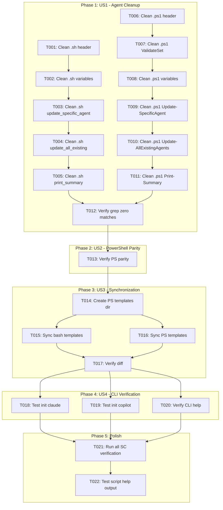
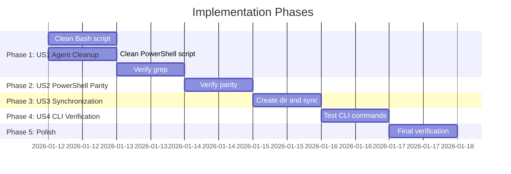

# Tasks: Scripts Cleanup and Agent Support Standardization

**Input**: Design documents from `/specs/016-scripts-cleanup/`
**Prerequisites**: plan.md (required), spec.md (required), research.md, quickstart.md

**Tests**: No automated tests requested - verification via grep and manual script execution

**Organization**: Tasks grouped by user story to enable independent implementation and testing

## Task Dependencies

<!-- BEGIN:AUTO-GENERATED section="task-dependencies" -->

<!-- END:AUTO-GENERATED -->

## Phase Timeline

<!-- BEGIN:AUTO-GENERATED section="phase-timeline" -->

<!-- END:AUTO-GENERATED -->

## Format: `[ID] [P?] [Story] Description`

- **[P]**: Can run in parallel (different files, no dependencies)
- **[Story]**: Which user story this task belongs to (US1, US2, US3, US4)
- Include exact file paths in descriptions

## Path Conventions

- **Source scripts**: `scripts/bash/`, `scripts/powershell/`
- **Template scripts**: `templates/scripts/bash/`, `templates/scripts/powershell/`

---

## Phase 1: User Story 1 - Consistent Agent Support in Scripts (Priority: P1) 🎯 MVP

**Goal**: Remove all references to unsupported AI agents from scripts, keeping only Claude and Copilot

**Independent Test**: `grep -ri "gemini\|codebuddy" scripts/ templates/scripts/` returns zero results, and `update-agent-context.sh --help` shows only claude and copilot

### Bash Script Cleanup (update-agent-context.sh)

- [x] T001 [US1] Update header comments to list only Claude Code and GitHub Copilot as supported agents in scripts/bash/update-agent-context.sh (lines 31-39)
- [x] T002 [US1] Remove unsupported agent file path variables (GEMINI_FILE, CURSOR_FILE, QWEN_FILE, AGENTS_FILE, WINDSURF_FILE, KILOCODE_FILE, AUGGIE_FILE, ROO_FILE, CODEBUDDY_FILE, QODER_FILE, AMP_FILE, SHAI_FILE, Q_FILE, BOB_FILE) keeping only CLAUDE_FILE and COPILOT_FILE in scripts/bash/update-agent-context.sh (lines 62-77)
- [x] T003 [US1] Clean update_specific_agent() function to remove all case statements except claude and copilot in scripts/bash/update-agent-context.sh (lines 581-642)
- [x] T004 [US1] Clean update_all_existing_agents() function to remove all file existence checks except CLAUDE_FILE and COPILOT_FILE in scripts/bash/update-agent-context.sh (lines 644-728)
- [x] T005 [US1] Update print_summary() function usage text to show only claude and copilot options in scripts/bash/update-agent-context.sh (lines 729-748)

### PowerShell Script Cleanup (update-agent-context.ps1)

- [x] T006 [P] [US1] Update header synopsis and description to list only Claude Code and GitHub Copilot in scripts/powershell/update-agent-context.ps1 (lines 1-25)
- [x] T007 [P] [US1] Update ValidateSet parameter to only allow 'claude' and 'copilot' in scripts/powershell/update-agent-context.ps1 (lines 26-30)
- [x] T008 [P] [US1] Remove unsupported agent file path variables keeping only $CLAUDE_FILE and $COPILOT_FILE in scripts/powershell/update-agent-context.ps1 (lines 47-62)
- [x] T009 [P] [US1] Clean Update-SpecificAgent function to remove switch cases for unsupported agents in scripts/powershell/update-agent-context.ps1 (lines 368-393)
- [x] T010 [P] [US1] Clean Update-AllExistingAgents function to remove file checks for unsupported agents in scripts/powershell/update-agent-context.ps1 (lines 395-418)
- [x] T011 [P] [US1] Update Print-Summary function usage text to show only claude and copilot in scripts/powershell/update-agent-context.ps1 (lines 420-428)

### US1 Verification

- [x] T012 [US1] Verify grep returns zero matches for unsupported agents: `grep -ri "gemini\|codebuddy\|cursor-agent\|qwen\|opencode\|codex\|windsurf\|kilocode\|auggie\|roo\|amp\|shai\|qoder\|bob" scripts/`

**Checkpoint**: US1 complete - scripts only reference claude and copilot

---

## Phase 2: User Story 2 - PowerShell Scripts Parity (Priority: P1)

**Goal**: Ensure PowerShell equivalents exist for all Bash scripts

**Independent Test**: `ls scripts/powershell/*.ps1 | wc -l` returns 5 (matching bash scripts count)

### US2 Verification

- [x] T013 [US2] Verify scripts/powershell/ contains all 5 scripts matching scripts/bash/ (common.ps1, check-prerequisites.ps1, create-new-feature.ps1, setup-plan.ps1, update-agent-context.ps1)

**Checkpoint**: US2 complete - PowerShell parity confirmed

---

## Phase 3: User Story 3 - Script Folder Synchronization (Priority: P2)

**Goal**: Synchronize scripts/ to templates/scripts/ for CLI distribution

**Independent Test**: `diff -r scripts/ templates/scripts/` returns no output (identical content)

### Create Missing Directory

- [x] T014 [US3] Create missing templates/scripts/powershell/ directory

### Synchronize Templates

- [x] T015 [P] [US3] Sync scripts/bash/ to templates/scripts/bash/ using cp -r
- [x] T016 [P] [US3] Sync scripts/powershell/ to templates/scripts/powershell/ using cp -r

### US3 Verification

- [x] T017 [US3] Verify diff -r scripts/bash templates/scripts/bash returns no differences
- [x] T017b [US3] Verify diff -r scripts/powershell templates/scripts/powershell returns no differences

**Checkpoint**: US3 complete - templates synchronized with source

---

## Phase 4: User Story 4 - CLI Init and Update Commands Work (Priority: P1)

**Goal**: Verify CLI init command works correctly with cleaned scripts

**Independent Test**: `doit init test-project --agent claude` completes successfully in a clean directory

### CLI Verification

- [x] T018 [US4] Test `doit init` with --agent claude in a temporary directory and verify all project files are created
- [x] T019 [P] [US4] Test `doit init` with --agent copilot in a temporary directory and verify all project files are created
- [x] T020 [US4] Verify `doit --help` shows init and verify commands with correct descriptions

**Checkpoint**: US4 complete - CLI commands work with cleaned scripts

---

## Phase 5: Polish & Final Verification

**Purpose**: Run all success criteria verification commands

### Success Criteria Verification

- [x] T021 Run all success criteria verification commands (SC-001 through SC-009) per quickstart.md
- [x] T022 Test script help output confirms only claude and copilot are shown: `bash scripts/bash/update-agent-context.sh --help`

---

## Dependencies & Execution Order

### Phase Dependencies

- **Phase 1 (US1)**: No dependencies - start immediately
- **Phase 2 (US2)**: Depends on Phase 1 completion (scripts must be cleaned first)
- **Phase 3 (US3)**: Depends on Phase 1 completion (sync cleaned scripts)
- **Phase 4 (US4)**: Depends on Phases 1 and 3 completion (CLI uses templates)
- **Phase 5 (Polish)**: Depends on all previous phases

### Parallel Opportunities

- T001-T005 (Bash cleanup) can run in parallel with T006-T011 (PowerShell cleanup) since they're different files
- T015 (sync bash) and T016 (sync powershell) can run in parallel
- T018 (test claude) and T019 (test copilot) can run in parallel

---

## Parallel Example: Phase 1

```bash
# Bash and PowerShell cleanup can run in parallel:
# Session 1: Work on scripts/bash/update-agent-context.sh (T001-T005)
# Session 2: Work on scripts/powershell/update-agent-context.ps1 (T006-T011)

# After both complete:
# Run T012 to verify all unsupported agents removed
```

---

## Implementation Strategy

### MVP First (User Story 1 Only)

1. Complete Phase 1: US1 - Agent Cleanup (T001-T012)
2. **STOP and VALIDATE**: Run grep verification
3. Scripts now only reference claude and copilot

### Full Completion

1. Phase 1: US1 - Clean both scripts
2. Phase 2: US2 - Verify PowerShell parity
3. Phase 3: US3 - Sync to templates
4. Phase 4: US4 - Test CLI commands
5. Phase 5: Final verification

---

## Notes

- [P] tasks = different files, safe to parallelize
- [USx] label maps task to specific user story
- Total tasks: 22
- Estimated time: 2-3 hours
- Most work is in Phase 1 (US1) - the actual script cleanup
- Phases 2-4 are mostly verification tasks
