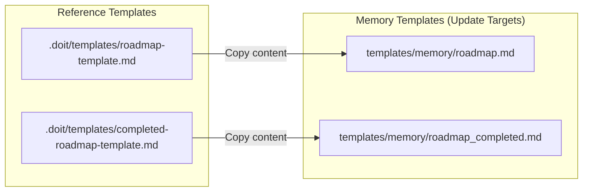

# Implementation Plan: Roadmap Template Cleanup

**Branch**: `017-roadmap-template-cleanup` | **Date**: 2026-01-13 | **Spec**: [spec.md](spec.md)
**Input**: Feature specification from `/specs/017-roadmap-template-cleanup/spec.md`

## Summary

Update the roadmap template files in `templates/memory/` to contain placeholder syntax instead of actual project data. The reference templates in `.doit/templates/` already have the correct format - this feature simply copies that content to the memory templates used by `doit init`.

## Technical Context

**Language/Version**: Markdown (file content only - no code changes)
**Primary Dependencies**: None (file system operations only)
**Storage**: File system
**Testing**: Manual verification (diff commands, grep for sample content)
**Target Platform**: N/A (template files)
**Project Type**: single
**Performance Goals**: N/A (one-time file update)
**Constraints**: None
**Scale/Scope**: 2 files, ~113 lines total

## Architecture Overview

This feature involves no code architecture - it's a simple file content update:

<!-- BEGIN:AUTO-GENERATED section="architecture" -->

<!-- END:AUTO-GENERATED -->

## Constitution Check

*GATE: Must pass before Phase 0 research. Re-check after Phase 1 design.*

| Check | Status | Notes |
|-------|--------|-------|
| Tech Stack Alignment | N/A | No code changes - file content only |
| Complexity Justified | PASS | Minimal complexity (2 file updates) |
| Testing Required | PASS | Manual verification via diff/grep |
| Documentation | PASS | Spec and plan complete |

**Result**: All gates pass. No violations to justify.

## Project Structure

### Documentation (this feature)

```text
specs/017-roadmap-template-cleanup/
├── spec.md              # Feature specification
├── plan.md              # This file
├── research.md          # Phase 0 output (complete)
├── quickstart.md        # Phase 1 output (complete)
└── checklists/
    └── requirements.md  # Spec validation checklist
```

### Source Code (files to update)

```text
templates/
└── memory/
    ├── roadmap.md              # UPDATE: Replace with placeholder template
    └── roadmap_completed.md    # UPDATE: Replace with placeholder template

.doit/
└── templates/
    ├── roadmap-template.md           # SOURCE: Reference template (correct format)
    └── completed-roadmap-template.md # SOURCE: Reference template (correct format)
```

**Structure Decision**: No structural changes. This feature updates existing file content only.

## Implementation Tasks

| # | Task | File(s) | Effort |
|---|------|---------|--------|
| 1 | Copy roadmap-template.md content to roadmap.md | `templates/memory/roadmap.md` | Low |
| 2 | Copy completed-roadmap-template.md content to roadmap_completed.md | `templates/memory/roadmap_completed.md` | Low |
| 3 | Verify no sample content remains | Both files | Low |
| 4 | Commit changes | N/A | Low |

## Complexity Tracking

> No violations to track. This is a minimal-complexity feature.

## Risk Assessment

| Risk | Likelihood | Impact | Mitigation |
|------|------------|--------|------------|
| Reference templates incorrect | Low | Medium | Templates already validated in .doit/templates/ |
| Breaking existing projects | None | N/A | Only affects new `doit init` operations |

## Notes

- No data-model.md needed (no data entities)
- No contracts/ needed (no API)
- Package reinstall propagates changes to `.venv/lib/python3.11/site-packages/doit_cli/templates/`
- The symlink `src/doit_cli/templates -> ../../templates` means source package uses the same files
