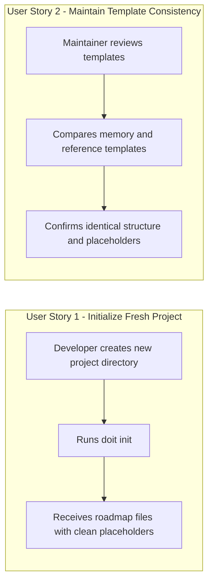

# Feature Specification: Roadmap Template Cleanup

**Feature Branch**: `017-roadmap-template-cleanup`
**Created**: 2026-01-13
**Status**: Complete
**Input**: User description: "we need to update the roadmap and roadmap_completed templates that get copied to the .doit directory with templates and not any actual data"

## Summary

The `doit init` command copies roadmap files from `templates/memory/` to the user's `.doit/memory/` directory. Currently, these source files (`roadmap.md` and `roadmap_completed.md`) contain actual project data (a Task Management App example and doit's own completed features) instead of template placeholders. Users initializing new projects receive this example data instead of a clean template they can customize for their project.

The files need to be updated to use placeholder syntax (e.g., `[PROJECT_NAME]`, `[P1_ITEM_1]`) consistent with the existing template files at `.doit/templates/roadmap-template.md` and `.doit/templates/completed-roadmap-template.md`.

## User Scenarios & Testing *(mandatory)*

### User Story 1 - Initialize Fresh Project with Clean Roadmap (Priority: P1)

As a developer setting up a new project with doit, I want the roadmap files to contain template placeholders instead of example data, so that I can immediately customize them for my project without first having to delete irrelevant sample content.

**Why this priority**: This is the core functionality being fixed. Without this, every new project starts with confusing sample data that doesn't apply to their project.

**Independent Test**: Can be fully tested by running `doit init` in a new directory and verifying the roadmap files contain placeholder syntax rather than Task Management App data.

**Acceptance Scenarios**:

1. **Given** a new directory without a `.doit` folder, **When** the user runs `doit init`, **Then** the `roadmap.md` file contains placeholder text like `[PROJECT_NAME]`, `[PROJECT_VISION]`, and `[P1_ITEM_1]` instead of "Task Management App" and specific task items.

2. **Given** a new directory without a `.doit` folder, **When** the user runs `doit init`, **Then** the `roadmap_completed.md` file contains placeholder text like `[PROJECT_NAME]`, `[COMPLETED_ITEM]`, and `[COUNT]` instead of actual completed feature entries.

3. **Given** template files have been updated, **When** a user views the initialized roadmap files, **Then** the structure and format matches the existing `.doit/templates/roadmap-template.md` and `.doit/templates/completed-roadmap-template.md` files.

---

### User Story 2 - Maintain Template Consistency (Priority: P2)

As a doit maintainer, I want the memory templates (`templates/memory/roadmap*.md`) to match the reference templates (`.doit/templates/roadmap-template.md`), so that there is a single source of truth for the roadmap structure.

**Why this priority**: Reduces confusion and maintenance burden by ensuring templates are consistent across the codebase.

**Independent Test**: Can be fully tested by comparing the structure and placeholder syntax between the memory templates and the reference templates.

**Acceptance Scenarios**:

1. **Given** the memory templates have been updated, **When** comparing `templates/memory/roadmap.md` with `.doit/templates/roadmap-template.md`, **Then** both files have identical structure, sections, and placeholder naming conventions.

2. **Given** the memory templates have been updated, **When** comparing `templates/memory/roadmap_completed.md` with `.doit/templates/completed-roadmap-template.md`, **Then** both files have identical structure, sections, and placeholder naming conventions.

---

### Edge Cases

- What happens if a user has already initialized a project with the old templates? The existing `.doit/memory/` files are not affected; only new initializations will receive the updated templates.
- What about the `.venv` packaged templates? The packaged templates in `.venv/lib/python3.11/site-packages/doit_cli/templates/` will be updated when the package is rebuilt and reinstalled.

## User Journey Visualization

<!-- BEGIN:AUTO-GENERATED section="user-journey" -->

<!-- END:AUTO-GENERATED -->

## Requirements *(mandatory)*

### Functional Requirements

- **FR-001**: The `templates/memory/roadmap.md` file MUST contain placeholder syntax (e.g., `[PROJECT_NAME]`, `[PROJECT_VISION]`, `[P1_ITEM_1]`) instead of actual project data
- **FR-002**: The `templates/memory/roadmap_completed.md` file MUST contain placeholder syntax (e.g., `[PROJECT_NAME]`, `[COMPLETED_ITEM]`, `[COUNT]`) instead of actual completed feature entries
- **FR-003**: The updated memory templates MUST match the structure and placeholder naming of the reference templates in `.doit/templates/`
- **FR-004**: The placeholder format MUST use square brackets with UPPER_SNAKE_CASE (e.g., `[PLACEHOLDER_NAME]`) consistent with existing conventions
- **FR-005**: All HTML comments providing guidance (e.g., `<!-- Items that are essential... -->`) MUST be preserved in the updated templates

## Success Criteria *(mandatory)*

### Measurable Outcomes

- **SC-001**: After running `doit init` on a new project, the roadmap.md file contains zero references to "Task Management App" or other sample-specific content
- **SC-002**: After running `doit init` on a new project, the roadmap_completed.md file contains zero entries in the completed features table beyond the template placeholder row
- **SC-003**: The file diff between `templates/memory/roadmap.md` and `.doit/templates/roadmap-template.md` shows structural equivalence (same sections, same placeholder naming)
- **SC-004**: 100% of placeholder patterns in memory templates match those in reference templates

## Assumptions

- The placeholder syntax `[PLACEHOLDER_NAME]` is the established convention across all doit templates
- Users are expected to replace placeholders with their actual project data after initialization
- The reference templates in `.doit/templates/` represent the canonical template format
- Package rebuild/reinstall is required to update the `.venv` packaged templates
