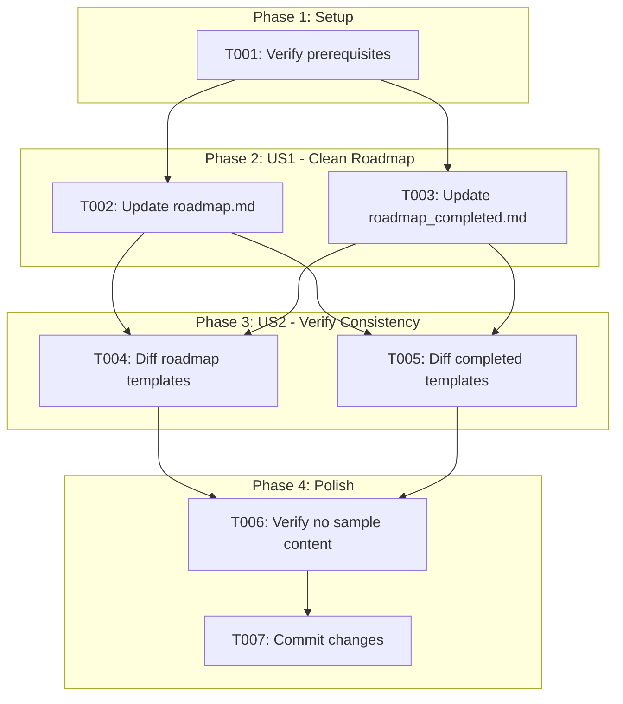
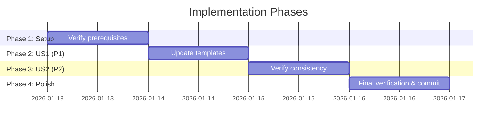

# Tasks: Roadmap Template Cleanup

**Input**: Design documents from `/specs/017-roadmap-template-cleanup/`
**Prerequisites**: plan.md (required), spec.md (required for user stories), quickstart.md

**Tests**: No automated tests - manual verification via diff/grep commands.

**Organization**: Tasks are grouped by user story to enable independent implementation and testing of each story.

## Task Dependencies

<!-- BEGIN:AUTO-GENERATED section="task-dependencies" -->

<!-- END:AUTO-GENERATED -->

## Phase Timeline

<!-- BEGIN:AUTO-GENERATED section="phase-timeline" -->

<!-- END:AUTO-GENERATED -->

## Format: `[ID] [P?] [Story] Description`

- **[P]**: Can run in parallel (different files, no dependencies)
- **[Story]**: Which user story this task belongs to (e.g., US1, US2)
- Include exact file paths in descriptions

---

## Phase 1: Setup

**Purpose**: Verify we're on the correct branch and reference templates exist

- [x] T001 Verify on branch `017-roadmap-template-cleanup` and reference templates exist at `.doit/templates/roadmap-template.md` and `.doit/templates/completed-roadmap-template.md`

---

## Phase 2: User Story 1 - Initialize Fresh Project with Clean Roadmap (Priority: P1) 🎯 MVP

**Goal**: Update memory templates to contain placeholders instead of sample data so `doit init` provides clean templates.

**Independent Test**: Run `doit init` in a new directory and verify roadmap files contain `[PROJECT_NAME]` placeholder instead of "Task Management App".

### Implementation for User Story 1

- [x] T002 [P] [US1] Replace content of `templates/memory/roadmap.md` with content from `.doit/templates/roadmap-template.md`
- [x] T003 [P] [US1] Replace content of `templates/memory/roadmap_completed.md` with content from `.doit/templates/completed-roadmap-template.md`

**Checkpoint**: At this point, the memory templates should contain placeholder syntax. User Story 1 is complete.

---

## Phase 3: User Story 2 - Maintain Template Consistency (Priority: P2)

**Goal**: Verify memory templates match reference templates exactly, establishing single source of truth.

**Independent Test**: Run `diff` between memory and reference templates - output should be empty.

### Verification for User Story 2

- [x] T004 [P] [US2] Verify `templates/memory/roadmap.md` matches `.doit/templates/roadmap-template.md` using `diff` command
- [x] T005 [P] [US2] Verify `templates/memory/roadmap_completed.md` matches `.doit/templates/completed-roadmap-template.md` using `diff` command

**Checkpoint**: Both template pairs should be identical. User Story 2 is complete.

---

## Phase 4: Polish & Final Verification

**Purpose**: Ensure no sample content remains and commit changes

- [x] T006 Verify no sample content remains using `grep -r "Task Management App" templates/memory/` and `grep -r "Update Doit Templates" templates/memory/` (both should return no results)
- [x] T007 Commit changes with message describing template cleanup

---

## Dependencies & Execution Order

### Phase Dependencies

- **Setup (Phase 1)**: No dependencies - verify prerequisites first
- **User Story 1 (Phase 2)**: Depends on Setup - file updates
- **User Story 2 (Phase 3)**: Depends on US1 - verification
- **Polish (Phase 4)**: Depends on US2 - final checks and commit

### User Story Dependencies

- **User Story 1 (P1)**: Can start after Setup - No dependencies on other stories
- **User Story 2 (P2)**: Depends on US1 completion - verifies the changes made in US1

### Parallel Opportunities

- T002 and T003 can run in parallel (different files)
- T004 and T005 can run in parallel (different files)

---

## Parallel Example: User Story 1

```bash
# Launch both file updates together:
Task: "Replace content of templates/memory/roadmap.md with content from .doit/templates/roadmap-template.md"
Task: "Replace content of templates/memory/roadmap_completed.md with content from .doit/templates/completed-roadmap-template.md"
```

---

## Implementation Strategy

### MVP First (User Story 1 Only)

1. Complete Phase 1: Setup (verify branch and reference files)
2. Complete Phase 2: User Story 1 (update both template files)
3. **STOP and VALIDATE**: Check files contain placeholders
4. This delivers the core fix - clean templates for new projects

### Full Implementation

1. Complete Setup → Verify prerequisites
2. Complete User Story 1 → Template files updated
3. Complete User Story 2 → Verify templates match exactly
4. Complete Polish → Final verification and commit

---

## Summary

| Metric | Value |
|--------|-------|
| Total Tasks | 7 |
| User Story 1 Tasks | 2 |
| User Story 2 Tasks | 2 |
| Setup Tasks | 1 |
| Polish Tasks | 2 |
| Parallel Opportunities | 2 groups (T002+T003, T004+T005) |

---

## Notes

- [P] tasks = different files, no dependencies
- [Story] label maps task to specific user story for traceability
- This is a minimal-complexity feature - no code changes, just file content updates
- Verification is manual via diff and grep commands
- Package reinstall needed to propagate changes to installed package
