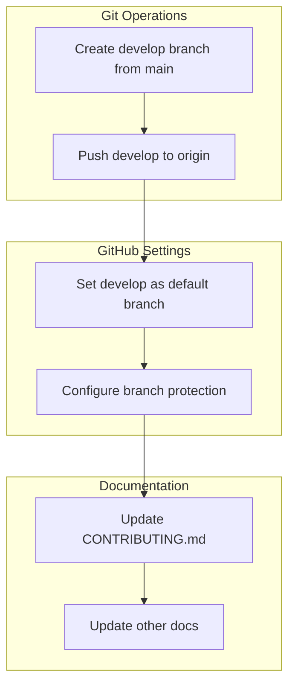

# Implementation Plan: Develop Branch Setup

**Branch**: `018-develop-branch-setup` | **Date**: 2026-01-13 | **Spec**: [spec.md](spec.md)
**Input**: Feature specification from `/specs/018-develop-branch-setup/spec.md`

## Summary

This plan establishes a Gitflow-inspired branching strategy for the DoIt project by creating a `develop` branch as the default integration branch. The implementation uses Git CLI for branch creation and GitHub CLI (`gh`) for repository settings and branch protection configuration. No code changes are required—this is a pure DevOps/infrastructure feature.

## Technical Context

**Language/Version**: N/A (infrastructure/DevOps feature)
**Primary Dependencies**: Git CLI, GitHub CLI (`gh`)
**Storage**: N/A (GitHub repository settings)
**Testing**: Manual verification via Git and GitHub UI
**Target Platform**: GitHub repository
**Project Type**: DevOps/Configuration
**Performance Goals**: N/A
**Constraints**: Requires repository admin access
**Scale/Scope**: Single repository configuration

## Architecture Overview

<!-- BEGIN:AUTO-GENERATED section="architecture" -->

<!-- END:AUTO-GENERATED -->

## Constitution Check

*GATE: Must pass before Phase 0 research. Re-check after Phase 1 design.*

| Principle | Status | Notes |
|-----------|--------|-------|
| Project Structure | ✅ Pass | No code changes, follows existing conventions |
| Documentation | ✅ Pass | Will update CONTRIBUTING.md per FR-007 |
| Branch Naming | ✅ Pass | Uses existing `###-feature-name` convention |

No constitution violations—this is a process/infrastructure improvement that aligns with project practices.

## Project Structure

### Documentation (this feature)

```text
specs/018-develop-branch-setup/
├── plan.md              # This file
├── research.md          # Existing branch protection analysis
├── quickstart.md        # New workflow quick reference
└── checklists/
    └── requirements.md  # Requirements validation checklist
```

### Source Code (repository root)

No source code changes required. Files to be modified:

```text
CONTRIBUTING.md          # Update branch workflow instructions
```

**Structure Decision**: This is a DevOps/infrastructure feature. No source code structure changes needed.

## Implementation Phases

### Phase 1: Branch Creation (FR-001)

**Actions:**
1. Create `develop` branch from current `main`
2. Push `develop` to origin

**Commands:**
```bash
git checkout main
git pull origin main
git checkout -b develop
git push -u origin develop
```

**Verification:** Branch exists on GitHub with same commit as main

### Phase 2: Default Branch Configuration (FR-002)

**Actions:**
1. Set `develop` as the default branch in GitHub settings

**Commands:**
```bash
gh repo edit --default-branch develop
```

**Verification:**
- Clone repository fresh → lands on `develop`
- GitHub UI shows `develop` as default

### Phase 3: Branch Protection (FR-003, FR-004, FR-006)

**Actions:**
1. Configure `develop` branch protection matching `main` rules
2. Verify `main` retains existing protection

**Existing `main` protection rules (to replicate on `develop`):**
- Required PR reviews: 1 approving review
- Dismiss stale reviews: enabled
- Force pushes: disabled
- Deletions: disabled

**Commands:**
```bash
gh api repos/{owner}/{repo}/branches/develop/protection \
  -X PUT \
  -H "Accept: application/vnd.github+json" \
  -f required_pull_request_reviews='{"dismiss_stale_reviews":true,"required_approving_review_count":1}' \
  -f enforce_admins=false \
  -f required_status_checks=null \
  -f restrictions=null \
  -F allow_force_pushes=false \
  -F allow_deletions=false
```

**Verification:**
- Direct push to `develop` rejected
- PR required to merge to `develop`

### Phase 4: Documentation Updates (FR-005, FR-007)

**Files to update:**

1. **CONTRIBUTING.md** - Update branch workflow:
   - Change "Create Branch - From latest `main`" to "From latest `develop`"
   - Update clone instructions to reflect new default
   - Add section explaining main vs develop workflow

**Verification:** Documentation accurately reflects new workflow

## Success Criteria Mapping

| Criteria | Implementation | Verification Method |
|----------|----------------|---------------------|
| SC-001 | Phase 2 | `git clone ... && git branch` shows develop |
| SC-002 | Phase 2 | Create PR via GitHub UI, check target |
| SC-003 | Phase 3 | `git push origin develop` rejected |
| SC-004 | Phase 4 | Review updated CONTRIBUTING.md |
| SC-005 | Phase 3 | `gh api repos/.../branches/.../protection` for both |

## Risk Mitigation

| Risk | Mitigation |
|------|------------|
| Existing PRs targeting main | Review before switch; retarget if needed |
| Contributors confused by change | Clear documentation update |
| CI/CD configured for main only | Verify no CI triggers; update if needed |

## Complexity Tracking

No violations—this is a straightforward infrastructure configuration with no code complexity.

## Dependencies

- GitHub CLI (`gh`) must be installed and authenticated
- Repository admin access required
- No existing PRs blocking the switch (or plan to handle them)

## Rollback Plan

If issues arise:
1. Set `main` as default branch: `gh repo edit --default-branch main`
2. Remove `develop` protection: `gh api ... -X DELETE`
3. Delete `develop` branch: `git push origin --delete develop`
4. Revert CONTRIBUTING.md changes
