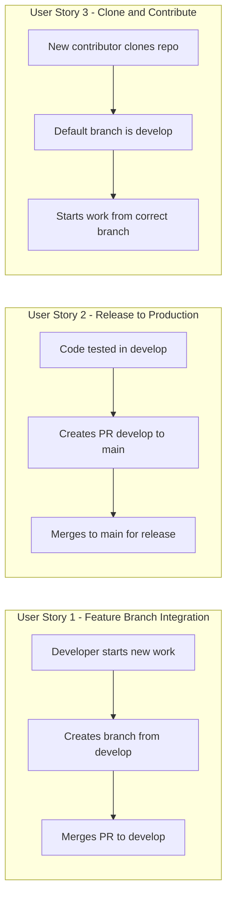

# Feature Specification: Develop Branch Setup

**Feature Branch**: `018-develop-branch-setup`
**Created**: 2026-01-13
**Status**: Complete
**Input**: User description: "we need to create a develop branch and make it our default branch so that we are following best practices"

## Summary

Implement a Git branching strategy that follows industry best practices by creating a `develop` branch as the primary integration branch for ongoing development. The `main` branch will be reserved for production-ready code, while `develop` serves as the default branch where feature branches are merged and tested before promotion to `main`.

## User Scenarios & Testing *(mandatory)*

### User Story 1 - Feature Branch Integration (Priority: P1)

As a developer working on a new feature, I want to create feature branches from `develop` and merge them back to `develop`, so that ongoing work is integrated and tested before reaching the production-ready `main` branch.

**Why this priority**: This is the core workflow change. Without this, the new branching strategy cannot be used.

**Independent Test**: Can be fully tested by creating a test feature branch from `develop`, making a commit, and merging it back to `develop` via PR.

**Acceptance Scenarios**:

1. **Given** a developer needs to start new work, **When** they run `git checkout -b ###-feature-name develop`, **Then** the new branch is created from the latest `develop` branch.

2. **Given** a feature branch with completed work, **When** the developer creates a PR, **Then** the PR target defaults to `develop` (not `main`).

3. **Given** a PR is approved and merged to `develop`, **When** the merge completes, **Then** the changes are visible in `develop` but NOT in `main`.

---

### User Story 2 - Release to Production (Priority: P2)

As a project maintainer, I want to promote tested code from `develop` to `main` for releases, so that `main` always contains stable, production-ready code.

**Why this priority**: Essential for the release workflow, but depends on the develop branch existing first.

**Independent Test**: Can be fully tested by creating a PR from `develop` to `main` and verifying the merge process.

**Acceptance Scenarios**:

1. **Given** code has been tested in `develop`, **When** a maintainer creates a PR from `develop` to `main`, **Then** the PR shows only the changes not yet in `main`.

2. **Given** a release PR is approved, **When** merged to `main`, **Then** `main` contains the same code as `develop` at that point.

---

### User Story 3 - Clone and Contribute (Priority: P3)

As a new contributor cloning the repository, I want to start from the correct branch by default, so that I don't accidentally base my work on the production branch.

**Why this priority**: Improves contributor experience but is not blocking for the core workflow.

**Independent Test**: Can be fully tested by cloning the repository fresh and verifying the default checked-out branch.

**Acceptance Scenarios**:

1. **Given** a new contributor clones the repository, **When** the clone completes, **Then** they are on the `develop` branch by default.

2. **Given** a contributor views the repository on GitHub, **When** they see the default branch indicator, **Then** it shows `develop` as the default.

---

### Edge Cases

- What happens to existing open PRs targeting `main`? They remain valid and should be reviewed/merged before the switch, or retargeted to `develop`.
- What happens to existing branch protection rules on `main`? They should be preserved; similar rules should be applied to `develop`.
- What if someone accidentally pushes directly to `develop`? Branch protection rules should prevent direct pushes, requiring PRs.

## User Journey Visualization

<!-- BEGIN:AUTO-GENERATED section="user-journey" -->

<!-- END:AUTO-GENERATED -->

## Requirements *(mandatory)*

### Functional Requirements

- **FR-001**: A `develop` branch MUST be created from the current `main` branch
- **FR-002**: The `develop` branch MUST be set as the default branch in GitHub repository settings
- **FR-003**: Branch protection rules MUST be configured for `develop` to require PR reviews before merging
- **FR-004**: The `develop` branch MUST NOT allow direct pushes (force push disabled)
- **FR-005**: Documentation MUST be updated to reflect the new branching workflow
- **FR-006**: The `main` branch MUST retain its existing protection rules for production releases
- **FR-007**: The CONTRIBUTING.md file MUST be updated to instruct contributors to branch from `develop`

## Success Criteria *(mandatory)*

### Measurable Outcomes

- **SC-001**: After cloning the repository, the default checked-out branch is `develop`
- **SC-002**: New PRs created via GitHub UI default to targeting `develop`
- **SC-003**: Direct pushes to `develop` are rejected by branch protection
- **SC-004**: The branching strategy is documented and accessible to all contributors
- **SC-005**: Both `main` and `develop` branches exist and have appropriate protection rules

## Assumptions

- The project uses GitHub as its hosting platform
- The `gh` CLI is available for GitHub operations
- Repository admin access is available to change default branch settings
- Existing contributors will be informed of the workflow change via updated documentation
- The standard Gitflow-inspired branching model is the desired approach
