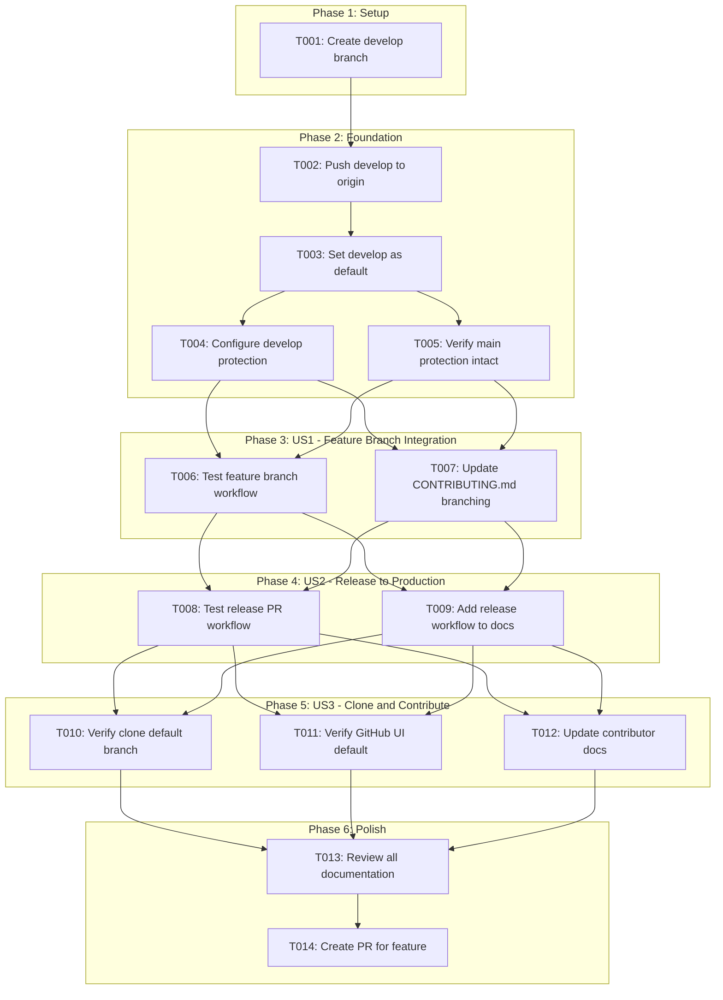
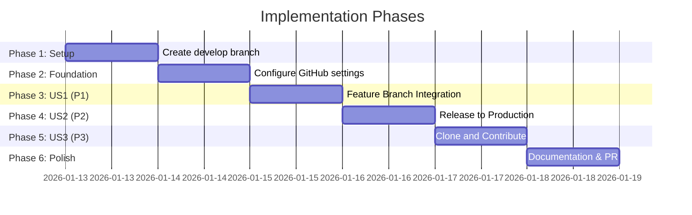

# Tasks: Develop Branch Setup

**Input**: Design documents from `/specs/018-develop-branch-setup/`
**Prerequisites**: plan.md (required), spec.md (required for user stories), research.md, quickstart.md

**Tests**: Not applicable - this is a DevOps/infrastructure feature with manual verification steps.

**Organization**: Tasks are grouped by user story to enable independent implementation and testing of each story.

## Task Dependencies

<!-- BEGIN:AUTO-GENERATED section="task-dependencies" -->

<!-- END:AUTO-GENERATED -->

## Phase Timeline

<!-- BEGIN:AUTO-GENERATED section="phase-timeline" -->

<!-- END:AUTO-GENERATED -->

## Format: `[ID] [P?] [Story] Description`

- **[P]**: Can run in parallel (different files, no dependencies)
- **[Story]**: Which user story this task belongs to (e.g., US1, US2, US3)
- Include exact file paths or commands in descriptions

## Phase 1: Setup (Branch Creation)

**Purpose**: Create the develop branch from main

- [x] T001 Create develop branch from main using `git checkout main && git pull && git checkout -b develop`

---

## Phase 2: Foundational (GitHub Configuration)

**Purpose**: Configure GitHub repository settings - MUST complete before user story verification

**CRITICAL**: No user story verification can begin until this phase is complete

- [x] T002 Push develop branch to origin using `git push -u origin develop`
- [x] T003 Set develop as default branch using `gh repo edit --default-branch develop`
- [x] T004 [P] Configure branch protection for develop with PR reviews, dismiss stale reviews, no force push
- [x] T005 [P] Verify main branch protection rules are intact using `gh api repos/{owner}/{repo}/branches/main/protection`

**Checkpoint**: GitHub configuration complete - user story verification can now begin

---

## Phase 3: User Story 1 - Feature Branch Integration (Priority: P1)

**Goal**: Developers can create feature branches from develop and merge back via PR

**Independent Test**: Create a test branch from develop, verify PR targets develop by default

### Implementation for User Story 1

- [x] T006 [US1] Test feature branch workflow: create branch `git checkout -b test-branch develop`, verify PR defaults to develop target
- [x] T007 [US1] Update CONTRIBUTING.md lines 38-40 and 267-268 to change branch instructions from `main` to `develop`

**Checkpoint**: User Story 1 complete - feature branch integration verified

---

## Phase 4: User Story 2 - Release to Production (Priority: P2)

**Goal**: Maintainers can promote tested code from develop to main for releases

**Independent Test**: Create a PR from develop to main and verify it shows correct diff

### Implementation for User Story 2

- [x] T008 [US2] Test release PR workflow: create PR from develop to main using `gh pr create --base main --head develop --title "Test release" --body "Test"`, then close without merging
- [x] T009 [US2] Add release workflow documentation to CONTRIBUTING.md explaining develop-to-main promotion process

**Checkpoint**: User Story 2 complete - release workflow verified

---

## Phase 5: User Story 3 - Clone and Contribute (Priority: P3)

**Goal**: New contributors clone the repository and land on develop by default

**Independent Test**: Clone repository fresh and verify checked-out branch is develop

### Implementation for User Story 3

- [x] T010 [P] [US3] Verify clone default branch by cloning to temp directory: `git clone [repo-url] /tmp/test-clone && cd /tmp/test-clone && git branch --show-current`
- [x] T011 [P] [US3] Verify GitHub UI shows develop as default branch in repository settings
- [x] T012 [US3] Update CONTRIBUTING.md Quick Start section to reflect that clone lands on develop

**Checkpoint**: User Story 3 complete - new contributor experience verified

---

## Phase 6: Polish & Cross-Cutting Concerns

**Purpose**: Final documentation review and PR creation

- [x] T013 Review all documentation changes for consistency and accuracy
- [x] T014 Create PR for 018-develop-branch-setup feature using `/doit.checkin`

---

## Dependencies & Execution Order

### Phase Dependencies

- **Setup (Phase 1)**: No dependencies - can start immediately
- **Foundational (Phase 2)**: Depends on Setup completion - BLOCKS all user stories
- **User Stories (Phase 3-5)**: All depend on Foundational phase completion
  - User stories can proceed sequentially in priority order (P1 → P2 → P3)
- **Polish (Phase 6)**: Depends on all user stories being complete

### User Story Dependencies

- **User Story 1 (P1)**: Can start after Foundational (Phase 2) - No dependencies on other stories
- **User Story 2 (P2)**: Can start after Foundational (Phase 2) - Independent of US1
- **User Story 3 (P3)**: Can start after Foundational (Phase 2) - Independent of US1/US2

### Parallel Opportunities

- T004 and T005 can run in parallel (different GitHub API calls)
- T006 and T007 can run in parallel (verification vs documentation)
- T008 and T009 can run in parallel (verification vs documentation)
- T010, T011, and T012 can run in parallel (different verification methods)

---

## Parallel Example: Phase 2 Foundation

```bash
# Launch protection configuration tasks together:
Task: "Configure branch protection for develop"
Task: "Verify main branch protection rules are intact"
```

## Parallel Example: User Story 3

```bash
# Launch all US3 verification tasks together:
Task: "Verify clone default branch"
Task: "Verify GitHub UI shows develop as default"
Task: "Update CONTRIBUTING.md Quick Start section"
```

---

## Implementation Strategy

### MVP First (User Story 1 Only)

1. Complete Phase 1: Setup (create branch)
2. Complete Phase 2: Foundational (configure GitHub)
3. Complete Phase 3: User Story 1 (feature branch workflow)
4. **STOP and VALIDATE**: Test feature branch workflow independently
5. Proceed to US2 and US3

### Incremental Delivery

1. Complete Setup + Foundational → GitHub configured
2. Add User Story 1 → Feature branching works → Core workflow ready
3. Add User Story 2 → Release workflow documented
4. Add User Story 3 → New contributor experience complete
5. Polish → PR created

---

## Success Criteria Mapping

| Task | Success Criteria | Verification |
| ---- | ---------------- | ------------ |
| T003 | SC-001 | Clone lands on develop |
| T003 | SC-002 | PRs target develop by default |
| T004 | SC-003 | Direct push to develop rejected |
| T007, T009, T012 | SC-004 | Documentation updated |
| T004, T005 | SC-005 | Both branches have protection |

---

## Notes

- [P] tasks = different operations, no dependencies
- [Story] label maps task to specific user story for traceability
- Each user story should be independently completable and testable
- This is a DevOps feature - "implementation" is configuration, not code
- Commit after each phase completion
- Stop at any checkpoint to validate story independently
