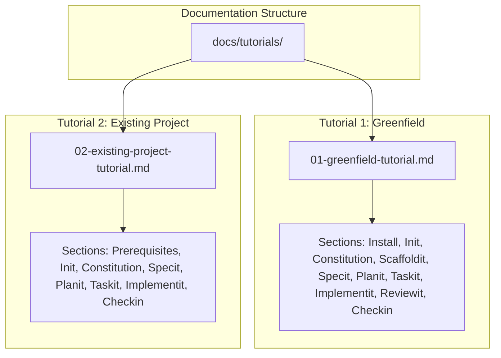

# Implementation Plan: DoIt Comprehensive Tutorials

**Branch**: `019-doit-tutorials` | **Date**: 2026-01-13 | **Spec**: [spec.md](./spec.md)
**Input**: Feature specification from `/specs/019-doit-tutorials/spec.md`

## Summary

Create two comprehensive, step-by-step tutorials demonstrating the complete DoIt workflow. Tutorial 1 (Greenfield) guides users through starting a new project from scratch. Tutorial 2 (Existing Project) shows how to adopt DoIt in an existing codebase. Both tutorials include annotated command examples, interactive prompts, expected outputs, and workflow visualizations.

**Technical Approach**: Pure documentation feature using Markdown with embedded Mermaid diagrams. No code implementation required - deliverables are tutorial documents placed in the docs site.

## Technical Context

**Language/Version**: Markdown (documentation), Mermaid (diagrams)
**Primary Dependencies**: None (documentation only)
**Storage**: N/A (file system - docs directory)
**Testing**: Manual validation - follow tutorials end-to-end
**Target Platform**: Documentation site (GitHub Pages / MkDocs compatible)
**Project Type**: single (documentation files)
**Performance Goals**: N/A (static documentation)
**Constraints**: Markdown must render correctly on GitHub and docs site
**Scale/Scope**: 2 tutorial documents, ~50-100 pages combined

## Architecture Overview

<!-- BEGIN:AUTO-GENERATED section="architecture" -->

<!-- END:AUTO-GENERATED -->

## Constitution Check

*GATE: Must pass before Phase 0 research. Re-check after Phase 1 design.*

| Principle               | Status | Notes                                                      |
| ----------------------- | ------ | ---------------------------------------------------------- |
| Documentation Standards | PASS   | Using Markdown with Mermaid, compatible with existing docs |
| Simplicity              | PASS   | No code complexity - pure documentation                    |
| Quality Over Speed      | PASS   | Comprehensive examples with full command interactions      |

**Gate Status**: PASSED - No violations. Documentation-only feature aligns with project standards.

## Project Structure

### Documentation (this feature)

```text
specs/019-doit-tutorials/
├── plan.md              # This file
├── research.md          # Phase 0 output
├── quickstart.md        # Phase 1 output (validation checklist)
└── checklists/
    └── requirements.md  # Spec quality checklist
```

### Source Code (repository root)

```text
docs/
└── tutorials/
    ├── index.md                      # Tutorial overview/navigation
    ├── 01-greenfield-tutorial.md     # Tutorial 1: New project walkthrough
    └── 02-existing-project-tutorial.md # Tutorial 2: Existing project walkthrough
```

**Structure Decision**: Single project layout using `docs/tutorials/` directory for tutorial documents. No source code changes required.

## Complexity Tracking

> No violations to justify - documentation-only feature with straightforward structure.

## Tutorial Content Structure

### Tutorial 1: Greenfield Project (~60 pages)

1. **Introduction** - What You'll Build, Time Estimate, Prerequisites
2. **Installation** - Installing DoIt CLI, verification
3. **Project Initialization** - `doit init` with sample responses
4. **Constitution Setup** - `/doit.constitution` with example principles
5. **Project Scaffolding** - `/doit.scaffoldit` output walkthrough
6. **Feature Specification** - `/doit.specit` with ambiguity resolution demo
7. **Implementation Planning** - `/doit.planit` with research and contracts
8. **Task Generation** - `/doit.taskit` task structure explanation
9. **Implementation** - `/doit.implementit` with 3+ task completions
10. **Code Review** - `/doit.reviewit` feedback handling
11. **Feature Completion** - `/doit.checkin` PR creation
12. **Bonus: Roadmap Management** - `/doit.roadmapit` usage
13. **Bonus: Test Execution** - `/doit.testit` usage
14. **Summary** - Workflow recap and next steps

### Tutorial 2: Existing Project (~40 pages)

1. **Introduction** - What You'll Learn, Time Estimate, Prerequisites
2. **Preparing Your Project** - What to expect, backup recommendations
3. **Initialization for Existing Projects** - `doit init` adaptation guidance
4. **Constitution for Existing Patterns** - Reflecting existing tech stack
5. **Adding a New Feature** - `/doit.specit` through `/doit.checkin`
6. **Key Differences from Greenfield** - What to skip, what to adapt
7. **Summary** - Workflow recap and next steps

## Sample Project Definitions

### Greenfield Sample: TaskFlow CLI

A simple command-line task management app demonstrating:

- Project setup from scratch
- A feature: "Add task priority levels"
- User stories, data model, implementation tasks

### Existing Project Sample: Weather API

A pre-existing REST API demonstrating:

- Retrofitting DoIt onto existing codebase
- A feature: "Add weather alerts endpoint"
- Working with existing patterns and code

## Deliverables

| Artifact          | Location                                         | Description                     |
| ----------------- | ------------------------------------------------ | ------------------------------- |
| Tutorial 1        | `docs/tutorials/01-greenfield-tutorial.md`       | Complete greenfield walkthrough |
| Tutorial 2        | `docs/tutorials/02-existing-project-tutorial.md` | Existing project guide          |
| Tutorial Index    | `docs/tutorials/index.md`                        | Navigation and overview         |
| Workflow Diagrams | Embedded in tutorials                            | Mermaid command flow diagrams   |
