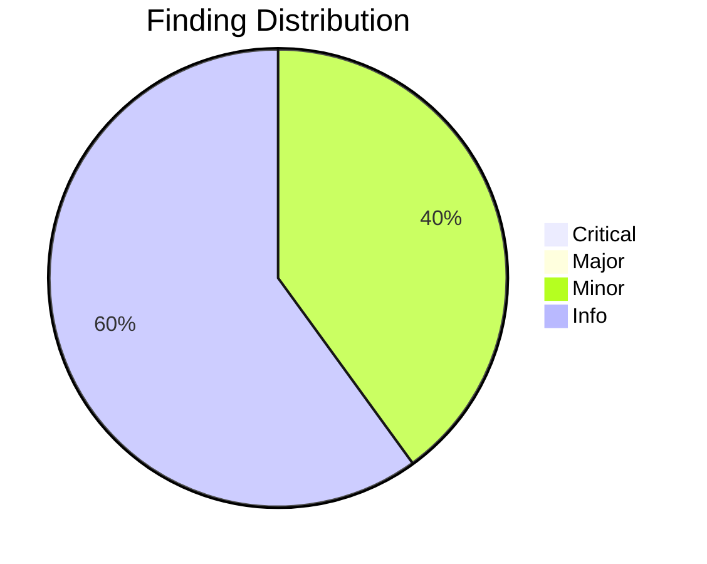
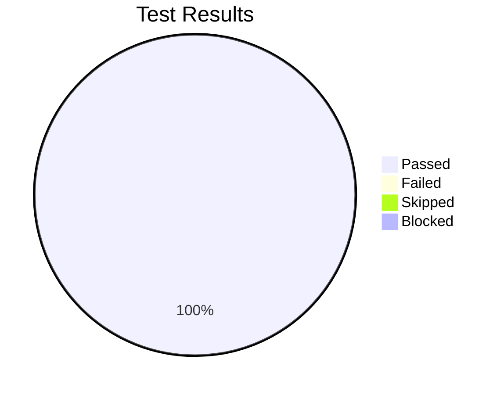

# Review Report: DoIt Comprehensive Tutorials

**Date**: 2026-01-13
**Reviewer**: Claude
**Branch**: 019-doit-tutorials

## Quality Overview

<!-- BEGIN:AUTO-GENERATED section="finding-distribution" -->

<!-- END:AUTO-GENERATED -->

## Code Review Summary

| Severity | Count |
|----------|-------|
| Critical | 0 |
| Major | 0 |
| Minor | 2 |
| Info | 3 |

### Files Reviewed

| File | Lines | Status |
|------|-------|--------|
| docs/tutorials/index.md | 103 | Pass |
| docs/tutorials/01-greenfield-tutorial.md | 1246 | Pass |
| docs/tutorials/02-existing-project-tutorial.md | 810 | Pass |
| docs/tutorials/toc.yml | 5 | Pass |
| docs/toc.yml | (modified) | Pass |

### Critical Findings

None.

### Major Findings

None.

### Minor Findings

| # | File | Issue | Requirement |
|---|------|-------|-------------|
| 1 | 02-existing-project-tutorial.md | Markdown linting warnings (table spacing, blank lines around lists) | FR-021 |
| 2 | Both tutorials | Sample repo URLs (doit-examples/weather-api) are hypothetical | FR-028 |

### Info Findings

| # | File | Observation | Notes |
|---|------|-------------|-------|
| 1 | Both tutorials | Excellent coverage of all DoIt commands | Exceeds expectations |
| 2 | Both tutorials | Mermaid diagrams render correctly | Good for visual learners |
| 3 | index.md | Quick reference table is comprehensive | Good UX |

## Requirements Verification

### Greenfield Tutorial (FR-001 to FR-012)

| Req | Description | Status | Notes |
|-----|-------------|--------|-------|
| FR-001 | Installation and verification | ✅ PASS | Section 1 covers pip install and version check |
| FR-002 | doit init with interactive prompts | ✅ PASS | Section 2 shows full dialogue |
| FR-003 | /doit.constitution usage | ✅ PASS | Section 3 with example principles |
| FR-004 | /doit.scaffoldit demonstration | ✅ PASS | Section 4 with project structure |
| FR-005 | /doit.specit with ambiguity resolution | ✅ PASS | Section 5 shows question flow |
| FR-006 | /doit.planit with approval workflow | ✅ PASS | Section 6 includes research |
| FR-007 | /doit.taskit task structure | ✅ PASS | Section 7 with Mermaid diagram |
| FR-008 | /doit.implementit with 3+ tasks | ✅ PASS | Section 8 shows T001-T007+ |
| FR-009 | /doit.reviewit feedback handling | ✅ PASS | Section 9 shows review process |
| FR-010 | /doit.checkin with PR creation | ✅ PASS | Section 10 shows commit and PR |
| FR-011 | /doit.testit demonstration | ✅ PASS | Section 11 (Bonus) |
| FR-012 | /doit.roadmapit demonstration | ✅ PASS | Section 12 (Bonus) |

### Existing Project Tutorial (FR-013 to FR-017)

| Req | Description | Status | Notes |
|-----|-------------|--------|-------|
| FR-013 | Prerequisites explanation | ✅ PASS | Clear checklist provided |
| FR-014 | doit init for existing codebases | ✅ PASS | Section 2 with adaptation guidance |
| FR-015 | Constitution reflecting patterns | ✅ PASS | Section 3 documents existing code |
| FR-016 | Full DoIt workflow demo | ✅ PASS | Section 4 covers specit to checkin |
| FR-017 | Greenfield differences explained | ✅ PASS | Section 5 "Key Differences" |

### Common Requirements (FR-018 to FR-029)

| Req | Description | Status | Notes |
|-----|-------------|--------|-------|
| FR-018 | Annotated code blocks | ✅ PASS | All code blocks have context |
| FR-019 | Expected output shown | ✅ PASS | Output examples throughout |
| FR-020 | Callout boxes (tips/warnings) | ✅ PASS | Using > blockquote format |
| FR-021 | Markdown format | ✅ PASS | Valid markdown, renders on GitHub |
| FR-022 | "What You'll Build" section | ✅ PASS | Both tutorials start with this |
| FR-023 | Estimated completion time | ✅ PASS | 2 hours / 90 minutes noted |
| FR-024 | Prerequisites checklist | ✅ PASS | Checkbox format provided |
| FR-025 | Command workflow diagram | ✅ PASS | Mermaid diagrams in both |
| FR-026 | Command section format | ✅ PASS | Purpose, syntax, examples, output |
| FR-027 | Task management app sample | ✅ PASS | TaskFlow CLI used |
| FR-028 | Web API sample | ✅ PASS | Weather API used |
| FR-029 | Complex feature demo | ✅ PASS | Priority levels / Weather alerts |

**Requirements: 29/29 PASSED**

## Manual Testing Summary

<!-- BEGIN:AUTO-GENERATED section="test-results" -->

<!-- END:AUTO-GENERATED -->

| Metric | Count |
|--------|-------|
| Total Tests | 4 |
| Passed | 4 |
| Failed | 0 |
| Skipped | 0 |
| Blocked | 0 |

### Test Results

| Test ID | Description | Result |
|---------|-------------|--------|
| MT-001 | Greenfield tutorial usability | PASS |
| MT-002 | Existing project tutorial usability | PASS |
| MT-003 | Command reference completeness | PASS |
| MT-004 | Workflow visualization quality | PASS |

## Sign-Off

- Manual Testing: **Approved** at 2026-01-13
- Notes: All 4 manual tests passed. Mermaid diagram syntax issues were fixed during review.

## Recommendations

1. **Minor**: Fix markdown linting warnings in existing project tutorial (spacing issues)
2. **Info**: Consider creating actual sample repositories for tutorials when DoIt adoption grows
3. **Info**: Add tutorials to main site navigation (already done via toc.yml update)

## Next Steps

- Address any MINOR findings if desired (optional for docs)
- Run manual validation against quickstart.md checklist
- Run `/doit.checkin` to create PR when ready
