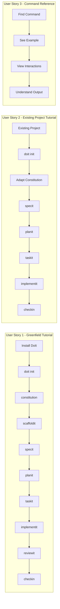

# Feature Specification: DoIt Comprehensive Tutorials

**Feature Branch**: `019-doit-tutorials`
**Created**: 2026-01-13
**Status**: Complete
**Input**: User description: "We need to create 2 tutorials with complete examples and a walk through. 1 tutorial will be greenfield and the other will be for an existing project. We want to show how all commands work the workflows and the interactions during the commands."

## Summary

Create two comprehensive, step-by-step tutorials that demonstrate the complete DoIt workflow from start to finish. The tutorials will serve as the primary learning resource for new users, showing real examples of every command, the expected interactions, and decision points throughout the spec-driven development process.

**Tutorial 1: Greenfield Project** - Start from scratch with a new project, demonstrating full project initialization and the complete feature development cycle.

**Tutorial 2: Existing Project Integration** - Add DoIt to an existing codebase, showing how to retrofit spec-driven development practices onto a project already in progress.

## User Scenarios & Testing *(mandatory)*

### User Story 1 - Greenfield Tutorial (Priority: P1)

A developer starting a brand new project wants to follow along with a complete tutorial that shows how to use DoIt from project inception through feature completion, including all command interactions and decision points.

**Why this priority**: New projects represent the ideal use case for DoIt's full workflow. This tutorial demonstrates the complete value proposition and shows users the optimal way to adopt spec-driven development.

**Independent Test**: A user can follow the greenfield tutorial end-to-end and successfully create a working project with at least one completed feature using all DoIt commands.

**Acceptance Scenarios**:

1. **Given** a user with DoIt installed, **When** they follow the greenfield tutorial from start to finish, **Then** they have a fully initialized project with constitution, roadmap, and one completed feature.
2. **Given** a user following the greenfield tutorial, **When** they reach a command that requires interaction, **Then** the tutorial shows example prompts, user responses, and expected outputs.
3. **Given** a user following the greenfield tutorial, **When** they execute `/doit.specit`, **Then** the tutorial demonstrates the ambiguity resolution process with sample questions and answers.
4. **Given** a user completing the greenfield tutorial, **When** they have finished all steps, **Then** they have created GitHub issues, a pull request, and understand the full DoIt workflow.

---

### User Story 2 - Existing Project Tutorial (Priority: P1)

A developer with an existing codebase wants to learn how to integrate DoIt into their project without disrupting existing work, understanding which commands apply and how to adapt the workflow.

**Why this priority**: Most developers will encounter DoIt with existing projects. This tutorial addresses the common adoption scenario and reduces friction for adoption.

**Independent Test**: A user can follow the existing project tutorial and successfully add DoIt to a pre-existing codebase, then complete one feature using the DoIt workflow.

**Acceptance Scenarios**:

1. **Given** a user with an existing project, **When** they follow the existing project tutorial, **Then** they have DoIt initialized with a constitution reflecting their existing project.
2. **Given** a user following the existing project tutorial, **When** they run `doit init`, **Then** the tutorial explains how to adapt constitution answers for an existing codebase.
3. **Given** a user following the existing project tutorial, **When** they create a new feature specification, **Then** the tutorial shows how to reference existing code and patterns.
4. **Given** a user completing the existing project tutorial, **When** they have finished all steps, **Then** they have one new feature fully integrated using the DoIt workflow.

---

### User Story 3 - Command Reference Within Tutorials (Priority: P2)

A user reading either tutorial wants clear, annotated examples of every DoIt command showing the full input/output interaction, decision points, and expected results.

**Why this priority**: Understanding each command's behavior and interactions is essential for effective use, but users can learn individual commands from reference docs if needed.

**Independent Test**: Each command section can be referenced independently to understand that specific command's behavior.

**Acceptance Scenarios**:

1. **Given** a user reading a tutorial, **When** they encounter a DoIt command, **Then** they see the exact command invocation with realistic input.
2. **Given** a user reading a command example, **When** the command produces interactive prompts, **Then** the tutorial shows the full dialogue with sample responses.
3. **Given** a user reading a command example, **When** the command produces output files, **Then** the tutorial shows annotated excerpts of the generated content.
4. **Given** a user reading a command example, **When** the command has multiple options or paths, **Then** the tutorial explains when to use each option.

---

### User Story 4 - Workflow Visualization (Priority: P3)

A user wants to see visual diagrams showing the overall DoIt workflow, command dependencies, and decision flows to understand the big picture before diving into details.

**Why this priority**: Visual learners benefit from diagrams, but the tutorials are usable without them.

**Independent Test**: The workflow diagrams can be viewed independently as a quick reference.

**Acceptance Scenarios**:

1. **Given** a user viewing a tutorial, **When** they see a workflow diagram, **Then** it clearly shows the sequence of DoIt commands from spec to completion.
2. **Given** a user viewing a tutorial, **When** they see a decision flow, **Then** it shows branching points where user input affects the workflow.

---

### Edge Cases

- What happens when a user skips a recommended command (e.g., skips `/doit.planit`)?
- How does the tutorial handle platform differences (Windows vs. Mac vs. Linux)?
- What if the user's existing project has a very different structure than expected?
- How does the tutorial address users without GitHub access (using `--skip-issues`)?

## User Journey Visualization

<!-- BEGIN:AUTO-GENERATED section="user-journey" -->

<!-- END:AUTO-GENERATED -->

## Requirements *(mandatory)*

### Functional Requirements

#### Greenfield Tutorial (Tutorial 1)

- **FR-001**: Tutorial MUST start with DoIt installation and verification steps
- **FR-002**: Tutorial MUST demonstrate `doit init` command with full interactive prompts and sample responses
- **FR-003**: Tutorial MUST show `/doit.constitution` usage with example project principles
- **FR-004**: Tutorial MUST demonstrate `/doit.scaffoldit` to create initial project structure
- **FR-005**: Tutorial MUST show `/doit.specit` with a realistic feature description and ambiguity resolution
- **FR-006**: Tutorial MUST demonstrate `/doit.planit` including the plan approval workflow
- **FR-007**: Tutorial MUST show `/doit.taskit` and explain the generated task structure
- **FR-008**: Tutorial MUST demonstrate `/doit.implementit` with at least 3 example task completions
- **FR-009**: Tutorial MUST show `/doit.reviewit` including handling of review feedback
- **FR-010**: Tutorial MUST demonstrate `/doit.checkin` including GitHub issue closure and PR creation
- **FR-011**: Tutorial MUST show `/doit.testit` for running automated tests
- **FR-012**: Tutorial MUST demonstrate `/doit.roadmapit` for managing project backlog

#### Existing Project Tutorial (Tutorial 2)

- **FR-013**: Tutorial MUST explain prerequisites for adding DoIt to an existing project
- **FR-014**: Tutorial MUST demonstrate `doit init` with guidance on answering questions for existing codebases
- **FR-015**: Tutorial MUST show how to create a constitution that reflects existing project patterns
- **FR-016**: Tutorial MUST demonstrate adding a new feature to an existing project using the full DoIt workflow
- **FR-017**: Tutorial MUST address common differences from greenfield (no scaffoldit, existing structure)

#### Common Requirements

- **FR-018**: Both tutorials MUST include annotated code blocks showing exact command inputs
- **FR-019**: Both tutorials MUST show expected output for each command (abbreviated for length)
- **FR-020**: Both tutorials MUST include callout boxes for tips, warnings, and notes
- **FR-021**: Tutorials MUST be written in Markdown format for docs site compatibility
- **FR-022**: Tutorials MUST include a "What You'll Build" section at the start
- **FR-023**: Tutorials MUST include an estimated completion time
- **FR-024**: Tutorials MUST include prerequisites checklist
- **FR-025**: Tutorials MUST show the command workflow as a visual diagram
- **FR-026**: Each command section MUST show: purpose, syntax, example input, interactive prompts (if any), and output summary

#### Sample Project

- **FR-027**: Greenfield tutorial MUST use a realistic but simple example project (task management app)
- **FR-028**: Existing project tutorial MUST use a common project type (web API or CLI tool)
- **FR-029**: Sample feature for tutorials MUST be complex enough to demonstrate all workflow stages

## Success Criteria *(mandatory)*

### Measurable Outcomes

- **SC-001**: A new user can complete the greenfield tutorial in under 2 hours
- **SC-002**: A new user can complete the existing project tutorial in under 90 minutes
- **SC-003**: Users completing tutorials report understanding all DoIt commands (survey: >80% agreement)
- **SC-004**: Tutorials cover 100% of DoIt slash commands with working examples
- **SC-005**: Each tutorial results in a functional project/feature that can be verified
- **SC-006**: Users can find specific command examples within 30 seconds using document navigation

## Assumptions

- Users have basic familiarity with command line interfaces
- Users have Git installed and configured
- Users have Claude Code (or compatible AI IDE) installed
- Users have a GitHub account for issue/PR creation examples (or will use `--skip-issues`)
- Python 3.11+ is available for DoIt CLI installation
- The tutorial sample projects are simple enough to complete without domain expertise

## Out of Scope

- Video tutorials (text/Markdown only for this feature)
- Translations to non-English languages
- IDE-specific setup guides beyond Claude Code
- Advanced customization of templates
- Troubleshooting guides for installation issues (separate documentation)

## Dependencies

- All DoIt commands must be functional and stable
- GitHub integration features must work correctly
- Documentation site must support Markdown rendering with Mermaid diagrams
