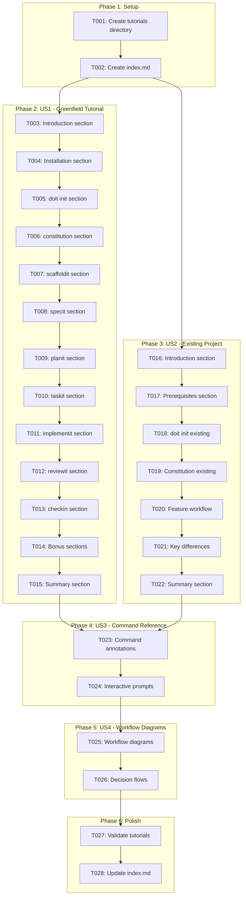
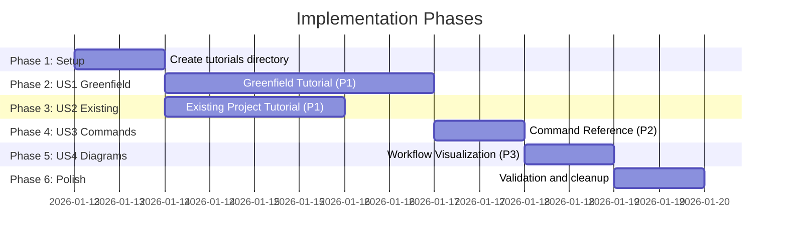

# Tasks: DoIt Comprehensive Tutorials

**Input**: Design documents from `/specs/019-doit-tutorials/`
**Prerequisites**: plan.md (required), spec.md (required for user stories), research.md, quickstart.md

**Tests**: Not applicable - this is a documentation feature with manual validation via quickstart.md checklist.

**Organization**: Tasks are grouped by user story to enable independent implementation and testing of each story.

## Task Dependencies

<!-- BEGIN:AUTO-GENERATED section="task-dependencies" -->

<!-- END:AUTO-GENERATED -->

## Phase Timeline

<!-- BEGIN:AUTO-GENERATED section="phase-timeline" -->

<!-- END:AUTO-GENERATED -->

## Format: `[ID] [P?] [Story] Description`

- **[P]**: Can run in parallel (different files, no dependencies)
- **[Story]**: Which user story this task belongs to (e.g., US1, US2, US3)
- Include exact file paths in descriptions

---

## Phase 1: Setup (Documentation Structure)

**Purpose**: Create the tutorials directory and navigation structure

- [ ] T001 Create tutorials directory at `docs/tutorials/`
- [ ] T002 Create tutorial index with navigation at `docs/tutorials/index.md`

**Checkpoint**: Directory structure ready for tutorial content

---

## Phase 2: User Story 1 - Greenfield Tutorial (Priority: P1)

**Goal**: Complete walkthrough for starting a new project from scratch with DoIt

**Independent Test**: A user can follow the tutorial end-to-end and create a working project with one completed feature

### Implementation for User Story 1

- [ ] T003 [US1] Write Introduction section (What You'll Build, Time Estimate, Prerequisites) in `docs/tutorials/01-greenfield-tutorial.md`
- [ ] T004 [US1] Write Installation section (pip install, verification, Claude Code setup) in `docs/tutorials/01-greenfield-tutorial.md`
- [ ] T005 [US1] Write Project Initialization section (`doit init` with full interactive prompts for TaskFlow CLI sample) in `docs/tutorials/01-greenfield-tutorial.md`
- [ ] T006 [US1] Write Constitution Setup section (`/doit.constitution` with example principles for TaskFlow CLI) in `docs/tutorials/01-greenfield-tutorial.md`
- [ ] T007 [US1] Write Project Scaffolding section (`/doit.scaffoldit` output walkthrough) in `docs/tutorials/01-greenfield-tutorial.md`
- [ ] T008 [US1] Write Feature Specification section (`/doit.specit` with "Add task priority levels" feature, ambiguity resolution demo) in `docs/tutorials/01-greenfield-tutorial.md`
- [ ] T009 [US1] Write Implementation Planning section (`/doit.planit` with research and plan approval) in `docs/tutorials/01-greenfield-tutorial.md`
- [ ] T010 [US1] Write Task Generation section (`/doit.taskit` task structure explanation) in `docs/tutorials/01-greenfield-tutorial.md`
- [ ] T011 [US1] Write Implementation section (`/doit.implementit` with 3 example task completions) in `docs/tutorials/01-greenfield-tutorial.md`
- [ ] T012 [US1] Write Code Review section (`/doit.reviewit` feedback handling) in `docs/tutorials/01-greenfield-tutorial.md`
- [ ] T013 [US1] Write Feature Completion section (`/doit.checkin` issue closure and PR creation) in `docs/tutorials/01-greenfield-tutorial.md`
- [ ] T014 [US1] Write Bonus sections (`/doit.roadmapit` and `/doit.testit` usage) in `docs/tutorials/01-greenfield-tutorial.md`
- [ ] T015 [US1] Write Summary section (workflow recap, next steps, troubleshooting tips) in `docs/tutorials/01-greenfield-tutorial.md`

**Checkpoint**: Greenfield tutorial is complete and can be followed end-to-end

---

## Phase 3: User Story 2 - Existing Project Tutorial (Priority: P1)

**Goal**: Guide for adding DoIt to an existing codebase without disruption

**Independent Test**: A user can follow the tutorial and add DoIt to an existing project, completing one feature

### Implementation for User Story 2

- [ ] T016 [P] [US2] Write Introduction section (What You'll Learn, Time Estimate, Prerequisites) in `docs/tutorials/02-existing-project-tutorial.md`
- [ ] T017 [US2] Write Preparing Your Project section (backup recommendations, what to expect) in `docs/tutorials/02-existing-project-tutorial.md`
- [ ] T018 [US2] Write Initialization section (`doit init` with guidance for existing codebases using Weather API sample) in `docs/tutorials/02-existing-project-tutorial.md`
- [ ] T019 [US2] Write Constitution section (reflecting existing project patterns and tech stack) in `docs/tutorials/02-existing-project-tutorial.md`
- [ ] T020 [US2] Write Adding a New Feature section (`/doit.specit` through `/doit.checkin` for "Add weather alerts endpoint") in `docs/tutorials/02-existing-project-tutorial.md`
- [ ] T021 [US2] Write Key Differences section (when to skip scaffoldit, adapting workflow to existing structure) in `docs/tutorials/02-existing-project-tutorial.md`
- [ ] T022 [US2] Write Summary section (workflow recap, next steps) in `docs/tutorials/02-existing-project-tutorial.md`

**Checkpoint**: Existing project tutorial is complete and can be followed independently

---

## Phase 4: User Story 3 - Command Reference Enhancement (Priority: P2)

**Goal**: Ensure every command has clear, annotated examples with full interaction patterns

**Independent Test**: Each command section can be referenced independently to understand that command's behavior

### Implementation for User Story 3

- [ ] T023 [US3] Review and enhance all command code blocks with syntax highlighting and annotations in both tutorials
- [ ] T024 [US3] Add interactive prompt examples showing full dialogues with sample responses for all commands in both tutorials

**Checkpoint**: All commands have complete reference examples with input/output patterns

---

## Phase 5: User Story 4 - Workflow Visualization (Priority: P3)

**Goal**: Add visual diagrams showing overall DoIt workflow and decision points

**Independent Test**: Workflow diagrams can be viewed as a quick reference

### Implementation for User Story 4

- [ ] T025 [US4] Add workflow Mermaid diagram showing command sequence in `docs/tutorials/01-greenfield-tutorial.md` Introduction section
- [ ] T026 [US4] Add decision flow diagram showing branching points (skip commands, no GitHub, etc.) in both tutorials

**Checkpoint**: Both tutorials have clear visual workflow diagrams

---

## Phase 6: Polish & Validation

**Purpose**: Final validation and cross-tutorial consistency

- [ ] T027 Validate both tutorials using `specs/019-doit-tutorials/quickstart.md` checklist
- [ ] T028 Update `docs/tutorials/index.md` with final links, descriptions, and time estimates

---

## Dependencies & Execution Order

### Phase Dependencies

- **Setup (Phase 1)**: No dependencies - can start immediately
- **User Story 1 (Phase 2)**: Depends on Setup - creates main tutorial file
- **User Story 2 (Phase 3)**: Depends on Setup - can run in PARALLEL with US1 (different file)
- **User Story 3 (Phase 4)**: Depends on US1 and US2 completion - enhances existing content
- **User Story 4 (Phase 5)**: Depends on US3 - adds diagrams to existing content
- **Polish (Phase 6)**: Depends on all user stories complete

### User Story Dependencies

- **User Story 1 (P1)**: Can start after Setup - writes `01-greenfield-tutorial.md`
- **User Story 2 (P1)**: Can start after Setup - writes `02-existing-project-tutorial.md` (PARALLEL with US1)
- **User Story 3 (P2)**: Depends on US1 and US2 - modifies both tutorial files
- **User Story 4 (P3)**: Depends on US3 - modifies both tutorial files

### Parallel Opportunities

- T016 can start in parallel with T003 (different tutorial files)
- US1 and US2 can be written in parallel by different authors
- T025 and T026 can run in parallel (different diagram types)

---

## Parallel Example: US1 and US2

```bash
# Launch both tutorial skeletons together:
Task: "Write Introduction section in docs/tutorials/01-greenfield-tutorial.md"
Task: "Write Introduction section in docs/tutorials/02-existing-project-tutorial.md"
```

---

## Implementation Strategy

### MVP First (User Story 1 Only)

1. Complete Phase 1: Setup (create directory, index)
2. Complete Phase 2: User Story 1 (Greenfield Tutorial)
3. **STOP and VALIDATE**: Can a user follow the greenfield tutorial successfully?
4. Publish/demo if ready

### Incremental Delivery

1. Complete Setup → Directory ready
2. Add User Story 1 → Greenfield tutorial complete → Publish
3. Add User Story 2 → Existing project tutorial complete → Publish
4. Add User Story 3 → Command reference enhanced
5. Add User Story 4 → Diagrams added
6. Polish → Fully validated

### Parallel Author Strategy

With multiple authors:

1. Setup phase together
2. Once Setup is done:
   - Author A: User Story 1 (Greenfield)
   - Author B: User Story 2 (Existing Project)
3. After both complete: Author A or B does US3 and US4

---

## Notes

- [P] tasks = different files, no dependencies
- [Story] label maps task to specific user story for traceability
- Each user story should be independently completable and testable
- Documentation feature - validation is manual using quickstart.md checklist
- Commit after each section or logical group
- Stop at any checkpoint to validate tutorial independently
