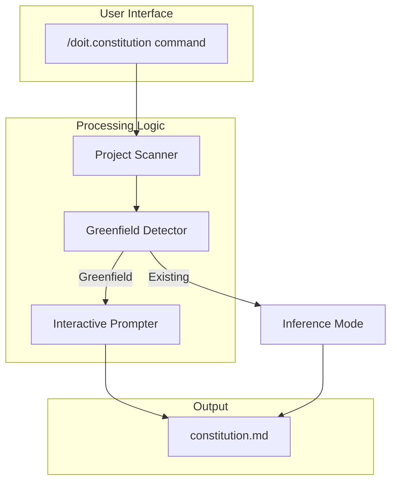

# Implementation Plan: Constitution Command Improvements

**Branch**: `020-constitution-improvements` | **Date**: 2026-01-13 | **Spec**: [spec.md](./spec.md)
**Input**: Feature specification from `/specs/020-constitution-improvements/spec.md`

## Summary

Enhance the `/doit.constitution` command template to: (1) exclude dotfiles/dotfolders when scanning projects for context inference, and (2) detect greenfield projects and guide users through interactive constitution creation with prompted questions.

**Technical Approach**: Update the Markdown command template at `.claude/commands/doit.constitution.md` with new workflow logic for dotfile filtering, greenfield detection, and interactive questioning mode.

## Technical Context

**Language/Version**: Markdown (command templates), Claude Code slash command system
**Primary Dependencies**: None (template-based execution by AI agent)
**Storage**: N/A (file system - reads project directories)
**Testing**: Manual validation - run constitution on test projects
**Target Platform**: Claude Code and compatible AI IDE extensions
**Project Type**: single (documentation/template updates)
**Performance Goals**: N/A (interactive command)
**Constraints**: Must work within existing slash command architecture
**Scale/Scope**: Single command template update

## Architecture Overview

<!-- BEGIN:AUTO-GENERATED section="architecture" -->

<!-- END:AUTO-GENERATED -->

## Constitution Check

*GATE: Must pass before Phase 0 research. Re-check after Phase 1 design.*

| Principle | Status | Notes |
| --------- | ------ | ----- |
| Simplicity | PASS | Template-only changes, no new dependencies |
| Documentation Standards | PASS | Following existing command template patterns |
| Backward Compatibility | PASS | Existing behavior preserved for non-greenfield projects |

**Gate Status**: PASSED - No violations. Template update aligns with existing architecture.

## Project Structure

### Documentation (this feature)

```text
specs/020-constitution-improvements/
├── plan.md              # This file
├── research.md          # Phase 0 output
├── quickstart.md        # Phase 1 output (validation checklist)
└── checklists/
    └── requirements.md  # Spec quality checklist
```

### Source Code (repository root)

```text
.claude/commands/
└── doit.constitution.md    # Primary file to update (command template)
```

**Structure Decision**: Single file update. The constitution command is a Markdown template that defines AI agent behavior. All changes are contained within this template file.

## Complexity Tracking

> No violations to justify - simple template update with no new dependencies or complexity.

## Implementation Approach

### Phase 1: Dotfile Exclusion Logic

Add instructions to the command template for filtering directories/files starting with `.` when scanning the project:

1. **Scan Filtering Rules**:
   - Exclude directories: `.git`, `.doit`, `.vscode`, `.idea`, `.env`, `.config`, etc.
   - Exclude files: `.gitignore`, `.env`, `.dockerignore`, etc.
   - Exception: Still read `.doit/memory/constitution.md` as target file

2. **Implementation in Template**:

   ```markdown
   When scanning project for context:
   1. List all directories/files in project root
   2. EXCLUDE any path starting with "." (dotfiles/dotfolders)
   3. Exception: Read .doit/memory/constitution.md for updates
   4. Analyze remaining source files for tech stack inference
   ```

### Phase 2: Greenfield Detection Logic

Add logic to detect when a project has no analyzable source code:

1. **Detection Criteria**:
   - Source extensions: `.py`, `.js`, `.ts`, `.java`, `.go`, `.rs`, `.rb`, `.php`, `.cs`, `.cpp`, `.c`, `.swift`, `.kt`
   - Excluded from count: README, LICENSE, .md files, config files
   - Greenfield = zero source files found outside dotfolders

2. **Implementation in Template**:

   ```markdown
   After dotfile filtering:
   1. Count files with source code extensions
   2. If count == 0: "Detected greenfield project - entering interactive mode"
   3. If count > 0: Proceed with normal inference mode
   ```

### Phase 3: Interactive Questioning Flow

Add structured prompts for greenfield projects:

1. **Question Sequence**:
   - Q1: Project purpose and goals
   - Q2: Primary programming language
   - Q3: Frameworks (optional, can skip)
   - Q4: Key libraries (optional, can skip)
   - Q5: Hosting platform preference
   - Q6: Database choice (including "none")
   - Q7: CI/CD preference

2. **Pre-fill Logic**:
   - Parse arguments provided with `/doit.constitution`
   - Skip questions where arguments provide answers
   - Example: `/doit.constitution Python FastAPI PostgreSQL` → skip Q2, Q3, Q6

3. **Constitution Generation**:
   - Map answers to template placeholders
   - Set RATIFICATION_DATE to current date
   - Set version to 1.0.0

## Deliverables

| Artifact | Location | Description |
| -------- | -------- | ----------- |
| Updated Command | `.claude/commands/doit.constitution.md` | Enhanced command template with new logic |
| Research | `specs/020-constitution-improvements/research.md` | Implementation patterns research |
| Quickstart | `specs/020-constitution-improvements/quickstart.md` | Testing checklist |

## Testing Strategy

### Manual Test Cases

| Test ID | Scenario | Expected Result |
| ------- | -------- | --------------- |
| MT-001 | Run on project with `.git`, `.vscode` | Dotfolders not scanned |
| MT-002 | Run on empty project (only `.doit`) | Greenfield detection triggers |
| MT-003 | Run on project with source files | Normal inference mode |
| MT-004 | Run greenfield with arguments | Arguments pre-fill questions |
| MT-005 | Complete interactive flow | Constitution generated with all fields |
