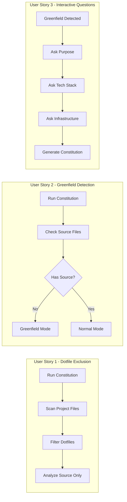

# Feature Specification: Constitution Command Improvements

**Feature Branch**: `020-constitution-improvements`
**Created**: 2026-01-13
**Status**: Complete
**Input**: User description: "when the constitution is run it should ignore the .doit and other folders that start with a . when assessing the project for the constitution if it is greenfield it should ask questions"

## Summary

Improve the `/doit.constitution` command with two enhancements: (1) exclude dotfiles and dotfolders when scanning the project for context inference, and (2) detect greenfield projects and provide interactive questioning to guide users through constitution creation.

## User Scenarios & Testing *(mandatory)*

### User Story 1 - Dotfile Exclusion During Project Scan (Priority: P1)

As a developer running the constitution command on an existing project, I want the command to ignore directories starting with `.` (like `.doit`, `.git`, `.vscode`, `.idea`, `.env`) when analyzing my codebase, so that it focuses on actual project code and doesn't get confused by configuration files or cached data.

**Why this priority**: This is a bug fix that directly impacts the accuracy of project assessment. Without this, the constitution command may incorrectly analyze metadata/config folders as project code.

**Independent Test**: Can be tested by running `/doit.constitution` on a project with multiple dotfolders and verifying they are not scanned or referenced in the output.

**Acceptance Scenarios**:

1. **Given** a project with `.doit`, `.git`, `.vscode`, and `.idea` directories, **When** the user runs `/doit.constitution`, **Then** none of these directories are scanned or referenced in the analysis
2. **Given** a project with a `.env` file and `.config` directory, **When** the constitution command infers tech stack, **Then** it ignores content from dotfiles and focuses on source code
3. **Given** a project with only dotfolders and no source code, **When** the constitution command runs, **Then** it correctly identifies the project as having no analyzable source files

---

### User Story 2 - Greenfield Project Detection (Priority: P1)

As a developer starting a new project, I want the constitution command to detect that my project is greenfield (empty or minimal), so that it can guide me through constitution creation with appropriate questions rather than trying to infer from non-existent code.

**Why this priority**: New projects need guided constitution creation since there's no existing code to analyze. Without this, users get a confusing experience trying to run constitution on empty projects.

**Independent Test**: Can be tested by running `/doit.constitution` on an empty or newly initialized project and verifying the command enters interactive mode.

**Acceptance Scenarios**:

1. **Given** an empty project directory with only `.doit` initialized, **When** the user runs `/doit.constitution`, **Then** the command detects it as greenfield and enters interactive mode
2. **Given** a project with only configuration files (no source code), **When** the user runs `/doit.constitution`, **Then** the command treats it as greenfield
3. **Given** a project with existing source code files, **When** the user runs `/doit.constitution`, **Then** the command proceeds with normal inference mode (not greenfield)

---

### User Story 3 - Interactive Questioning for Greenfield Projects (Priority: P2)

As a developer on a greenfield project, I want to be guided through a series of questions to establish my project constitution, so that I can define my project's purpose, tech stack, infrastructure, and principles without needing to know the constitution structure beforehand.

**Why this priority**: This enhances the greenfield experience but the core detection (US2) must work first. This builds on that foundation.

**Independent Test**: Can be tested by running `/doit.constitution` on an empty project and verifying all prompted questions appear and user responses are captured correctly.

**Acceptance Scenarios**:

1. **Given** a greenfield project, **When** the constitution command enters interactive mode, **Then** it asks about project purpose and goals first
2. **Given** the user answers the purpose question, **When** proceeding through the flow, **Then** the command asks about tech stack (language, frameworks, libraries)
3. **Given** all questions are answered, **When** the flow completes, **Then** the constitution is created with all user-provided values filled in

---

### Edge Cases

- What happens when a project has only dotfolders and a single README.md? (Treated as greenfield since README is not source code)
- How does the system handle a project with source code in a dotfolder like `.hidden-src`? (Still ignores it as a dotfolder)
- What if the user provides arguments to `/doit.constitution` on a greenfield project? (Arguments pre-fill relevant fields, skip those questions)
- What happens if interactive mode is interrupted mid-flow? (Partial constitution is not saved; user must complete or restart)

## User Journey Visualization

<!-- BEGIN:AUTO-GENERATED section="user-journey" -->

<!-- END:AUTO-GENERATED -->

## Requirements *(mandatory)*

### Functional Requirements

**Dotfile Exclusion:**

- **FR-001**: System MUST exclude all directories starting with `.` when scanning project for context
- **FR-002**: System MUST exclude all files starting with `.` (dotfiles) from source code analysis
- **FR-003**: System MUST still read `.doit/memory/constitution.md` as the target file for updates
- **FR-004**: System MUST log or indicate which directories were excluded when in verbose mode

**Greenfield Detection:**

- **FR-005**: System MUST detect a project as greenfield when no source code files exist outside of dotfolders
- **FR-006**: System MUST consider common source file extensions: `.py`, `.js`, `.ts`, `.java`, `.go`, `.rs`, `.rb`, `.php`, `.cs`, `.cpp`, `.c`, `.swift`, `.kt`
- **FR-007**: System MUST NOT count README, LICENSE, or documentation files as source code for greenfield detection
- **FR-008**: System MUST display a message indicating greenfield detection: "Detected greenfield project - entering interactive mode"

**Interactive Questioning:**

- **FR-009**: System MUST prompt for project purpose when in greenfield mode
- **FR-010**: System MUST prompt for primary programming language
- **FR-011**: System MUST prompt for frameworks (with option to skip if none)
- **FR-012**: System MUST prompt for key libraries (with option to skip if none)
- **FR-013**: System MUST prompt for hosting platform preference
- **FR-014**: System MUST prompt for database choice (including "none" option)
- **FR-015**: System MUST prompt for CI/CD preference
- **FR-016**: System MUST allow users to skip optional questions by pressing Enter
- **FR-017**: System MUST use provided `/doit.constitution` arguments to pre-fill answers and skip those questions

**Constitution Generation:**

- **FR-018**: System MUST generate a complete constitution from interactive answers
- **FR-019**: System MUST set `RATIFICATION_DATE` to current date for new constitutions
- **FR-020**: System MUST set initial version to `1.0.0` for new constitutions

## Success Criteria *(mandatory)*

### Measurable Outcomes

- **SC-001**: Running constitution on a project with 10+ dotfolders completes without referencing any dotfolder content
- **SC-002**: Greenfield detection correctly identifies empty projects with greater than 95% accuracy
- **SC-003**: Users can complete interactive constitution creation in under 5 minutes
- **SC-004**: All required constitution fields are populated after interactive flow completes
- **SC-005**: No placeholder tokens remain in constitution after greenfield interactive completion

## Assumptions

- Users understand basic project terminology (frameworks, CI/CD, hosting)
- The existing constitution template structure remains unchanged
- Interactive mode uses the AI agent's native conversation capabilities (no custom UI needed)
- Common source file extensions list covers majority of use cases (can be extended later)

## Out of Scope

- Custom UI for interactive questioning (uses standard AI chat interface)
- Supporting non-standard source file extensions
- Automatic tech stack detection from package.json, requirements.txt, etc. (future enhancement)
- Multi-language project detection
