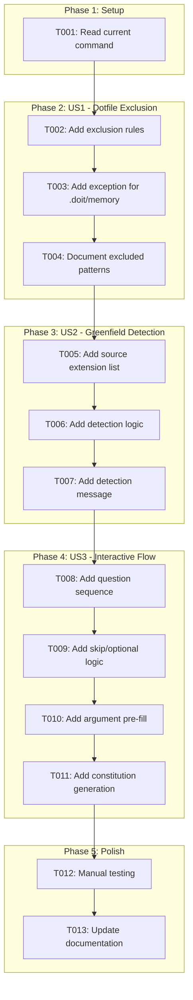
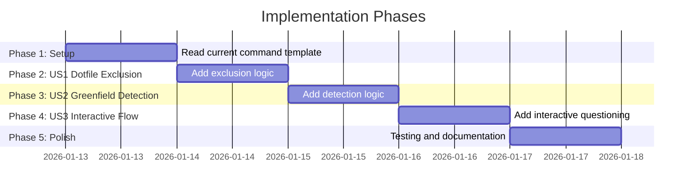

# Tasks: Constitution Command Improvements

**Input**: Design documents from `/specs/020-constitution-improvements/`
**Prerequisites**: plan.md (required), spec.md (required for user stories), research.md
**Epic**: #114 | **Features**: #115 (US1), #116 (US2), #117 (US3)

## Task Dependencies

<!-- BEGIN:AUTO-GENERATED section="task-dependencies" -->

<!-- END:AUTO-GENERATED -->

## Phase Timeline

<!-- BEGIN:AUTO-GENERATED section="phase-timeline" -->

<!-- END:AUTO-GENERATED -->

## Format: `[ID] [P?] [Story] Description`

- **[P]**: Can run in parallel (different files, no dependencies)
- **[Story]**: Which user story this task belongs to (e.g., US1, US2, US3)
- Include exact file paths in descriptions

## Path Conventions

- **Primary file**: `.claude/commands/doit.constitution.md` (command template)
- **Target output**: `.doit/memory/constitution.md` (generated file)

---

## Phase 1: Setup

**Purpose**: Understand current command structure before modifications

- [x] T001 Read and analyze current command template at `.claude/commands/doit.constitution.md` (#118)

---

## Phase 2: User Story 1 - Dotfile Exclusion During Project Scan (Priority: P1)

**Goal**: Exclude all dotfiles and dotfolders from project scanning to ensure accurate context inference

**Independent Test**: Run `/doit.constitution` on project with `.git`, `.vscode`, `.idea` folders and verify they are not referenced in output

### Implementation for User Story 1

- [x] T002 [US1] Add dotfile/dotfolder exclusion rules section to command template in `.claude/commands/doit.constitution.md` (#119)
  - Specify directories to exclude: `.git`, `.doit`, `.vscode`, `.idea`, `.env`, `.config`, `.cache`, `.npm`, `.yarn`
  - Specify files to exclude: any path starting with `.`

- [x] T003 [US1] Add exception rule for reading `.doit/memory/constitution.md` as target file in `.claude/commands/doit.constitution.md` (#120)
  - Ensure this file can still be read/written despite dotfolder exclusion

- [x] T004 [US1] Document excluded patterns in command template in `.claude/commands/doit.constitution.md` (#121)
  - Add clear list of what is excluded and why
  - Note that `node_modules` should also be excluded (non-dotfolder but irrelevant)

**Checkpoint**: Dotfile exclusion logic complete - command will no longer scan dotfolders

---

## Phase 3: User Story 2 - Greenfield Project Detection (Priority: P1)

**Goal**: Detect when a project has no source code and should enter interactive mode

**Independent Test**: Run `/doit.constitution` on empty project (only `.doit` initialized) and verify "Detected greenfield project" message appears

### Implementation for User Story 2

- [x] T005 [US2] Add source file extension list to command template in `.claude/commands/doit.constitution.md` (#122)
  - Include: `.py`, `.js`, `.ts`, `.jsx`, `.tsx`, `.java`, `.go`, `.rs`, `.rb`, `.php`, `.cs`, `.cpp`, `.c`, `.h`, `.swift`, `.kt`, `.scala`, `.clj`, `.ex`, `.exs`
  - Exclude from count: `.md`, `.json`, `.yaml`, `.yml`, `Makefile`, `Dockerfile`

- [x] T006 [US2] Add greenfield detection logic to command template in `.claude/commands/doit.constitution.md` (#123)
  - After dotfile filtering, count files with source extensions
  - If count == 0: project is greenfield
  - If count > 0: proceed with normal inference mode

- [x] T007 [US2] Add greenfield detection message to command template in `.claude/commands/doit.constitution.md` (#124)
  - Display: "Detected greenfield project - entering interactive mode"
  - Add branching logic to route to interactive questioning

**Checkpoint**: Greenfield detection complete - command now identifies empty projects

---

## Phase 4: User Story 3 - Interactive Questioning for Greenfield Projects (Priority: P2)

**Goal**: Guide users through constitution creation with prompted questions

**Independent Test**: Run `/doit.constitution` on empty project, answer all questions, verify complete constitution is generated

### Implementation for User Story 3

- [x] T008 [US3] Add question sequence to command template in `.claude/commands/doit.constitution.md` (#125)
  - Q1: Project purpose and goals (mandatory) -> maps to [PROJECT_PURPOSE], [SUCCESS_CRITERIA]
  - Q2: Primary programming language (mandatory) -> maps to [PRIMARY_LANGUAGE]
  - Q3: Frameworks (optional, Enter to skip) -> maps to [FRAMEWORKS]
  - Q4: Key libraries (optional, Enter to skip) -> maps to [KEY_LIBRARIES]
  - Q5: Hosting platform preference (optional) -> maps to [HOSTING_PLATFORM]
  - Q6: Database choice including "none" (optional) -> maps to [DATABASE]
  - Q7: CI/CD preference (optional) -> maps to [CICD_PIPELINE]

- [x] T009 [US3] Add skip/optional logic for questions in `.claude/commands/doit.constitution.md` (#126)
  - Allow users to skip optional questions by pressing Enter or typing "skip"
  - Mark which questions are mandatory vs optional

- [x] T010 [US3] Add argument pre-fill logic to command template in `.claude/commands/doit.constitution.md` (#127)
  - Parse arguments provided with `/doit.constitution` command
  - Match keywords to categories (language, framework, database, hosting, CI/CD)
  - Skip questions where arguments provide answers
  - Example: `/doit.constitution Python FastAPI PostgreSQL` skips Q2, Q3, Q6

- [x] T011 [US3] Add constitution generation from answers in `.claude/commands/doit.constitution.md` (#128)
  - Map all answers to corresponding template placeholders
  - Set RATIFICATION_DATE to current date
  - Set initial version to 1.0.0
  - Generate complete constitution file at `.doit/memory/constitution.md`

**Checkpoint**: Interactive flow complete - greenfield users can create constitution through guided questions

---

## Phase 5: Polish & Validation

**Purpose**: Verify implementation against success criteria

- [x] T012 Manual testing following quickstart.md checklist (#129)
  - MT-001: Test dotfile exclusion with `.git`, `.vscode`, `.idea` folders
  - MT-002: Test greenfield detection on empty project
  - MT-003: Test existing project detection
  - MT-004: Test argument pre-fill
  - MT-005: Test complete interactive flow

- [x] T013 [P] Update any related documentation in docs/ if needed (#130)

---

## Dependencies & Execution Order

### Phase Dependencies

- **Setup (Phase 1)**: No dependencies - read and understand current template
- **US1 Dotfile Exclusion (Phase 2)**: Depends on Setup - must understand template before modifying
- **US2 Greenfield Detection (Phase 3)**: Depends on US1 - detection requires filtering to work correctly
- **US3 Interactive Flow (Phase 4)**: Depends on US2 - interactive mode is triggered by greenfield detection
- **Polish (Phase 5)**: Depends on all user stories complete

### Task Dependencies Within Phases

- T002-T004 must be sequential (building on each other in same file)
- T005-T007 must be sequential (building on each other in same file)
- T008-T011 must be sequential (building on each other in same file)
- T012-T013 can run in parallel after implementation complete

---

## Implementation Strategy

### Single-File Update

All implementation tasks modify the same file: `.claude/commands/doit.constitution.md`

Tasks should be completed sequentially to avoid conflicts and ensure coherent template structure.

### MVP First (User Story 1 + 2)

1. Complete Phase 1: Setup
2. Complete Phase 2: US1 (Dotfile Exclusion)
3. Complete Phase 3: US2 (Greenfield Detection)
4. **STOP and VALIDATE**: Test dotfile exclusion and greenfield detection
5. Continue to Phase 4: US3 (Interactive Flow)
6. Complete Phase 5: Polish

---

## Notes

- All tasks modify the same Markdown template file
- No code compilation or build steps required
- Testing is manual - run `/doit.constitution` on test projects
- Commit after each phase completion for safe rollback
