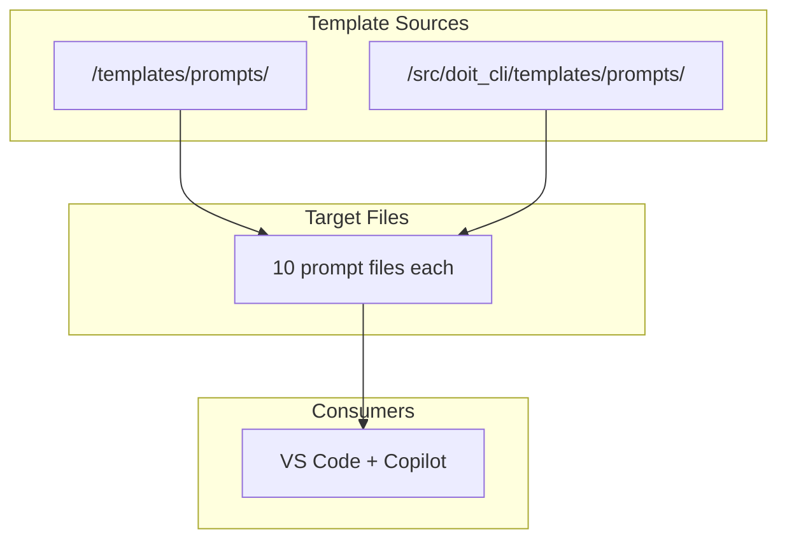

# Implementation Plan: GitHub Copilot Prompt File Fix

**Branch**: `021-copilot-agent-fix` | **Date**: 2026-01-13 | **Spec**: [spec.md](spec.md)
**Input**: Feature specification from `/specs/021-copilot-agent-fix/spec.md`

## Summary

Update 20 prompt files (`.prompt.md`) across two directories to replace the deprecated `mode: agent` YAML frontmatter attribute with `agent: true`. This is a text replacement task with no code changes, ensuring compatibility with VS Code 1.106+ and the current GitHub Copilot prompt file specification.

## Technical Context

**Language/Version**: Markdown (YAML frontmatter)
**Primary Dependencies**: None (text files only)
**Storage**: N/A (no database involved)
**Testing**: Manual verification via grep commands
**Target Platform**: VS Code 1.106+ with GitHub Copilot extension
**Project Type**: single (configuration files)
**Performance Goals**: N/A (static files)
**Constraints**: Must preserve all other frontmatter properties exactly
**Scale/Scope**: 20 files (10 per directory)

## Architecture Overview

<!-- BEGIN:AUTO-GENERATED section="architecture" -->

<!-- END:AUTO-GENERATED -->

## Constitution Check

*GATE: Must pass before Phase 0 research. Re-check after Phase 1 design.*

| Principle | Compliance | Notes |
|-----------|------------|-------|
| I. Specification-First | ✅ PASS | Spec created before implementation |
| II. Persistent Memory | ✅ PASS | No memory files affected |
| III. Auto-Generated Diagrams | ✅ N/A | No diagrams in prompt files |
| IV. Opinionated Workflow | ✅ PASS | Following specit → planit → taskit flow |
| V. AI-Native Design | ✅ PASS | Updating AI assistant integration files |

**Tech Stack Alignment**: This feature modifies template files only, not Python code. No deviation from constitution tech stack.

## Project Structure

### Documentation (this feature)

```text
specs/021-copilot-agent-fix/
├── plan.md              # This file
├── research.md          # Phase 0: Deprecation research (complete)
├── quickstart.md        # Phase 1: Implementation guide
└── tasks.md             # Phase 2: Task breakdown (via /doit.taskit)
```

### Source Files (to be modified)

```text
templates/prompts/
├── doit-checkin.prompt.md       # mode: agent → agent: true
├── doit-constitution.prompt.md  # mode: agent → agent: true
├── doit-documentit.prompt.md    # mode: agent → agent: true
├── doit-implementit.prompt.md   # mode: agent → agent: true
├── doit-planit.prompt.md        # mode: agent → agent: true
├── doit-reviewit.prompt.md      # mode: agent → agent: true
├── doit-roadmapit.prompt.md     # mode: agent → agent: true
├── doit-scaffoldit.prompt.md    # mode: agent → agent: true
├── doit-specit.prompt.md        # mode: agent → agent: true
├── doit-taskit.prompt.md        # mode: agent → agent: true
└── doit-testit.prompt.md        # ALREADY CORRECT (reference)

src/doit_cli/templates/prompts/
├── [same 11 files as above]
└── [same changes required]
```

**Structure Decision**: Single project structure. This is a configuration fix, not a code change. Files are organized in standard DoIt template locations.

## Complexity Tracking

> No constitution violations. This is a minimal-scope text replacement task.

## Implementation Approach

### Phase 1: Text Replacement

For each of the 10 files needing updates in both directories:

1. Open file
2. Replace line 2: `mode: agent` → `agent: true`
3. Preserve all other content exactly
4. Save file

### Phase 2: Validation

After all updates:

```bash
# Verify no deprecated syntax remains
grep -r "mode: agent" templates/prompts/ src/doit_cli/templates/prompts/
# Expected: No results

# Verify correct syntax is present
grep -r "agent: true" templates/prompts/ src/doit_cli/templates/prompts/
# Expected: 22 results (11 per directory)
```

## Key Decisions

| Decision | Choice | Rationale |
|----------|--------|-----------|
| Update approach | Direct text replacement | Simple, auditable, no tooling needed |
| File preservation | Keep all other properties | Minimize change surface area |
| Validation method | Grep commands | Quick, reliable verification |
| Scope | 2 directories only | `.venv/` is derived, updates on reinstall |

## Risk Assessment

| Risk | Likelihood | Impact | Mitigation |
|------|------------|--------|------------|
| Breaking prompt execution | Low | Medium | Test in VS Code after update |
| Missing files | Low | Low | Pre-counted files (20 total) |
| Incorrect syntax | Low | Low | Reference `doit-testit.prompt.md` format |

## Dependencies

- VS Code 1.106+ (for prompt file support)
- GitHub Copilot extension (for agent mode)
- No external dependencies for implementation

## Next Steps

1. Run `/doit.taskit` to generate task breakdown
2. Execute text replacements (20 files)
3. Run validation grep commands
4. Test in VS Code with Copilot
5. Run `/doit.reviewit` and `/doit.checkin`
