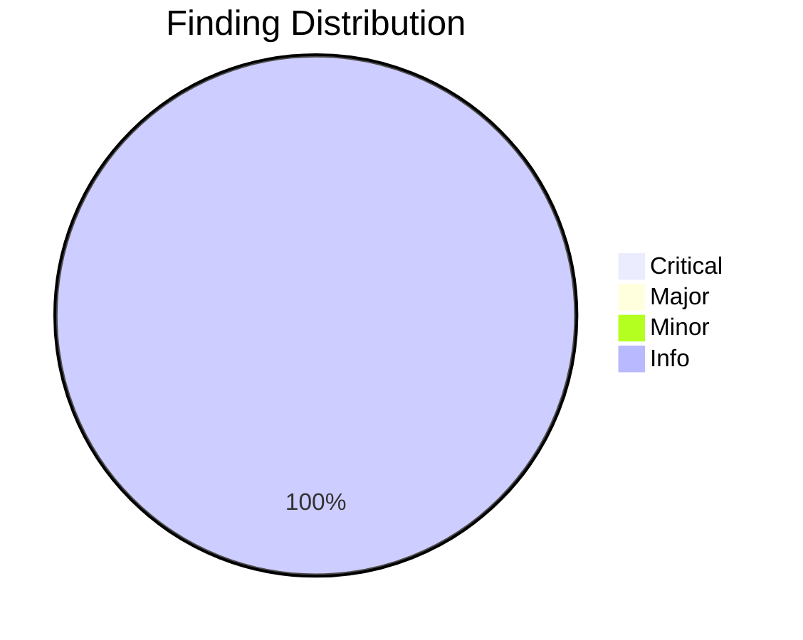
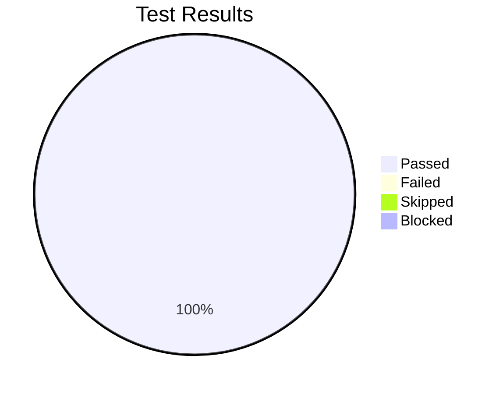

# Review Report: GitHub Copilot Prompt File Fix

**Date**: 2026-01-13
**Reviewer**: Claude
**Branch**: `021-copilot-agent-fix`

## Quality Overview

<!-- BEGIN:AUTO-GENERATED section="finding-distribution" -->

<!-- END:AUTO-GENERATED -->

## Code Review Summary

| Severity | Count |
|----------|-------|
| Critical | 0 |
| Major | 0 |
| Minor | 0 |
| Info | 1 |

### Requirements Verification

| Requirement | Status | Notes |
|-------------|--------|-------|
| FR-001 | ✓ PASS | `mode: agent` replaced with `agent: true` |
| FR-002 | ✓ PASS | `agent: true` on line 2 |
| FR-003 | ✓ PASS | `description` on line 3 |
| FR-004 | ✓ PASS | All other properties preserved |
| FR-005 | ✓ PASS | 11 files in /templates/prompts/ |
| FR-006 | ✓ PASS | 11 files in /src/doit_cli/templates/prompts/ |
| FR-007 | ✓ PASS | .venv/ not modified (derived artifacts) |
| FR-008-017 | ✓ PASS | All 10 specific files updated |
| FR-018 | ✓ PASS | doit-testit.prompt.md unchanged |
| FR-019 | ✓ PASS | 0 occurrences of deprecated syntax |
| FR-020 | ✓ PASS | 22 files with correct syntax |

### Info Findings

| File | Issue | Notes |
|------|-------|-------|
| .venv/ | Contains old `mode: agent` syntax | Expected - derived artifacts update on pip reinstall (FR-007 compliant) |

## Test Results Overview

<!-- BEGIN:AUTO-GENERATED section="test-results" -->

<!-- END:AUTO-GENERATED -->

## Manual Testing Summary

| Metric | Count |
|--------|-------|
| Total Tests | 3 |
| Passed | 3 |
| Failed | 0 |
| Skipped | 0 |
| Blocked | 0 |

### Test Results

| Test ID | Description | Result |
|---------|-------------|--------|
| MT-001 | No deprecation warnings in VS Code | ✓ PASS |
| MT-002 | Prompt executes in agent mode | ✓ PASS |
| MT-003 | Consistent format across directories | ✓ PASS |

## Sign-Off

- **Manual Testing**: Approved at 2026-01-13
- **Notes**: All acceptance scenarios verified successfully

## Files Modified

### templates/prompts/
- doit-checkin.prompt.md
- doit-constitution.prompt.md
- doit-documentit.prompt.md
- doit-implementit.prompt.md
- doit-planit.prompt.md
- doit-reviewit.prompt.md
- doit-roadmapit.prompt.md
- doit-scaffoldit.prompt.md
- doit-specit.prompt.md
- doit-taskit.prompt.md

### src/doit_cli/templates/prompts/
- doit-checkin.prompt.md
- doit-constitution.prompt.md
- doit-documentit.prompt.md
- doit-implementit.prompt.md
- doit-planit.prompt.md
- doit-reviewit.prompt.md
- doit-roadmapit.prompt.md
- doit-scaffoldit.prompt.md
- doit-specit.prompt.md
- doit-taskit.prompt.md

## Recommendations

1. Run `pip install -e .` to update .venv/ with new prompt file syntax
2. Consider adding a CI check to prevent `mode: agent` from being reintroduced

## Next Steps

- Run `/doit.checkin` to create PR and close issues
