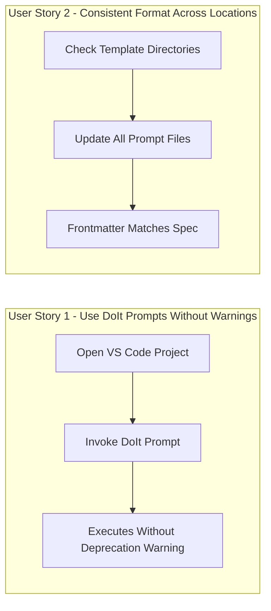

# Feature Specification: GitHub Copilot Prompt File Fix

**Feature Branch**: `021-copilot-agent-fix`
**Created**: 2026-01-13
**Status**: Complete
**Input**: User description: "Fix the deprecated mode: agent attribute by renaming it to agent: true for github copilot. check the latest spec and make sure we align to it"

## Summary

Update DoIt's GitHub Copilot prompt files (`.prompt.md`) to use the current (non-deprecated) YAML frontmatter specification. This involves changing the deprecated `mode: agent` attribute to `agent: true` across all prompt files, ensuring compatibility with the current VS Code Copilot specification.

## User Scenarios & Testing *(mandatory)*

### User Story 1 - Use DoIt Prompt Files Without Deprecation Warnings (Priority: P1)

As a developer using GitHub Copilot in VS Code, I want DoIt's prompt files to work without deprecation warnings, so that I can use the spec-driven development workflow seamlessly without error messages.

**Why this priority**: This is a compatibility fix that addresses a known deprecation. The `mode: agent` attribute has been deprecated in favor of `agent: true`. Without this fix, users may see warnings or face compatibility issues in future Copilot versions.

**Independent Test**: Can be tested by loading a project with DoIt prompt files in VS Code and verifying no deprecation warnings appear when using the prompts.

**Acceptance Scenarios**:

1. **Given** a user has VS Code with GitHub Copilot installed, **When** they open a project containing DoIt prompt files, **Then** no deprecation warnings are displayed about `mode: agent`
2. **Given** a prompt file uses `agent: true` syntax, **When** the user invokes the prompt via `/command`, **Then** the prompt executes in agent mode correctly
3. **Given** all 11 DoIt prompt files are updated, **When** comparing against the VS Code Copilot specification, **Then** all frontmatter properties match the current documented format

---

### User Story 2 - Maintain Consistent Format Across All Locations (Priority: P1)

As a DoIt maintainer, I want all prompt files in both template directories to use the same correct format, so that users get consistent behavior regardless of which template source is used.

**Why this priority**: DoIt has prompt files in two locations that must stay synchronized: `/templates/prompts/` and `/src/doit_cli/templates/prompts/`. Inconsistency causes confusion and potential bugs.

**Independent Test**: Can be tested by comparing frontmatter across all prompt file locations.

**Acceptance Scenarios**:

1. **Given** prompt files exist in `/templates/prompts/`, **When** checking their frontmatter, **Then** all use `agent: true` (not `mode: agent`)
2. **Given** prompt files exist in `/src/doit_cli/templates/prompts/`, **When** checking their frontmatter, **Then** all use `agent: true` (not `mode: agent`)
3. **Given** both locations are updated, **When** comparing corresponding files, **Then** frontmatter format matches exactly

---

### Edge Cases

- What happens if additional frontmatter properties need updating? (Only `mode: agent` → `agent: true` is in scope; other properties are already correct)
- What if VS Code version doesn't support `agent: true`? (Users need VS Code 1.106+ for prompt files feature)
- How to handle `.venv/` installed copies? (Out of scope - those are derived from pip install and will update on reinstall)

## User Journey Visualization

<!-- BEGIN:AUTO-GENERATED section="user-journey" -->

<!-- END:AUTO-GENERATED -->

## Requirements *(mandatory)*

### Functional Requirements

**Frontmatter Update:**

- **FR-001**: All prompt files MUST replace `mode: agent` with `agent: true` in YAML frontmatter
- **FR-002**: The `agent: true` property MUST be on line 2 of each file (after opening `---`)
- **FR-003**: The `description` property MUST remain unchanged on line 3
- **FR-004**: All other frontmatter properties MUST be preserved exactly

**File Locations:**

- **FR-005**: Prompt files in `/templates/prompts/` MUST be updated (10 files)
- **FR-006**: Prompt files in `/src/doit_cli/templates/prompts/` MUST be updated (10 files)
- **FR-007**: Files in `.venv/` directory MUST NOT be modified (derived artifacts)

**Files to Update:**

- **FR-008**: `doit-checkin.prompt.md` MUST be updated from `mode: agent` to `agent: true`
- **FR-009**: `doit-constitution.prompt.md` MUST be updated from `mode: agent` to `agent: true`
- **FR-010**: `doit-documentit.prompt.md` MUST be updated from `mode: agent` to `agent: true`
- **FR-011**: `doit-implementit.prompt.md` MUST be updated from `mode: agent` to `agent: true`
- **FR-012**: `doit-planit.prompt.md` MUST be updated from `mode: agent` to `agent: true`
- **FR-013**: `doit-reviewit.prompt.md` MUST be updated from `mode: agent` to `agent: true`
- **FR-014**: `doit-roadmapit.prompt.md` MUST be updated from `mode: agent` to `agent: true`
- **FR-015**: `doit-scaffoldit.prompt.md` MUST be updated from `mode: agent` to `agent: true`
- **FR-016**: `doit-specit.prompt.md` MUST be updated from `mode: agent` to `agent: true`
- **FR-017**: `doit-taskit.prompt.md` MUST be updated from `mode: agent` to `agent: true`

**Validation:**

- **FR-018**: `doit-testit.prompt.md` MUST remain unchanged (already correct)
- **FR-019**: After update, zero prompt files should contain `mode: agent`
- **FR-020**: After update, all 11 prompt files in each location should contain `agent: true`

## Success Criteria *(mandatory)*

### Measurable Outcomes

- **SC-001**: 100% of prompt files (22 files across 2 directories) pass YAML frontmatter validation
- **SC-002**: Zero occurrences of `mode: agent` remain in any `.prompt.md` file
- **SC-003**: All 11 DoIt prompts load successfully in VS Code 1.106+ without deprecation warnings
- **SC-004**: Grep for `mode: agent` in `/templates/prompts/` and `/src/doit_cli/templates/prompts/` returns no results
- **SC-005**: Grep for `agent: true` returns exactly 11 results in each prompt directory

## Assumptions

- VS Code prompt file specification uses `agent: true` as the correct format (verified via documentation)
- The deprecated `mode: agent` attribute functions identically to `agent: true`
- No other frontmatter properties require changes at this time
- Users running older VS Code versions (< 1.106) are out of scope

## Out of Scope

- Updating files in `.venv/` directory (derived from pip install)
- Adding new frontmatter properties beyond the deprecation fix
- Updating Claude Code commands (`.claude/commands/` files use a different format)
- Documentation updates (if needed, will be a separate task)
