# Implementation Tasks: GitHub Copilot Prompt File Fix

**Feature**: 021-copilot-agent-fix | **Generated**: 2026-01-13
**Spec**: [spec.md](spec.md) | **Plan**: [plan.md](plan.md)

## Task Dependencies

```mermaid
flowchart TD
    subgraph "Phase 1: Template Directory Updates"
        T1[T1: Update doit-checkin.prompt.md]
        T2[T2: Update doit-constitution.prompt.md]
        T3[T3: Update doit-documentit.prompt.md]
        T4[T4: Update doit-implementit.prompt.md]
        T5[T5: Update doit-planit.prompt.md]
        T6[T6: Update doit-reviewit.prompt.md]
        T7[T7: Update doit-roadmapit.prompt.md]
        T8[T8: Update doit-scaffoldit.prompt.md]
        T9[T9: Update doit-specit.prompt.md]
        T10[T10: Update doit-taskit.prompt.md]
    end
    subgraph "Phase 2: Source Directory Updates"
        T11[T11: Update src doit-checkin.prompt.md]
        T12[T12: Update src doit-constitution.prompt.md]
        T13[T13: Update src doit-documentit.prompt.md]
        T14[T14: Update src doit-implementit.prompt.md]
        T15[T15: Update src doit-planit.prompt.md]
        T16[T16: Update src doit-reviewit.prompt.md]
        T17[T17: Update src doit-roadmapit.prompt.md]
        T18[T18: Update src doit-scaffoldit.prompt.md]
        T19[T19: Update src doit-specit.prompt.md]
        T20[T20: Update src doit-taskit.prompt.md]
    end
    subgraph "Phase 3: Validation"
        V1[V1: Verify no deprecated syntax]
        V2[V2: Verify correct syntax count]
    end
    T1 & T2 & T3 & T4 & T5 & T6 & T7 & T8 & T9 & T10 --> V1
    T11 & T12 & T13 & T14 & T15 & T16 & T17 & T18 & T19 & T20 --> V1
    V1 --> V2
```

<!-- BEGIN:AUTO-GENERATED section="dependencies" -->

<!-- END:AUTO-GENERATED -->

## Phase Timeline

```mermaid
gantt
    title Implementation Timeline
    dateFormat X
    axisFormat %s min
    section Phase 1
    Update /templates/prompts/ files (10 parallel)    :t1, 0, 2
    section Phase 2
    Update /src/doit_cli/templates/prompts/ files (10 parallel)    :t2, 2, 4
    section Phase 3
    Validation    :v1, 4, 5
```

<!-- BEGIN:AUTO-GENERATED section="timeline" -->

<!-- END:AUTO-GENERATED -->

---

## User Story 1: Use DoIt Prompts Without Deprecation Warnings

> As a developer using GitHub Copilot in VS Code, I want DoIt's prompt files to work without deprecation warnings, so that I can use the spec-driven development workflow seamlessly without error messages.

### Task T1: Update doit-checkin.prompt.md in /templates/prompts/

**Requirement**: FR-008
**Priority**: P1 | **Effort**: XS | **Parallel**: Yes

**Change**:
- File: `templates/prompts/doit-checkin.prompt.md`
- Line 2: `mode: agent` → `agent: true`

**Verification**: `grep "agent: true" templates/prompts/doit-checkin.prompt.md`

---

### Task T2: Update doit-constitution.prompt.md in /templates/prompts/

**Requirement**: FR-009
**Priority**: P1 | **Effort**: XS | **Parallel**: Yes

**Change**:
- File: `templates/prompts/doit-constitution.prompt.md`
- Line 2: `mode: agent` → `agent: true`

**Verification**: `grep "agent: true" templates/prompts/doit-constitution.prompt.md`

---

### Task T3: Update doit-documentit.prompt.md in /templates/prompts/

**Requirement**: FR-010
**Priority**: P1 | **Effort**: XS | **Parallel**: Yes

**Change**:
- File: `templates/prompts/doit-documentit.prompt.md`
- Line 2: `mode: agent` → `agent: true`

**Verification**: `grep "agent: true" templates/prompts/doit-documentit.prompt.md`

---

### Task T4: Update doit-implementit.prompt.md in /templates/prompts/

**Requirement**: FR-011
**Priority**: P1 | **Effort**: XS | **Parallel**: Yes

**Change**:
- File: `templates/prompts/doit-implementit.prompt.md`
- Line 2: `mode: agent` → `agent: true`

**Verification**: `grep "agent: true" templates/prompts/doit-implementit.prompt.md`

---

### Task T5: Update doit-planit.prompt.md in /templates/prompts/

**Requirement**: FR-012
**Priority**: P1 | **Effort**: XS | **Parallel**: Yes

**Change**:
- File: `templates/prompts/doit-planit.prompt.md`
- Line 2: `mode: agent` → `agent: true`

**Verification**: `grep "agent: true" templates/prompts/doit-planit.prompt.md`

---

### Task T6: Update doit-reviewit.prompt.md in /templates/prompts/

**Requirement**: FR-013
**Priority**: P1 | **Effort**: XS | **Parallel**: Yes

**Change**:
- File: `templates/prompts/doit-reviewit.prompt.md`
- Line 2: `mode: agent` → `agent: true`

**Verification**: `grep "agent: true" templates/prompts/doit-reviewit.prompt.md`

---

### Task T7: Update doit-roadmapit.prompt.md in /templates/prompts/

**Requirement**: FR-014
**Priority**: P1 | **Effort**: XS | **Parallel**: Yes

**Change**:
- File: `templates/prompts/doit-roadmapit.prompt.md`
- Line 2: `mode: agent` → `agent: true`

**Verification**: `grep "agent: true" templates/prompts/doit-roadmapit.prompt.md`

---

### Task T8: Update doit-scaffoldit.prompt.md in /templates/prompts/

**Requirement**: FR-015
**Priority**: P1 | **Effort**: XS | **Parallel**: Yes

**Change**:
- File: `templates/prompts/doit-scaffoldit.prompt.md`
- Line 2: `mode: agent` → `agent: true`

**Verification**: `grep "agent: true" templates/prompts/doit-scaffoldit.prompt.md`

---

### Task T9: Update doit-specit.prompt.md in /templates/prompts/

**Requirement**: FR-016
**Priority**: P1 | **Effort**: XS | **Parallel**: Yes

**Change**:
- File: `templates/prompts/doit-specit.prompt.md`
- Line 2: `mode: agent` → `agent: true`

**Verification**: `grep "agent: true" templates/prompts/doit-specit.prompt.md`

---

### Task T10: Update doit-taskit.prompt.md in /templates/prompts/

**Requirement**: FR-017
**Priority**: P1 | **Effort**: XS | **Parallel**: Yes

**Change**:
- File: `templates/prompts/doit-taskit.prompt.md`
- Line 2: `mode: agent` → `agent: true`

**Verification**: `grep "agent: true" templates/prompts/doit-taskit.prompt.md`

---

## User Story 2: Maintain Consistent Format Across All Locations

> As a DoIt maintainer, I want all prompt files in both template directories to use the same correct format, so that users get consistent behavior regardless of which template source is used.

### Task T11: Update doit-checkin.prompt.md in /src/doit_cli/templates/prompts/

**Requirement**: FR-008, FR-006
**Priority**: P1 | **Effort**: XS | **Parallel**: Yes

**Change**:
- File: `src/doit_cli/templates/prompts/doit-checkin.prompt.md`
- Line 2: `mode: agent` → `agent: true`

**Verification**: `grep "agent: true" src/doit_cli/templates/prompts/doit-checkin.prompt.md`

---

### Task T12: Update doit-constitution.prompt.md in /src/doit_cli/templates/prompts/

**Requirement**: FR-009, FR-006
**Priority**: P1 | **Effort**: XS | **Parallel**: Yes

**Change**:
- File: `src/doit_cli/templates/prompts/doit-constitution.prompt.md`
- Line 2: `mode: agent` → `agent: true`

**Verification**: `grep "agent: true" src/doit_cli/templates/prompts/doit-constitution.prompt.md`

---

### Task T13: Update doit-documentit.prompt.md in /src/doit_cli/templates/prompts/

**Requirement**: FR-010, FR-006
**Priority**: P1 | **Effort**: XS | **Parallel**: Yes

**Change**:
- File: `src/doit_cli/templates/prompts/doit-documentit.prompt.md`
- Line 2: `mode: agent` → `agent: true`

**Verification**: `grep "agent: true" src/doit_cli/templates/prompts/doit-documentit.prompt.md`

---

### Task T14: Update doit-implementit.prompt.md in /src/doit_cli/templates/prompts/

**Requirement**: FR-011, FR-006
**Priority**: P1 | **Effort**: XS | **Parallel**: Yes

**Change**:
- File: `src/doit_cli/templates/prompts/doit-implementit.prompt.md`
- Line 2: `mode: agent` → `agent: true`

**Verification**: `grep "agent: true" src/doit_cli/templates/prompts/doit-implementit.prompt.md`

---

### Task T15: Update doit-planit.prompt.md in /src/doit_cli/templates/prompts/

**Requirement**: FR-012, FR-006
**Priority**: P1 | **Effort**: XS | **Parallel**: Yes

**Change**:
- File: `src/doit_cli/templates/prompts/doit-planit.prompt.md`
- Line 2: `mode: agent` → `agent: true`

**Verification**: `grep "agent: true" src/doit_cli/templates/prompts/doit-planit.prompt.md`

---

### Task T16: Update doit-reviewit.prompt.md in /src/doit_cli/templates/prompts/

**Requirement**: FR-013, FR-006
**Priority**: P1 | **Effort**: XS | **Parallel**: Yes

**Change**:
- File: `src/doit_cli/templates/prompts/doit-reviewit.prompt.md`
- Line 2: `mode: agent` → `agent: true`

**Verification**: `grep "agent: true" src/doit_cli/templates/prompts/doit-reviewit.prompt.md`

---

### Task T17: Update doit-roadmapit.prompt.md in /src/doit_cli/templates/prompts/

**Requirement**: FR-014, FR-006
**Priority**: P1 | **Effort**: XS | **Parallel**: Yes

**Change**:
- File: `src/doit_cli/templates/prompts/doit-roadmapit.prompt.md`
- Line 2: `mode: agent` → `agent: true`

**Verification**: `grep "agent: true" src/doit_cli/templates/prompts/doit-roadmapit.prompt.md`

---

### Task T18: Update doit-scaffoldit.prompt.md in /src/doit_cli/templates/prompts/

**Requirement**: FR-015, FR-006
**Priority**: P1 | **Effort**: XS | **Parallel**: Yes

**Change**:
- File: `src/doit_cli/templates/prompts/doit-scaffoldit.prompt.md`
- Line 2: `mode: agent` → `agent: true`

**Verification**: `grep "agent: true" src/doit_cli/templates/prompts/doit-scaffoldit.prompt.md`

---

### Task T19: Update doit-specit.prompt.md in /src/doit_cli/templates/prompts/

**Requirement**: FR-016, FR-006
**Priority**: P1 | **Effort**: XS | **Parallel**: Yes

**Change**:
- File: `src/doit_cli/templates/prompts/doit-specit.prompt.md`
- Line 2: `mode: agent` → `agent: true`

**Verification**: `grep "agent: true" src/doit_cli/templates/prompts/doit-specit.prompt.md`

---

### Task T20: Update doit-taskit.prompt.md in /src/doit_cli/templates/prompts/

**Requirement**: FR-017, FR-006
**Priority**: P1 | **Effort**: XS | **Parallel**: Yes

**Change**:
- File: `src/doit_cli/templates/prompts/doit-taskit.prompt.md`
- Line 2: `mode: agent` → `agent: true`

**Verification**: `grep "agent: true" src/doit_cli/templates/prompts/doit-taskit.prompt.md`

---

## Validation Tasks

### Task V1: Verify No Deprecated Syntax Remains

**Requirement**: FR-019
**Priority**: P1 | **Effort**: XS | **Depends On**: T1-T20

**Command**:
```bash
grep -r "mode: agent" templates/prompts/ src/doit_cli/templates/prompts/
```

**Expected**: No output (0 results)

---

### Task V2: Verify Correct Syntax Count

**Requirement**: FR-020
**Priority**: P1 | **Effort**: XS | **Depends On**: V1

**Command**:
```bash
grep -r "agent: true" templates/prompts/ src/doit_cli/templates/prompts/ | wc -l
```

**Expected**: 22 (11 files × 2 directories)

---

## Summary

| Metric | Value |
|--------|-------|
| Total Tasks | 22 |
| Completed Tasks | 22 |
| Parallel Opportunities | T1-T10 (parallel), T11-T20 (parallel) |
| Estimated Total Effort | XS (all tasks are text replacements) |
| Critical Path | Any single task → V1 → V2 |
| Files Modified | 20 |
| Files Unchanged | 2 (doit-testit.prompt.md in both directories) |

## Task Completion Status

- [x] T1: Update doit-checkin.prompt.md in /templates/prompts/
- [x] T2: Update doit-constitution.prompt.md in /templates/prompts/
- [x] T3: Update doit-documentit.prompt.md in /templates/prompts/
- [x] T4: Update doit-implementit.prompt.md in /templates/prompts/
- [x] T5: Update doit-planit.prompt.md in /templates/prompts/
- [x] T6: Update doit-reviewit.prompt.md in /templates/prompts/
- [x] T7: Update doit-roadmapit.prompt.md in /templates/prompts/
- [x] T8: Update doit-scaffoldit.prompt.md in /templates/prompts/
- [x] T9: Update doit-specit.prompt.md in /templates/prompts/
- [x] T10: Update doit-taskit.prompt.md in /templates/prompts/
- [x] T11: Update doit-checkin.prompt.md in /src/doit_cli/templates/prompts/
- [x] T12: Update doit-constitution.prompt.md in /src/doit_cli/templates/prompts/
- [x] T13: Update doit-documentit.prompt.md in /src/doit_cli/templates/prompts/
- [x] T14: Update doit-implementit.prompt.md in /src/doit_cli/templates/prompts/
- [x] T15: Update doit-planit.prompt.md in /src/doit_cli/templates/prompts/
- [x] T16: Update doit-reviewit.prompt.md in /src/doit_cli/templates/prompts/
- [x] T17: Update doit-roadmapit.prompt.md in /src/doit_cli/templates/prompts/
- [x] T18: Update doit-scaffoldit.prompt.md in /src/doit_cli/templates/prompts/
- [x] T19: Update doit-specit.prompt.md in /src/doit_cli/templates/prompts/
- [x] T20: Update doit-taskit.prompt.md in /src/doit_cli/templates/prompts/
- [x] V1: Verify no deprecated syntax remains
- [x] V2: Verify correct syntax count (22 files)

## Execution Order

1. **Phase 1** (Parallel): Execute T1-T10 simultaneously ✓
2. **Phase 2** (Parallel): Execute T11-T20 simultaneously ✓
3. **Phase 3** (Sequential): Run V1, then V2 ✓
