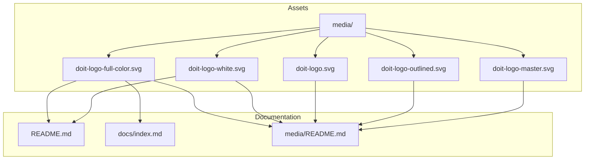

# Implementation Plan: Documentation Logo Integration

**Branch**: `022-docs-logo-integration` | **Date**: 2026-01-14 | **Spec**: [spec.md](./spec.md)
**Input**: Feature specification from `/specs/022-docs-logo-integration/spec.md`

## Summary

Integrate DoIt framework logos into README.md and documentation to establish visual branding. This is a documentation-only feature requiring edits to three markdown files: the main README, the docs homepage, and a new media README with usage guidelines. The implementation uses GitHub's native theme support via `<picture>` elements for dark/light mode compatibility.

## Technical Context

**Language/Version**: Markdown (GitHub Flavored Markdown, CommonMark)
**Primary Dependencies**: None (markdown files only)
**Storage**: N/A (no data persistence)
**Testing**: Manual visual verification on GitHub
**Target Platform**: GitHub repository, MkDocs documentation site
**Project Type**: Documentation modification (no source code changes)
**Performance Goals**: N/A (static content)
**Constraints**: GitHub markdown security restrictions (no inline SVG, no base64)
**Scale/Scope**: 3 files to modify/create

## Architecture Overview

<!-- BEGIN:AUTO-GENERATED section="architecture" -->

<!-- END:AUTO-GENERATED -->

## Constitution Check

*GATE: Must pass before Phase 0 research. Re-check after Phase 1 design.*

| Principle | Status | Notes |
|-----------|--------|-------|
| I. Specification-First | PASS | Spec created via /doit.specit |
| II. Persistent Memory | PASS | No memory files affected |
| III. Auto-Generated Diagrams | N/A | No spec diagrams in this feature |
| IV. Opinionated Workflow | PASS | Following standard workflow |
| V. AI-Native Design | PASS | Feature enhances project presentation |

**Tech Stack Alignment**: This feature does not introduce new technologies. It only modifies existing markdown files, which aligns with the project's markdown-first approach documented in the constitution.

**Gate Status**: PASSED - No violations, no justification needed

## Project Structure

### Documentation (this feature)

```text
specs/022-docs-logo-integration/
├── spec.md              # Feature specification
├── plan.md              # This file
├── research.md          # SVG/markdown best practices
├── quickstart.md        # Implementation quick reference
└── checklists/
    └── requirements.md  # Quality checklist
```

### Files to Modify/Create (repository root)

```text
README.md                # MODIFY: Add logo at top with theme support
docs/index.md            # MODIFY: Add logo at top
media/README.md          # CREATE: Logo usage guidelines
```

**Structure Decision**: No source code structure changes. This feature only modifies documentation files at the repository root level.

## Implementation Details

### File 1: README.md Modification

**Location**: Repository root
**Action**: Insert logo block at the very top, before the title

```html
<div align="center">
  <picture>
    <source media="(prefers-color-scheme: dark)" srcset="media/doit-logo-white.svg">
    
  </picture>
</div>
```

**Placement**: Line 1, before `# DoIt - Spec-Driven Development Framework`

### File 2: docs/index.md Modification

**Location**: `docs/index.md`
**Action**: Insert logo block at the top, before the title

```html
<div align="center">
  
</div>
```

**Placement**: Line 1, before `# DoIt`

**Note**: Using simple `` without `<picture>` since MkDocs sites typically don't support GitHub's theme switching mechanism.

### File 3: media/README.md Creation

**Location**: `media/README.md`
**Action**: Create new file with logo usage guidelines

**Content Structure**:
1. Header with purpose
2. Logo variants table with thumbnails
3. Usage guidelines per context
4. Technical specifications (dimensions, colors)
5. Download/usage instructions

## Testing Plan

| Test | Method | Expected Result |
|------|--------|-----------------|
| README logo visibility | View on GitHub (light mode) | Logo visible, centered, ~200px wide |
| README dark mode | View on GitHub (dark mode) | White variant displayed |
| README mobile | View on mobile device | Logo scales appropriately |
| README accessibility | Inspect alt text | "DoIt Framework Logo" present |
| Docs logo visibility | Build MkDocs locally | Logo visible at top of index |
| Media README | Navigate to media/ on GitHub | Usage guidelines displayed |

## Dependencies

- Existing logo files in `media/` folder (already present)
- No external dependencies
- No build steps required

## Risks and Mitigations

| Risk | Likelihood | Mitigation |
|------|------------|------------|
| SVG not rendering on some platforms | Low | GitHub and MkDocs both support SVG well |
| Logo too large/small | Low | Testing on multiple viewports; 200px is conservative |
| Dark mode not working | Low | Using GitHub's official `<picture>` approach |

## Complexity Tracking

> No constitution violations. This is a straightforward documentation update.

| Aspect | Complexity | Notes |
|--------|------------|-------|
| Files changed | Low | 3 files (2 edits, 1 new) |
| Risk | Low | No code changes, easily reversible |
| Testing | Low | Visual verification only |
| Dependencies | None | No new dependencies |
