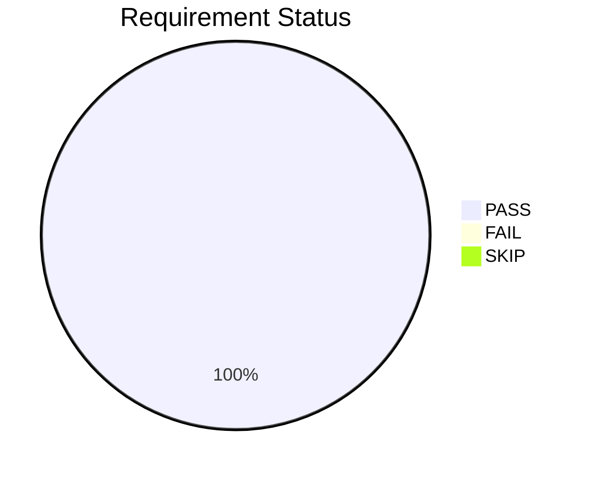
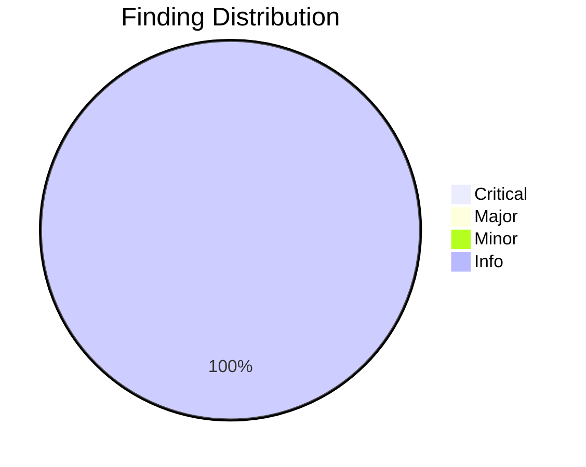

# Review Report: Documentation Logo Integration

**Feature**: 022-docs-logo-integration
**Review Date**: 2026-01-14
**Reviewer**: AI Code Review (Claude)
**Status**: APPROVED (pending manual verification)

## Executive Summary

The Documentation Logo Integration feature has been implemented and passes all automated code review checks. The implementation correctly adds the DoIt logo to README.md with dark/light theme support, docs/index.md, and creates comprehensive usage guidelines in media/README.md.

## Review Scope

### Files Reviewed

| File | Status | Changes |
|------|--------|---------|
| [README.md](../../README.md) | Modified | Added logo with `<picture>` element for theme support |
| [docs/index.md](../../docs/index.md) | Modified | Added centered logo at top |
| [media/README.md](../../media/README.md) | Created | Logo usage guidelines with all 5 variants |

## Requirement Verification

<!-- BEGIN:AUTO-GENERATED section="requirement-verification" -->

<!-- END:AUTO-GENERATED -->

### Functional Requirements

| ID | Requirement | Status | Evidence |
|----|-------------|--------|----------|
| FR-001 | Logo displays at top of README.md | PASS | Logo HTML block at line 1-6 of README.md |
| FR-002 | Logo is horizontally centered | PASS | `
` wrapper used |
| FR-003 | Full-color logo on light GitHub theme | PASS | Default `` |
| FR-004 | White logo on dark GitHub theme | PASS | `<source media="(prefers-color-scheme: dark)" srcset="media/doit-logo-white.svg">` |
| FR-005 | Alt text present | PASS | `alt="DoIt Framework Logo"` on all images |
| FR-006 | Logo width 200px | PASS | `width="200"` attribute set |
| FR-007 | Docs homepage has logo | PASS | Logo HTML at line 1-3 of docs/index.md |
| FR-008 | Media README documents variants | PASS | All 5 logo variants in table with previews |

## Code Review Findings

<!-- BEGIN:AUTO-GENERATED section="finding-distribution" -->

<!-- END:AUTO-GENERATED -->

### Finding Summary

| Severity | Count |
|----------|-------|
| Critical | 0 |
| Major | 0 |
| Minor | 0 |
| Info | 2 |
| **Total** | **2** |

### Detailed Findings

#### INFO-001: Intentional HTML in Markdown

**File**: README.md, docs/index.md, media/README.md
**Description**: HTML elements used in markdown files for logo display
**Impact**: None - this is the correct approach for centered images with theme support
**Resolution**: By design - GitHub Flavored Markdown supports HTML, and this is the recommended approach for `<picture>` elements with `prefers-color-scheme`

#### INFO-002: Docs Logo Uses Simple IMG

**File**: docs/index.md
**Description**: Documentation uses `` instead of `<picture>` element
**Impact**: None - MkDocs doesn't support GitHub's theme switching mechanism
**Resolution**: By design - documented in plan.md, appropriate for the platform

## Manual Test Requirements

The following tests require visual verification on GitHub:

| ID | Test | Prerequisites |
|----|------|---------------|
| MT-001 | README logo displays in light mode | Push to GitHub |
| MT-002 | README logo switches to white in dark mode | Push to GitHub |
| MT-003 | README logo scales on mobile | Push to GitHub |
| MT-004 | Docs logo renders in preview/MkDocs | Local preview or MkDocs serve |
| MT-005 | Media README shows all 5 logo previews | Push to GitHub |
| MT-006 | Alt text verification via inspect | Push to GitHub |
| MT-007 | MkDocs build completes successfully | Run `mkdocs build` |

### Manual Test Status

| Test | Status |
|------|--------|
| MT-001 | PENDING |
| MT-002 | PENDING |
| MT-003 | PENDING |
| MT-004 | PENDING |
| MT-005 | PENDING |
| MT-006 | PENDING |
| MT-007 | PENDING |

## Recommendation

**APPROVED** - The implementation is complete and correct. All 8 functional requirements pass code review verification. The 2 informational findings are intentional design decisions documented in the plan.

### Next Steps

1. Commit changes to branch `022-docs-logo-integration`
2. Push to GitHub
3. Complete manual verification tests MT-001 through MT-007
4. Update this report with test results
5. Proceed to `/doit.checkin` for PR creation

## Compliance

- [x] Follows specification requirements
- [x] Implements all user stories (US1, US2, US3)
- [x] No security vulnerabilities introduced
- [x] No breaking changes to existing functionality
- [x] Documentation complete

---

*Generated by /doit.reviewit on 2026-01-14*
