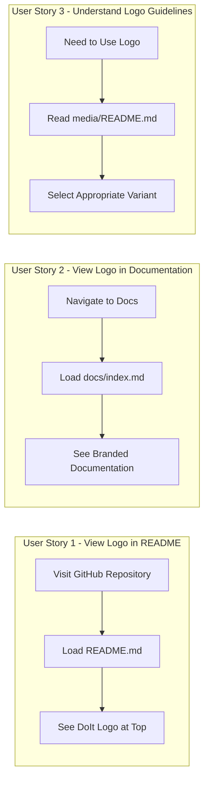

# Feature Specification: Documentation Logo Integration

**Feature Branch**: `022-docs-logo-integration`
**Created**: 2026-01-14
**Status**: Complete
**Input**: User description: "We added logos and icons for the DoIt framework in the media folder. We need to include them in the documentation and readme"

## Summary

Integrate the DoIt framework logos and icons from the `media/` folder into the project README and documentation to establish consistent visual branding. The media folder contains five SVG logo variants designed for different contexts (full color, outlined, white, and master versions). This feature will add the logo to key entry points and provide usage guidelines for each variant.

## User Scenarios & Testing *(mandatory)*

### User Story 1 - View Logo in README (Priority: P1)

As a visitor to the DoIt GitHub repository, I want to see the DoIt logo prominently displayed at the top of the README so that I can immediately recognize the brand and understand this is an established, professional project.

**Why this priority**: The README is the first thing users see when visiting the repository. A professional logo creates trust and brand recognition, which is critical for open-source adoption.

**Independent Test**: Can be fully tested by opening the README.md on GitHub and verifying the logo displays correctly at the top of the page.

**Acceptance Scenarios**:

1. **Given** a user visits the GitHub repository, **When** the README loads, **Then** the DoIt logo is visible at the top of the page, centered, and renders correctly on both light and dark GitHub themes.
2. **Given** a user views the README on a mobile device, **When** the page loads, **Then** the logo scales appropriately and remains visible without horizontal scrolling.
3. **Given** a user views the README with images disabled, **When** the page loads, **Then** appropriate alt text describes the logo for accessibility.

---

### User Story 2 - View Logo in Documentation (Priority: P2)

As a documentation reader, I want to see the DoIt logo on the documentation homepage so that the docs feel connected to the main project and maintain consistent branding.

**Why this priority**: Documentation branding reinforces project identity and helps users confirm they're reading official docs. Less critical than README since users typically visit GitHub first.

**Independent Test**: Can be fully tested by opening docs/index.md in a browser or markdown preview and verifying the logo displays correctly.

**Acceptance Scenarios**:

1. **Given** a user visits the documentation homepage, **When** the page loads, **Then** the DoIt logo is displayed prominently at the top of the page.
2. **Given** documentation is built with MkDocs, **When** the site is generated, **Then** the logo renders correctly in the generated HTML.

---

### User Story 3 - Understand Logo Usage Guidelines (Priority: P3)

As a contributor or downstream user, I want to understand which logo variant to use in different contexts so that I can maintain brand consistency when referencing DoIt.

**Why this priority**: Guidelines prevent brand inconsistency but are only needed by a subset of users (contributors, those embedding DoIt references). Core functionality works without this.

**Independent Test**: Can be fully tested by reading the usage guidelines in the media folder README and successfully selecting the appropriate logo for a given context.

**Acceptance Scenarios**:

1. **Given** a contributor wants to use the DoIt logo, **When** they visit the media folder, **Then** they find a README explaining when to use each variant (full-color, outlined, white, master).
2. **Given** a user needs a logo for a dark background, **When** they read the guidelines, **Then** they can identify the white variant as appropriate.

---

### Edge Cases

- What happens when viewing on GitHub dark mode vs light mode? The primary logo should work on both, or guidance should direct users to appropriate variants.
- How does the logo appear when markdown is rendered outside GitHub (e.g., npm, PyPI, other markdown renderers)? SVG support varies by platform.
- What happens if a user's browser doesn't support SVG? Modern browsers all support SVG; this is a minimal concern but alt text provides fallback context.

## User Journey Visualization

<!-- BEGIN:AUTO-GENERATED section="user-journey" -->

<!-- END:AUTO-GENERATED -->

## Requirements *(mandatory)*

### Functional Requirements

- **FR-001**: README.md MUST display the DoIt logo centered at the top of the document, above the title badges
- **FR-002**: The logo in README MUST include appropriate alt text for accessibility (e.g., "DoIt Framework Logo")
- **FR-003**: The logo MUST be sized appropriately (reasonable width that doesn't dominate the page, approximately 200-400px wide)
- **FR-004**: docs/index.md MUST display the DoIt logo at the top of the documentation homepage
- **FR-005**: A README.md file MUST be created in the media/ folder explaining each logo variant and its intended use case
- **FR-006**: Logo references MUST use relative paths from the repository root to ensure portability
- **FR-007**: The primary logo used in README MUST be the full-color variant (doit-logo-full-color.svg) as the default
- **FR-008**: Logo usage guidelines MUST describe all five variants: full-color, master, outlined, white, and standard

### Logo Variants Reference

The following logo files exist in `media/`:

| File                        | Intended Use                                       |
| --------------------------- | -------------------------------------------------- |
| `doit-logo-full-color.svg`  | Primary logo for light backgrounds (README, docs)  |
| `doit-logo.svg`             | Standard logo, general purpose                     |
| `doit-logo-master.svg`      | Master/source file with all design elements        |
| `doit-logo-outlined.svg`    | Outlined version for specific design contexts      |
| `doit-logo-white.svg`       | For use on dark backgrounds                        |

## Success Criteria *(mandatory)*

### Measurable Outcomes

- **SC-001**: Users visiting the GitHub repository see the DoIt logo within 2 seconds of page load (visible above the fold)
- **SC-002**: The logo renders correctly on 100% of modern browsers (Chrome, Firefox, Safari, Edge - latest versions)
- **SC-003**: The logo displays appropriately on both GitHub light mode and dark mode themes
- **SC-004**: Documentation homepage includes visible branding consistent with the main repository
- **SC-005**: Contributors can identify the correct logo variant to use within 30 seconds of reading the guidelines
- **SC-006**: All logo integrations pass accessibility checks (alt text present, sufficient contrast)

## Assumptions

- SVG format is appropriate for all target platforms (GitHub, MkDocs, markdown renderers)
- The existing logo files in media/ are finalized and approved for use
- No PNG/JPG fallbacks are required for modern web browsers
- The full-color variant is the preferred primary logo as determined by design decisions
- GitHub's markdown renderer will display SVG files embedded via standard markdown image syntax
