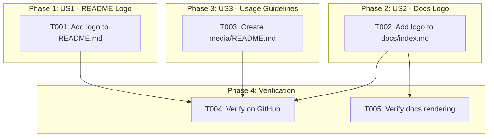
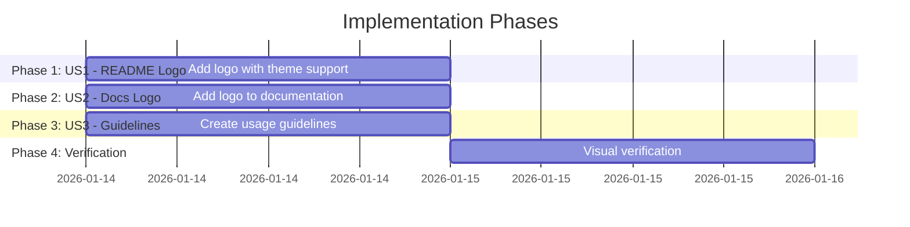

# Tasks: Documentation Logo Integration

**Input**: Design documents from `/specs/022-docs-logo-integration/`
**Prerequisites**: plan.md (required), spec.md (required for user stories), research.md, quickstart.md

**Tests**: Manual visual verification only (per plan.md - no automated tests required)

**Organization**: Tasks are grouped by user story to enable independent implementation and testing of each story.

## Task Dependencies

<!-- BEGIN:AUTO-GENERATED section="task-dependencies" -->

<!-- END:AUTO-GENERATED -->

## Phase Timeline

<!-- BEGIN:AUTO-GENERATED section="phase-timeline" -->

<!-- END:AUTO-GENERATED -->

## Format: `[ID] [P?] [Story] Description`

- **[P]**: Can run in parallel (different files, no dependencies)
- **[Story]**: Which user story this task belongs to (e.g., US1, US2, US3)
- Include exact file paths in descriptions

## Path Conventions

This is a **documentation-only** feature. All changes are to markdown files at the repository root:

```text
README.md                # Repository root
docs/index.md            # Documentation folder
media/README.md          # Media assets folder
```

---

## Phase 1: User Story 1 - View Logo in README (Priority: P1) 🎯 MVP

**Goal**: Display DoIt logo at top of README with dark/light theme support

**Independent Test**: Open README.md on GitHub in both light and dark mode; verify logo displays correctly and is centered

### Implementation for User Story 1

- [x] T001 [P] [US1] Add logo block with theme support at top of README.md

**Details for T001**:
Insert the following HTML at line 1 of `README.md`, before `# DoIt - Spec-Driven Development Framework`:

```html
<div align="center">
  <picture>
    <source media="(prefers-color-scheme: dark)" srcset="media/doit-logo-white.svg">
    
  </picture>
</div>

```

**Acceptance Criteria**:
- Logo visible at top of README (above title)
- Logo centered horizontally
- Full-color logo on light mode
- White logo on dark mode
- Alt text: "DoIt Framework Logo"
- Width: 200px

**Checkpoint**: User Story 1 complete when logo displays correctly on GitHub

---

## Phase 2: User Story 2 - View Logo in Documentation (Priority: P2)

**Goal**: Display DoIt logo at top of documentation homepage

**Independent Test**: Open docs/index.md in browser or MkDocs preview; verify logo displays at top

### Implementation for User Story 2

- [x] T002 [P] [US2] Add logo block at top of docs/index.md

**Details for T002**:
Insert the following HTML at line 1 of `docs/index.md`, before `# DoIt`:

```html
<div align="center">
  
</div>

```

**Note**: Using simple `` without `<picture>` since MkDocs doesn't support GitHub's theme switching mechanism.

**Acceptance Criteria**:
- Logo visible at top of docs homepage
- Logo centered horizontally
- Full-color logo displays
- Alt text: "DoIt Framework Logo"
- Width: 200px
- Works when MkDocs builds the site

**Checkpoint**: User Story 2 complete when logo displays in documentation

---

## Phase 3: User Story 3 - Logo Usage Guidelines (Priority: P3)

**Goal**: Create README in media folder explaining logo variants and usage

**Independent Test**: Navigate to media/ folder on GitHub; verify README displays with logo previews and clear guidelines

### Implementation for User Story 3

- [x] T003 [P] [US3] Create media/README.md with logo usage guidelines

**Details for T003**:
Create new file `media/README.md` with the following content:

```markdown
# DoIt Brand Assets

This folder contains the official DoIt framework logo files.

## Logo Variants

| Preview | File | Use Case |
|---------|------|----------|
|  | `doit-logo-full-color.svg` | Primary logo for light backgrounds |
|  | `doit-logo.svg` | General purpose |
|  | `doit-logo-outlined.svg` | When filled logos don't fit the design |
|  | `doit-logo-white.svg` | Dark backgrounds |
|  | `doit-logo-master.svg` | Source file for designers |

## Usage Guidelines

### When to Use Each Variant

- **Full Color** (`doit-logo-full-color.svg`): Default choice for README files, documentation, and presentations on light backgrounds
- **White** (`doit-logo-white.svg`): Use on dark backgrounds, dark mode interfaces, or colored backgrounds where the full-color version lacks contrast
- **Outlined** (`doit-logo-outlined.svg`): Use when a simpler, line-based logo fits better (icons, favicons, small sizes)
- **Standard** (`doit-logo.svg`): General purpose, when you need a single versatile option
- **Master** (`doit-logo-master.svg`): Reference file containing all design elements; use for creating new variants

### Technical Details

- **Format**: SVG (Scalable Vector Graphics)
- **Dimensions**: 200x200 viewBox
- **Colors**: Teal palette (#0d9488, #14b8a6, #2dd4c0)

## Embedding Examples

### GitHub README with Dark Mode Support

```html
<picture>
  <source media="(prefers-color-scheme: dark)" srcset="media/doit-logo-white.svg">
  
</picture>
```

### Simple Markdown Image

```markdown

```

### HTML with Size Control

```html

```

## License

The DoIt logo is part of the DoIt project and is licensed under the MIT License.
```

**Acceptance Criteria**:
- README exists in media/ folder
- Logo variant table with previews
- Usage guidelines for each variant
- Technical specifications documented
- Embedding code examples included

**Checkpoint**: User Story 3 complete when media/README.md displays correctly on GitHub

---

## Phase 4: Verification & Polish

**Purpose**: Verify all changes render correctly across platforms

- [ ] T004 [US1] Verify README logo on GitHub (light mode, dark mode, mobile)
- [ ] T005 [US2] Verify docs logo renders in MkDocs build
- [ ] T006 [US3] Verify media/README.md displays logo previews correctly
- [ ] T007 Commit all changes with descriptive message

**Verification Checklist**:
- [ ] README.md: Logo visible on GitHub (light mode)
- [ ] README.md: White logo visible on GitHub (dark mode)
- [ ] README.md: Logo scales on mobile viewport
- [ ] README.md: Alt text "DoIt Framework Logo" present
- [ ] docs/index.md: Logo visible in markdown preview
- [ ] docs/index.md: Logo renders in MkDocs build
- [ ] media/README.md: All 5 logo previews display
- [ ] media/README.md: Usage guidelines are clear

---

## Dependencies & Execution Order

### Phase Dependencies

- **Phase 1 (US1)**: No dependencies - can start immediately
- **Phase 2 (US2)**: No dependencies - can start immediately
- **Phase 3 (US3)**: No dependencies - can start immediately
- **Phase 4 (Verification)**: Depends on Phases 1-3 completion

### User Story Dependencies

All user stories are **completely independent**:

- **User Story 1 (P1)**: README.md only - no other dependencies
- **User Story 2 (P2)**: docs/index.md only - no other dependencies
- **User Story 3 (P3)**: media/README.md only - no other dependencies

### Parallel Opportunities

**ALL implementation tasks can run in parallel** since they modify different files:

- T001 (README.md) ⟹ [P]
- T002 (docs/index.md) ⟹ [P]
- T003 (media/README.md) ⟹ [P]

---

## Parallel Example: All Stories at Once

```bash
# All three implementation tasks can run simultaneously:
Task: "Add logo block with theme support at top of README.md"
Task: "Add logo block at top of docs/index.md"
Task: "Create media/README.md with logo usage guidelines"

# After all complete, run verification:
Task: "Verify README logo on GitHub"
Task: "Verify docs logo renders in MkDocs build"
Task: "Verify media/README.md displays logo previews correctly"
```

---

## Implementation Strategy

### MVP First (User Story 1 Only)

1. Complete T001: Add logo to README.md
2. **STOP and VALIDATE**: Push and verify on GitHub
3. If satisfied, this is a working MVP

### Incremental Delivery

1. T001 → Verify → README has logo (MVP!)
2. T002 → Verify → Docs have logo
3. T003 → Verify → Guidelines available
4. Each task adds value independently

### Single Session Strategy

Since all tasks are small markdown edits:

1. Complete T001, T002, T003 (can be parallel or sequential)
2. Commit all changes together
3. Push and verify all on GitHub
4. Complete verification tasks

---

## Summary

| Phase | Tasks | Parallel? | Est. Time |
|-------|-------|-----------|-----------|
| Phase 1: US1 - README | 1 | Yes | 5 min |
| Phase 2: US2 - Docs | 1 | Yes | 5 min |
| Phase 3: US3 - Guidelines | 1 | Yes | 10 min |
| Phase 4: Verification | 4 | Partial | 10 min |
| **Total** | **7** | - | **~30 min** |

---

## Notes

- [P] tasks = different files, no dependencies
- [Story] label maps task to specific user story for traceability
- All three user stories are completely independent
- No automated tests - manual visual verification only
- Commit after completion for easy rollback if needed
- Total estimated time: ~30 minutes for complete implementation
