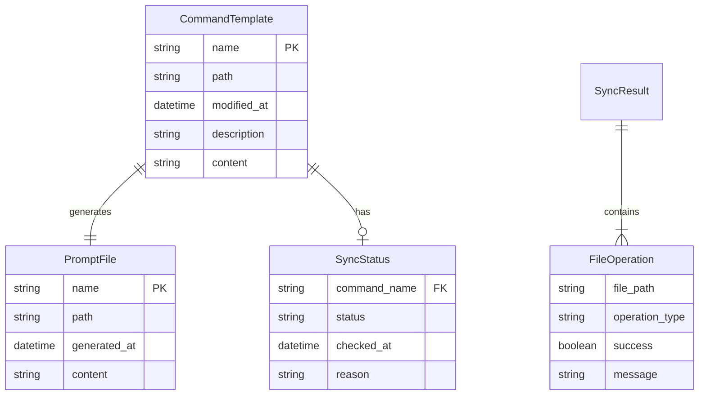
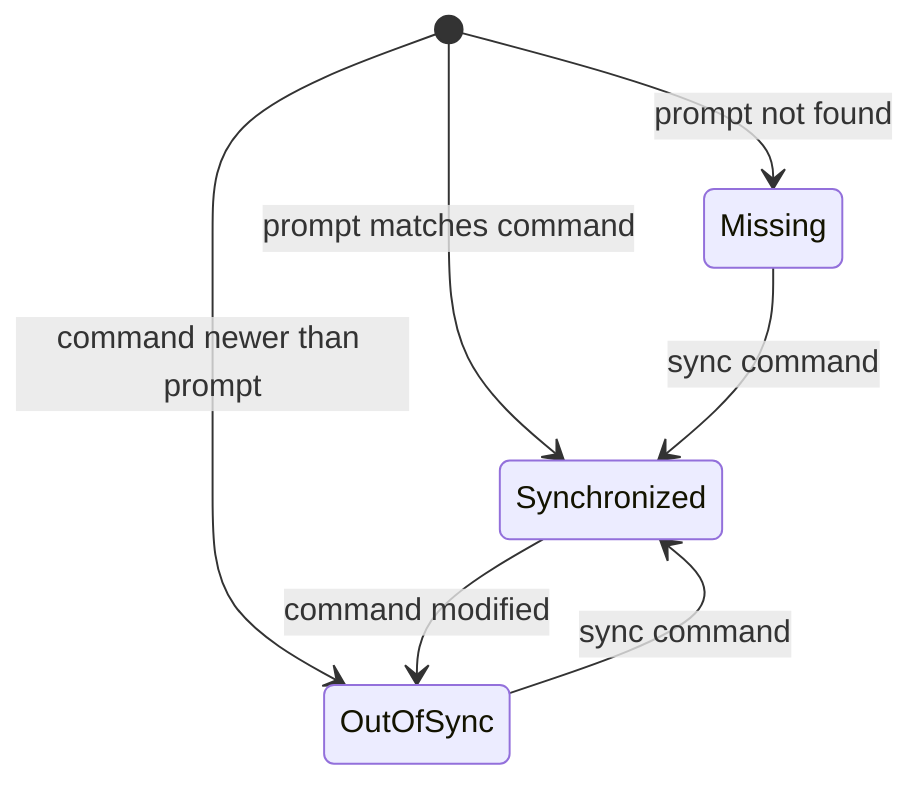
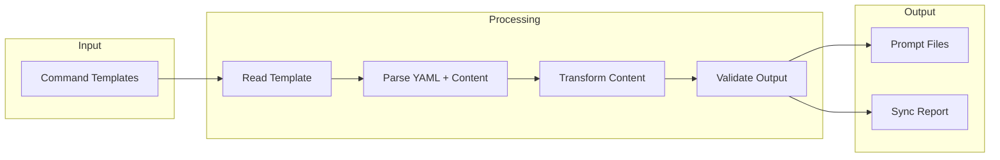

# Data Model: GitHub Copilot Prompts Synchronization

**Feature**: 023-copilot-prompts-sync
**Date**: 2026-01-15

## Entity Relationships

<!-- BEGIN:AUTO-GENERATED section="er-diagram" -->

<!-- END:AUTO-GENERATED -->

## Entities

### CommandTemplate

Represents a doit command template file in `.doit/templates/commands/`.

| Field | Type | Description |
| ----- | ---- | ----------- |
| name | string | Command name (e.g., "doit.checkin") |
| path | Path | Absolute file path |
| modified_at | datetime | Last modification timestamp |
| description | string | Extracted from YAML frontmatter |
| content | string | Full file content |

**Source**: Files matching `.doit/templates/commands/doit.*.md`

### PromptFile

Represents a generated GitHub Copilot prompt file in `.github/prompts/`.

| Field | Type | Description |
| ----- | ---- | ----------- |
| name | string | Prompt name (e.g., "doit.checkin.prompt") |
| path | Path | Absolute file path |
| generated_at | datetime | Generation timestamp |
| content | string | Transformed content |

**Target**: Files written to `.github/prompts/doit.*.prompt.md`

### SyncStatus

Represents the synchronization state between a command and its prompt.

| Field | Type | Description |
| ----- | ---- | ----------- |
| command_name | string | Reference to CommandTemplate |
| status | SyncStatusEnum | Current sync state |
| checked_at | datetime | When status was last checked |
| reason | string | Explanation for status |

**Status Values**:

<!-- BEGIN:AUTO-GENERATED section="sync-status-state" -->

<!-- END:AUTO-GENERATED -->

| Status | Description |
| ------ | ----------- |
| `SYNCHRONIZED` | Prompt exists and matches command |
| `OUT_OF_SYNC` | Command modified after prompt generation |
| `MISSING` | No corresponding prompt file exists |

### SyncResult

Represents the result of a synchronization operation.

| Field | Type | Description |
| ----- | ---- | ----------- |
| total_commands | int | Number of commands found |
| synced | int | Number successfully synced |
| skipped | int | Number skipped (already in sync) |
| failed | int | Number that failed |
| operations | list[FileOperation] | Details of each operation |

### FileOperation

Represents a single file operation during sync.

| Field | Type | Description |
| ----- | ---- | ----------- |
| file_path | string | Path of the file operated on |
| operation_type | OperationType | Type of operation |
| success | bool | Whether operation succeeded |
| message | string | Success/error message |

**Operation Types**:

| Type | Description |
| ---- | ----------- |
| `CREATED` | New prompt file created |
| `UPDATED` | Existing prompt file updated |
| `SKIPPED` | File already in sync |
| `FAILED` | Operation failed |

## Data Flow

## Validation Rules

### CommandTemplate Validation

- File must exist and be readable
- Must have `.md` extension
- Must match pattern `doit.*.md`
- Should have valid YAML frontmatter (graceful degradation if missing)

### PromptFile Validation

- Output path must be writable
- Content must be valid markdown
- YAML frontmatter must be valid if present

### Naming Convention

| Input | Output |
| ----- | ------ |
| `doit.checkin.md` | `doit.checkin.prompt.md` |
| `doit.specit.md` | `doit.specit.prompt.md` |
| `doit.{name}.md` | `doit.{name}.prompt.md` |

Transformation: Replace `.md` suffix with `.prompt.md`
