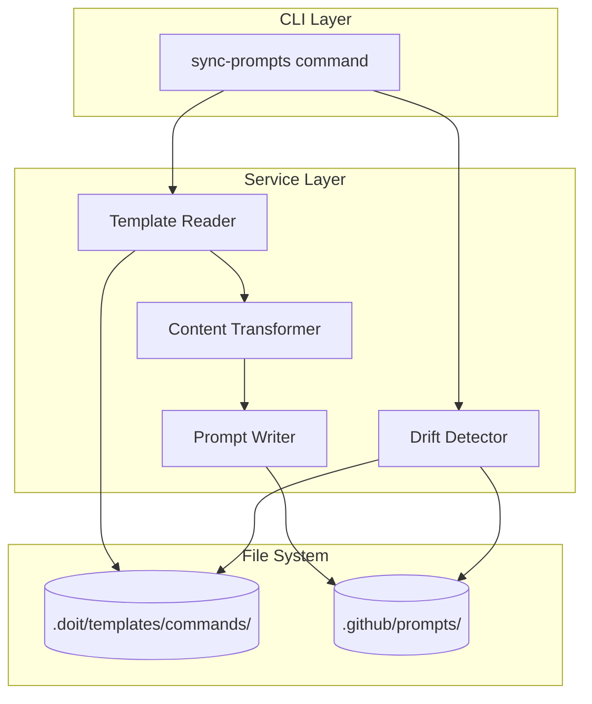

# Implementation Plan: GitHub Copilot Prompts Synchronization

**Branch**: `023-copilot-prompts-sync` | **Date**: 2026-01-15 | **Spec**: [spec.md](./spec.md)
**Input**: Feature specification from `/specs/023-copilot-prompts-sync/spec.md`

## Summary

Implement a synchronization system that generates GitHub Copilot prompt files from existing doit command templates. The system reads markdown command templates from `.doit/templates/commands/`, transforms them to Copilot-compatible format, and writes prompt files to `.github/prompts/` following the naming convention `doit.<name>.prompt.md`. Includes drift detection to identify when commands and prompts are out of sync.

## Technical Context

**Language/Version**: Python 3.11+ (per constitution)
**Primary Dependencies**: Typer (CLI), Rich (output formatting), pathlib (file operations)
**Storage**: File-based (markdown files in `.github/prompts/`)
**Testing**: pytest
**Target Platform**: Cross-platform CLI (macOS, Linux, Windows)
**Project Type**: single (CLI tool extension)
**Performance Goals**: Synchronize all 11 commands in under 30 seconds
**Constraints**: No external dependencies beyond existing CLI stack
**Scale/Scope**: 11 command templates → 11 prompt files

## Architecture Overview

<!-- BEGIN:AUTO-GENERATED section="architecture" -->

<!-- END:AUTO-GENERATED -->

## Constitution Check

*GATE: Must pass before Phase 0 research. Re-check after Phase 1 design.*

| Principle | Status | Notes |
|-----------|--------|-------|
| I. Specification-First | ✅ PASS | Spec created in 023-copilot-prompts-sync/spec.md |
| II. Persistent Memory | ✅ PASS | Uses file-based storage (markdown prompts) |
| III. Auto-Generated Diagrams | ✅ PASS | Plan includes Mermaid architecture diagram |
| IV. Opinionated Workflow | ✅ PASS | Following specit → planit → taskit flow |
| V. AI-Native Design | ✅ PASS | Feature enables Copilot AI integration |

**Tech Stack Alignment**:
| Constitution | This Plan | Status |
|--------------|-----------|--------|
| Python 3.11+ | Python 3.11+ | ✅ Aligned |
| Typer CLI | Typer CLI | ✅ Aligned |
| Rich | Rich | ✅ Aligned |
| pytest | pytest | ✅ Aligned |
| File-based storage | File-based storage | ✅ Aligned |

**Gate Result**: ✅ PASS - All principles satisfied, tech stack aligned

## Project Structure

### Documentation (this feature)

```text
specs/023-copilot-prompts-sync/
├── spec.md              # Feature specification
├── plan.md              # This file
├── research.md          # Phase 0 output
├── data-model.md        # Phase 1 output
├── quickstart.md        # Phase 1 output
├── contracts/           # Phase 1 output (N/A for this feature)
└── tasks.md             # Phase 2 output (/doit.taskit command)
```

### Source Code (repository root)

```text
src/doit_cli/
├── commands/
│   └── sync_prompts.py      # New CLI command
├── services/
│   ├── template_reader.py   # Read command templates
│   ├── prompt_transformer.py # Transform to Copilot format
│   ├── prompt_writer.py     # Write prompt files
│   └── drift_detector.py    # Detect sync status
└── models/
    └── sync_models.py       # Data classes for sync operations

tests/
├── unit/
│   ├── test_template_reader.py
│   ├── test_prompt_transformer.py
│   ├── test_prompt_writer.py
│   └── test_drift_detector.py
└── integration/
    └── test_sync_prompts_command.py

.github/
└── prompts/                 # Generated output directory
    ├── doit.checkin.prompt.md
    ├── doit.constitution.prompt.md
    ├── doit.documentit.prompt.md
    ├── doit.implementit.prompt.md
    ├── doit.planit.prompt.md
    ├── doit.reviewit.prompt.md
    ├── doit.roadmapit.prompt.md
    ├── doit.scaffoldit.prompt.md
    ├── doit.specit.prompt.md
    ├── doit.taskit.prompt.md
    └── doit.testit.prompt.md
```

**Structure Decision**: Single project structure following existing doit-cli patterns. New command added to `commands/` with supporting services in `services/`.

## Complexity Tracking

No violations - all choices align with constitution and use existing patterns.

| Aspect | Decision | Rationale |
|--------|----------|-----------|
| No new dependencies | ✅ | Uses pathlib (stdlib) and existing Rich/Typer |
| File-based only | ✅ | Aligns with constitution's "persistent memory" principle |
| Single service layer | ✅ | Simple transformation pipeline, no need for complex architecture |
