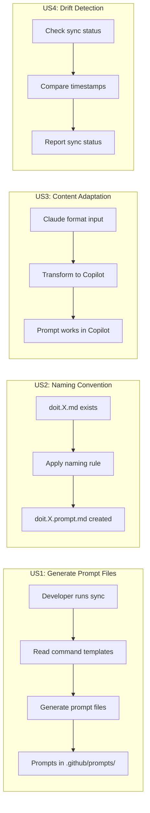
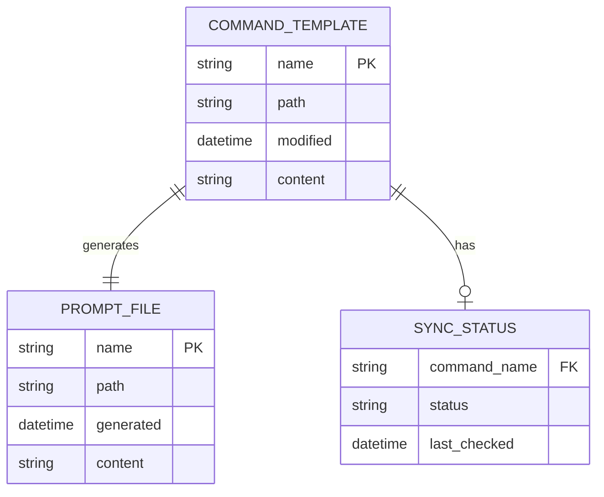

# Feature Specification: GitHub Copilot Prompts Synchronization

**Feature Branch**: `023-copilot-prompts-sync`
**Created**: 2026-01-15
**Status**: Complete
**Input**: User description: "we need to make sure the prompts and commands are the same. the prompt.md files for github copilot need to be created using the markdown file commands we also want to the prompt files to follow the naming of the commands with doit.documentit.md the prompts should be doit.checkin.prompt.md review the templates that the cli uses to generate the files in the .doit folder"

## User Scenarios & Testing *(mandatory)*

### User Story 1 - Generate GitHub Copilot Prompt Files from Commands (Priority: P1)

As a developer using GitHub Copilot, I want prompt files in `.github/prompts/` that correspond to each doit command template so that Copilot can use the same instructions as Claude Code slash commands.

**Why this priority**: This is the core feature - without the prompt file generation, the synchronization cannot happen. This enables Copilot users to have the same workflow capabilities as Claude Code users.

**Independent Test**: Can be fully tested by running the generation command and verifying that for each command file in `.doit/templates/commands/doit.*.md`, a corresponding `doit.*.prompt.md` file exists in `.github/prompts/` with content derived from the command template.

**Acceptance Scenarios**:

1. **Given** command templates exist in `.doit/templates/commands/`, **When** the synchronization is run, **Then** corresponding prompt files are created in `.github/prompts/` with matching naming convention (e.g., `doit.checkin.md` → `doit.checkin.prompt.md`)
2. **Given** a command template `doit.documentit.md` exists, **When** synchronization completes, **Then** a prompt file `doit.documentit.prompt.md` exists with the command's instructions adapted for GitHub Copilot
3. **Given** `.github/prompts/` directory does not exist, **When** synchronization is run, **Then** the directory is created automatically

---

### User Story 2 - Maintain Consistent Naming Convention (Priority: P1)

As a project maintainer, I want the prompt files to follow a consistent naming pattern that mirrors the command templates so that the relationship between commands and prompts is immediately clear.

**Why this priority**: Naming consistency is essential for discoverability and maintenance. Without it, developers cannot easily find the corresponding prompt for a command.

**Independent Test**: Can be verified by listing both directories and confirming the naming pattern: `doit.<name>.md` maps to `doit.<name>.prompt.md`

**Acceptance Scenarios**:

1. **Given** a command file named `doit.specit.md`, **When** the prompt file is generated, **Then** it is named `doit.specit.prompt.md`
2. **Given** multiple command files exist, **When** all prompts are generated, **Then** each command has exactly one corresponding prompt with the `.prompt.md` suffix

---

### User Story 3 - Adapt Command Content for Copilot Format (Priority: P2)

As a Copilot user, I want the prompt files to be formatted appropriately for GitHub Copilot's expected structure so that Copilot can interpret and execute the instructions correctly.

**Why this priority**: Content adaptation ensures the prompts actually work with Copilot. Without proper formatting, the prompts may not be recognized or may behave unexpectedly.

**Independent Test**: Can be tested by invoking a Copilot agent with a generated prompt and verifying it understands the instructions and can execute the workflow steps.

**Acceptance Scenarios**:

1. **Given** a command template with YAML frontmatter, **When** converted to prompt format, **Then** the frontmatter is transformed into Copilot-compatible metadata
2. **Given** a command contains `$ARGUMENTS` placeholder, **When** converted, **Then** the placeholder is adapted to Copilot's input handling convention
3. **Given** a command references `.doit/scripts/`, **When** converted, **Then** script paths remain valid and executable

---

### User Story 4 - Detect and Report Synchronization Drift (Priority: P2)

As a developer maintaining both systems, I want to know when command templates have been updated but prompts are out of sync so that I can keep them aligned.

**Why this priority**: Drift detection prevents users from experiencing different behavior between Claude Code and Copilot. This is important but secondary to initial generation.

**Independent Test**: Can be tested by modifying a command template after prompt generation and running a sync check that reports the drift.

**Acceptance Scenarios**:

1. **Given** a command template was modified after its prompt was generated, **When** sync status is checked, **Then** the out-of-sync file is reported
2. **Given** all prompts are current, **When** sync status is checked, **Then** a "synchronized" status is reported
3. **Given** a new command template was added with no corresponding prompt, **When** sync status is checked, **Then** the missing prompt is reported

---

### User Story 5 - Selective Synchronization (Priority: P3)

As a developer, I want to synchronize specific commands rather than all commands so that I can test changes incrementally or update only modified prompts.

**Why this priority**: Selective sync improves workflow efficiency for iterative development. This is a convenience feature that builds on the core capability.

**Independent Test**: Can be tested by specifying a single command name and verifying only that prompt is created/updated while others remain unchanged.

**Acceptance Scenarios**:

1. **Given** multiple commands exist, **When** synchronization is run for "doit.checkin" only, **Then** only `doit.checkin.prompt.md` is created/updated
2. **Given** a specific command name is provided, **When** synchronization runs, **Then** other prompt files are not modified

---

### Edge Cases

- What happens when a command template has invalid YAML frontmatter? The system should report the error and skip that file, continuing with others.
- What happens when a prompt file already exists with manual customizations? The system should warn before overwriting and provide an option to preserve custom content.
- How does the system handle command templates without the expected structure (missing ## Outline, etc.)? The system should generate a basic prompt with available content and flag the template for review.

## User Journey Visualization

<!-- BEGIN:AUTO-GENERATED section="user-journey" -->

<!-- END:AUTO-GENERATED -->

## Entity Relationships

<!-- BEGIN:AUTO-GENERATED section="entity-relationships" -->

<!-- END:AUTO-GENERATED -->

## Requirements *(mandatory)*

### Functional Requirements

- **FR-001**: System MUST scan `.doit/templates/commands/` directory for all `doit.*.md` command template files
- **FR-002**: System MUST create `.github/prompts/` directory if it does not exist
- **FR-003**: System MUST generate a prompt file for each command template following the naming pattern `doit.<name>.prompt.md`
- **FR-004**: System MUST preserve the core instructional content from command templates when generating prompts
- **FR-005**: System MUST transform YAML frontmatter `description` field to Copilot-compatible format
- **FR-006**: System MUST maintain the `## Outline` section content which defines the workflow steps
- **FR-007**: System MUST handle the `$ARGUMENTS` placeholder appropriately for Copilot's input mechanism
- **FR-008**: System MUST report which files were created, updated, or skipped during synchronization
- **FR-009**: System MUST detect when a command template has been modified more recently than its corresponding prompt
- **FR-010**: System MUST support synchronizing a single command by name (e.g., `sync doit.checkin`)
- **FR-011**: System MUST skip command templates with invalid structure and report them as errors

### Key Entities

- **Command Template**: Source markdown file in `.doit/templates/commands/` containing Claude Code slash command instructions with YAML frontmatter, `## User Input` section, and `## Outline` section defining workflow steps
- **Prompt File**: Generated markdown file in `.github/prompts/` containing GitHub Copilot agent instructions derived from a command template, following naming convention `doit.<name>.prompt.md`
- **Sync Status**: The relationship state between a command and its prompt indicating whether they are synchronized, out-of-sync (command newer than prompt), or missing (no prompt exists)

## Success Criteria *(mandatory)*

### Measurable Outcomes

- **SC-001**: All 11 existing command templates have corresponding prompt files generated in `.github/prompts/`
- **SC-002**: Prompt file naming follows the exact pattern `doit.<name>.prompt.md` for 100% of generated files
- **SC-003**: Generated prompts are usable by GitHub Copilot agents to execute the same workflows as Claude Code commands
- **SC-004**: Synchronization completes for all commands in under 30 seconds
- **SC-005**: Drift detection correctly identifies 100% of modified command templates that need re-synchronization
- **SC-006**: Zero manual intervention required for standard synchronization workflow

## Assumptions

- GitHub Copilot supports custom agent prompts in `.github/prompts/` directory (standard convention for Copilot Agents)
- The command template structure with YAML frontmatter and `## Outline` sections is stable and consistent
- File system operations (read/write to `.github/` directory) are permitted
- The project uses git for version control (for detecting modification times)

## Out of Scope

- Automatic bi-directional synchronization (prompts back to commands)
- CI/CD integration for automated sync checks
- Prompt validation against Copilot API
- Migration of existing manual prompt files to the new naming convention
