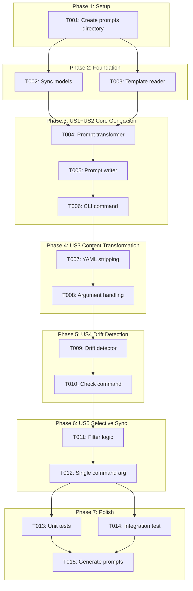
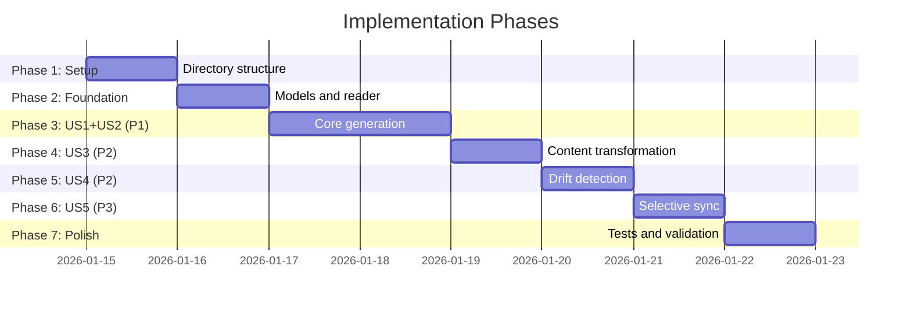

# Tasks: GitHub Copilot Prompts Synchronization

**Input**: Design documents from `/specs/023-copilot-prompts-sync/`
**Prerequisites**: plan.md (required), spec.md (required), research.md, data-model.md, quickstart.md

**Tests**: Tests are included based on plan.md test structure.

**Organization**: Tasks are grouped by user story to enable independent implementation and testing of each story.

## Task Dependencies

<!-- BEGIN:AUTO-GENERATED section="task-dependencies" -->

<!-- END:AUTO-GENERATED -->

## Phase Timeline

<!-- BEGIN:AUTO-GENERATED section="phase-timeline" -->

<!-- END:AUTO-GENERATED -->

## Format: `[ID] [P?] [Story] Description`

- **[P]**: Can run in parallel (different files, no dependencies)
- **[Story]**: Which user story this task belongs to (e.g., US1, US2, US3)
- Include exact file paths in descriptions

---

## Phase 1: Setup

**Purpose**: Project initialization and directory structure

- [x] T001 Create `.github/prompts/` directory structure with `.gitkeep` file

---

## Phase 2: Foundational (Blocking Prerequisites)

**Purpose**: Core data models and base services that ALL user stories depend on

**⚠️ CRITICAL**: No user story work can begin until this phase is complete

- [x] T002 [P] Create sync data models (CommandTemplate, PromptFile, SyncStatus, SyncResult) in src/doit_cli/models/sync_models.py
- [x] T003 [P] Implement TemplateReader service to scan and read command templates in src/doit_cli/services/template_reader.py

**Checkpoint**: Foundation ready - user story implementation can now begin

---

## Phase 3: User Story 1+2 - Core Prompt Generation (Priority: P1) 🎯 MVP

**Goal**: Generate GitHub Copilot prompt files from command templates with correct naming convention

**Independent Test**: Run `doit sync-prompts` and verify 11 prompt files exist in `.github/prompts/` with pattern `doit.<name>.prompt.md`

### Implementation for User Story 1+2

- [x] T004 [US1] Implement PromptTransformer service with basic content transformation in src/doit_cli/services/prompt_transformer.py
- [x] T005 [US1] Implement PromptWriter service to write prompt files with correct naming in src/doit_cli/services/prompt_writer.py
- [x] T006 [US1] Create sync-prompts CLI command that syncs all commands in src/doit_cli/cli/sync_prompts_command.py

**Checkpoint**: At this point, running `doit sync-prompts` generates all 11 prompt files with correct naming

---

## Phase 4: User Story 3 - Content Adaptation (Priority: P2)

**Goal**: Transform command content to Copilot-compatible format (strip YAML, handle arguments)

**Independent Test**: Verify generated prompts have no YAML frontmatter, `$ARGUMENTS` is replaced with natural language

### Implementation for User Story 3

- [x] T007 [US3] Add YAML frontmatter stripping to PromptTransformer in src/doit_cli/services/prompt_transformer.py
- [x] T008 [US3] Add `$ARGUMENTS` placeholder replacement in PromptTransformer in src/doit_cli/services/prompt_transformer.py

**Checkpoint**: Generated prompts are plain markdown without YAML frontmatter

---

## Phase 5: User Story 4 - Drift Detection (Priority: P2)

**Goal**: Detect when command templates and prompts are out of sync

**Independent Test**: Modify a command template, run `doit sync-prompts --check`, verify it reports the out-of-sync file

### Implementation for User Story 4

- [x] T009 [US4] Implement DriftDetector service with timestamp comparison in src/doit_cli/services/drift_detector.py
- [x] T010 [US4] Add `--check` flag to sync-prompts command for status check in src/doit_cli/cli/sync_prompts_command.py

**Checkpoint**: `doit sync-prompts --check` correctly reports sync status for all commands

---

## Phase 6: User Story 5 - Selective Synchronization (Priority: P3)

**Goal**: Allow syncing specific commands rather than all commands

**Independent Test**: Run `doit sync-prompts doit.checkin` and verify only that prompt is created/updated

### Implementation for User Story 5

- [x] T011 [US5] Add command name filter logic to TemplateReader in src/doit_cli/services/template_reader.py
- [x] T012 [US5] Add optional command_name argument to sync-prompts CLI in src/doit_cli/cli/sync_prompts_command.py

**Checkpoint**: Running `doit sync-prompts doit.checkin` only syncs that specific command

---

## Phase 7: Polish & Validation

**Purpose**: Testing, validation, and actual prompt file generation

- [x] T013 [P] Create unit tests for TemplateReader, PromptTransformer, PromptWriter, DriftDetector in tests/unit/test_sync_services.py
- [x] T014 [P] Create integration test for sync-prompts command in tests/integration/test_sync_prompts_command.py
- [x] T015 Run sync-prompts to generate all 11 prompt files and commit to repository

---

## Dependencies & Execution Order

### Phase Dependencies

- **Setup (Phase 1)**: No dependencies - can start immediately
- **Foundational (Phase 2)**: Depends on Setup completion - BLOCKS all user stories
- **US1+US2 Core Generation (Phase 3)**: Depends on Foundational - MVP delivery
- **US3 Content Adaptation (Phase 4)**: Can start after Phase 3
- **US4 Drift Detection (Phase 5)**: Can start after Phase 4
- **US5 Selective Sync (Phase 6)**: Can start after Phase 5
- **Polish (Phase 7)**: Depends on all user stories complete

### User Story Dependencies

- **User Story 1+2 (P1)**: Can start after Foundational - No dependencies on other stories - **MVP SCOPE**
- **User Story 3 (P2)**: Enhances transformer created in US1+2
- **User Story 4 (P2)**: Adds drift detection - uses models from Foundation
- **User Story 5 (P3)**: Adds filtering - modifies reader from Foundation

### Parallel Opportunities

- T002 and T003 (Foundation) can run in parallel
- T013 and T014 (Tests) can run in parallel

---

## Parallel Example: Foundation Phase

```bash
# Launch both foundational tasks together:
Task: "Create sync data models in src/doit_cli/models/sync_models.py"
Task: "Implement TemplateReader service in src/doit_cli/services/template_reader.py"
```

---

## Implementation Strategy

### MVP First (User Story 1+2 Only)

1. Complete Phase 1: Setup
2. Complete Phase 2: Foundational
3. Complete Phase 3: US1+US2 - Core Generation
4. **STOP and VALIDATE**: Run `doit sync-prompts` and verify 11 prompts generated
5. Deploy/demo if ready - basic sync works!

### Incremental Delivery

1. Complete Setup + Foundational → Foundation ready
2. Add US1+US2 Core Generation → Test → **MVP Complete!**
3. Add US3 Content Adaptation → Test → Prompts are Copilot-compatible
4. Add US4 Drift Detection → Test → Can check sync status
5. Add US5 Selective Sync → Test → Full feature complete
6. Polish → Tests and validation

---

## Summary

| Phase | User Story | Tasks | Priority |
| ----- | ---------- | ----- | -------- |
| 1 | Setup | 1 | - |
| 2 | Foundation | 2 | - |
| 3 | US1+US2: Core Generation | 3 | P1 (MVP) |
| 4 | US3: Content Adaptation | 2 | P2 |
| 5 | US4: Drift Detection | 2 | P2 |
| 6 | US5: Selective Sync | 2 | P3 |
| 7 | Polish | 3 | - |

**Total Tasks**: 15
**MVP Scope**: Tasks T001-T006 (6 tasks)
**Parallel Opportunities**: 4 task pairs identified

---

## Notes

- [P] tasks = different files, no dependencies
- [Story] label maps task to specific user story for traceability
- Each user story should be independently completable and testable
- Commit after each task or logical group
- Stop at any checkpoint to validate story independently
