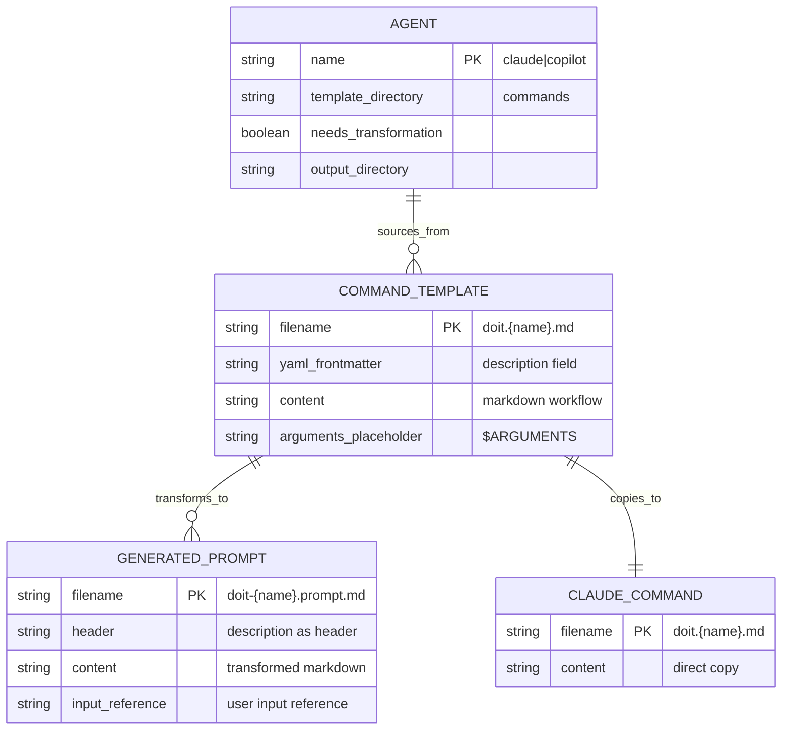
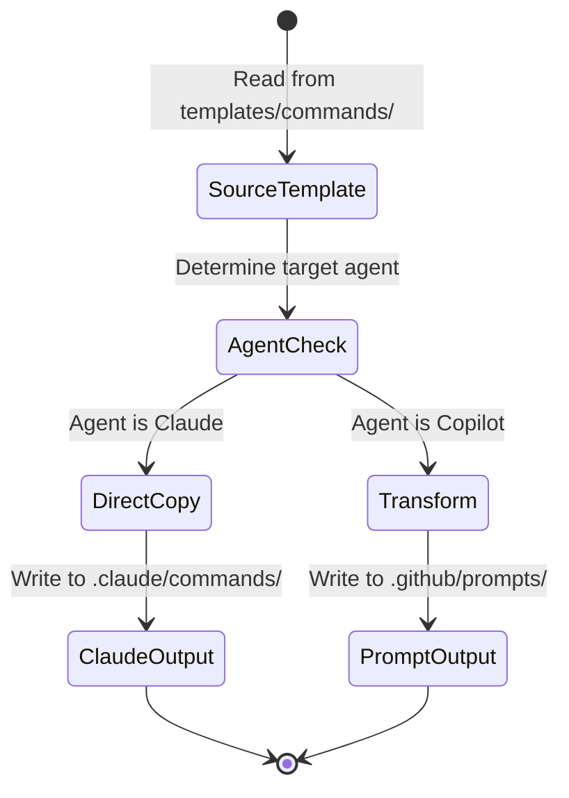

# Data Model: Unified Template Management

**Feature**: 024-unified-templates
**Date**: 2026-01-15

## Overview

This feature uses a file-based data model. There is no database; templates are stored as markdown files in the repository.

## Entity Relationship Diagram

<!-- BEGIN:AUTO-GENERATED section="er-diagram" -->

<!-- END:AUTO-GENERATED -->

## Entities

### Command Template (Source)

The canonical source file for each doit command.

| Field | Type | Description |
| ----- | ---- | ----------- |
| filename | string | `doit.{name}.md` (e.g., `doit.specit.md`) |
| yaml_frontmatter | string | YAML block with `description` field |
| content | markdown | Command workflow instructions |
| arguments_placeholder | string | `$ARGUMENTS` for user input |

**Location**: `templates/commands/`

**Example**:

```markdown
---
description: Create feature specifications
---

## User Input

```text
$ARGUMENTS
```

## Outline

1. Parse user description...
```

---

### Generated Prompt (Copilot Output)

Transformed version of command template for GitHub Copilot.

| Field | Type | Description |
| ----- | ---- | ----------- |
| filename | string | `doit-{name}.prompt.md` (e.g., `doit-specit.prompt.md`) |
| header | string | Description extracted from YAML |
| content | markdown | Transformed workflow (no YAML) |
| input_reference | string | Copilot-compatible input reference |

**Location**: `.github/prompts/` (in user project)

**Transformations Applied**:

1. Strip YAML frontmatter
2. Convert description to prompt header
3. Replace `$ARGUMENTS` with "the user's input"
4. Adjust Claude-specific terminology

---

### Claude Command (Claude Output)

Direct copy of command template for Claude Code.

| Field | Type | Description |
| ----- | ---- | ----------- |
| filename | string | Same as source: `doit.{name}.md` |
| content | markdown | Unchanged from source |

**Location**: `.claude/commands/` (in user project)

**Transformations Applied**: None (direct copy)

---

### Agent Configuration

Runtime configuration determining template handling.

| Field | Type | Description |
| ----- | ---- | ----------- |
| name | enum | `claude` or `copilot` |
| template_directory | string | Always "commands" (unified source) |
| needs_transformation | boolean | `true` for Copilot, `false` for Claude |
| output_directory | string | Agent-specific output path |

## State Machine: Template Processing



## File Naming Conventions

| Agent | Source Pattern | Output Pattern | Example |
| ----- | -------------- | -------------- | ------- |
| Claude | `doit.{name}.md` | `doit.{name}.md` | `doit.specit.md` |
| Copilot | `doit.{name}.md` | `doit-{name}.prompt.md` | `doit-specit.prompt.md` |

## Validation Rules

1. **Source templates MUST have YAML frontmatter** with `description` field
2. **Source templates MUST contain `$ARGUMENTS`** placeholder (or equivalent user input section)
3. **Generated filenames MUST follow agent conventions** (dot vs dash prefix, extension)
4. **Transformation MUST preserve all content** except explicitly transformed elements
