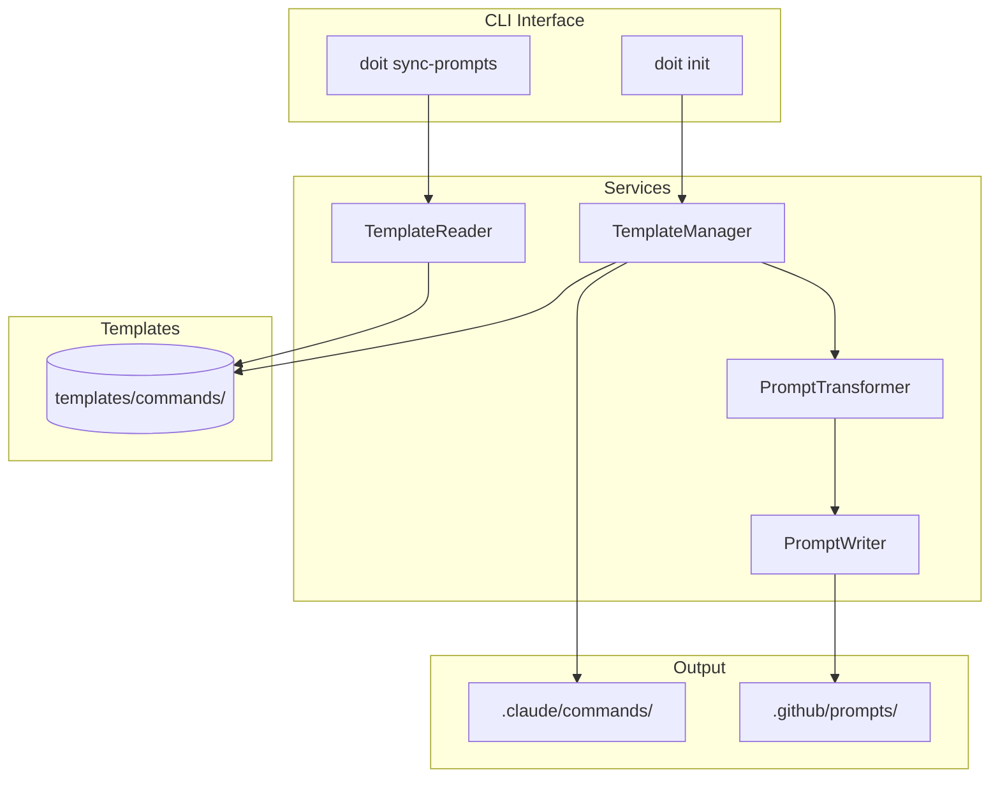

# Implementation Plan: Unified Template Management

**Branch**: `024-unified-templates` | **Date**: 2026-01-15 | **Spec**: [spec.md](spec.md)
**Input**: Feature specification from `/specs/024-unified-templates/spec.md`

## Summary

Consolidate doit command templates into a single source of truth by:
1. Modifying the `Agent` model to source both Claude and Copilot from `templates/commands/`
2. Applying `PromptTransformer` on-the-fly when generating Copilot prompts
3. Removing the `templates/prompts/` directory entirely
4. Updating `TemplateManager` and related services to support dynamic generation

## Technical Context

**Language/Version**: Python 3.11+ (per constitution)
**Primary Dependencies**: Typer, Rich, pytest (per constitution)
**Storage**: File-based (markdown templates in `templates/commands/`)
**Testing**: pytest
**Target Platform**: PyPI distribution (cross-platform CLI)
**Project Type**: single (CLI application)
**Performance Goals**: N/A (file operations, not user-facing latency)
**Constraints**: Backward compatibility with existing `doit init` and `sync-prompts` commands
**Scale/Scope**: 11 doit commands, 2 supported agents (Claude, Copilot)

## Architecture Overview

<!-- BEGIN:AUTO-GENERATED section="architecture" -->

<!-- END:AUTO-GENERATED -->

## Constitution Check

*GATE: Must pass before Phase 0 research. Re-check after Phase 1 design.*

| Principle | Status | Notes |
|-----------|--------|-------|
| Specification-First | PASS | Spec created before implementation |
| Persistent Memory | PASS | Templates remain in version-controlled files |
| Auto-Generated Diagrams | PASS | No diagram changes required |
| Opinionated Workflow | PASS | Uses standard doit workflow |
| AI-Native Design | PASS | Commands continue to work with AI assistants |

**Tech Stack Alignment**:
- Language: Python 3.11+ - ALIGNED
- Framework: Typer - ALIGNED
- Testing: pytest - ALIGNED
- No new dependencies required - ALIGNED

## Project Structure

### Documentation (this feature)

```text
specs/024-unified-templates/
├── spec.md              # Feature specification
├── plan.md              # This file
├── research.md          # Phase 0 output
├── data-model.md        # Phase 1 output (file-based model)
├── quickstart.md        # Phase 1 output
└── checklists/
    └── requirements.md  # Spec validation checklist
```

### Source Code (repository root)

```text
src/doit_cli/
├── models/
│   └── agent.py         # MODIFY: Update template_directory property
├── services/
│   ├── template_manager.py  # MODIFY: Generate prompts from commands/
│   ├── template_reader.py   # NO CHANGE: Already reads from commands/
│   ├── prompt_transformer.py # NO CHANGE: Already transforms content
│   ├── prompt_writer.py     # NO CHANGE: Already writes prompts
│   └── scaffolder.py        # REVIEW: May need updates for init flow
└── commands/
    └── init.py          # REVIEW: Verify Copilot init generates dynamically

templates/
├── commands/            # KEEP: Single source of truth
│   └── doit.*.md        # 11 command templates
└── prompts/             # DELETE: Remove entirely

tests/
├── unit/
│   └── test_template_manager.py  # UPDATE: Test dynamic generation
└── integration/
    └── test_init_command.py      # UPDATE: Verify both agents work
```

**Structure Decision**: Single project structure - this is a refactoring of existing services, not new architecture.

## Complexity Tracking

No constitution violations. This change simplifies the architecture by removing duplication.

## Implementation Phases

### Phase 1: Core Refactoring (P1 Stories)

1. **Modify Agent.template_directory**
   - Return "commands" for both CLAUDE and COPILOT agents
   - Add new property `needs_transformation` for COPILOT

2. **Update TemplateManager.get_bundled_templates()**
   - For Copilot: Read from commands/, apply PromptTransformer
   - For Claude: Direct copy (no transformation)

3. **Update TemplateManager.copy_templates_for_agent()**
   - For Copilot: Transform then write
   - For Claude: Direct copy

4. **Verify doit init --agent copilot**
   - Ensure prompts are generated dynamically
   - Verify content matches previous static prompts

### Phase 2: Cleanup (P2 Stories)

5. **Delete templates/prompts/ directory**
   - Remove all 11 prompt files
   - Update .gitignore if needed

6. **Update tests**
   - Remove tests that reference templates/prompts/
   - Add tests for dynamic generation

7. **Verify sync-prompts command**
   - Ensure it sources only from commands/
   - Verify TemplateReader behavior unchanged

### Rollback Plan

If issues arise:
1. Restore templates/prompts/ from git history
2. Revert Agent.template_directory changes
3. Revert TemplateManager changes

Changes are isolated to template handling; no database or external service dependencies.
