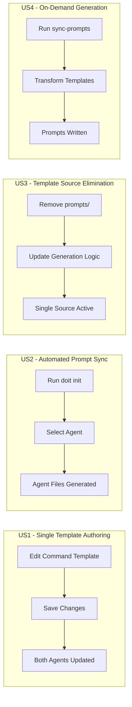

# Feature Specification: Unified Template Management

**Feature Branch**: `024-unified-templates`
**Created**: 2026-01-15
**Status**: Complete
**Input**: User description: "Unified template management (single source of truth for commands). Rationale: Eliminates duplicate templates, simplifies maintenance"

## Summary

Consolidate doit command templates into a single source of truth, eliminating the need to maintain separate template files for Claude Code commands and GitHub Copilot prompts. The command templates (`templates/commands/`) become the canonical source, and Copilot prompts are generated on-demand rather than stored as duplicate files.

## User Scenarios & Testing *(mandatory)*

### User Story 1 - Single Template Authoring (Priority: P1)

As a doit CLI maintainer, I want to edit command logic in one place so that changes automatically apply to all supported AI agents (Claude Code and GitHub Copilot).

**Why this priority**: This is the core value proposition - eliminating duplicate maintenance effort and ensuring consistency across agents.

**Independent Test**: Can be fully tested by editing a command template and verifying the change is reflected when used with both Claude Code and Copilot, without manually updating a second file.

**Acceptance Scenarios**:

1. **Given** a command template exists at `templates/commands/doit.specit.md`, **When** a maintainer updates the workflow steps, **Then** the change is available to both Claude Code (via `.claude/commands/`) and Copilot (via `.github/prompts/`) without editing additional files.
2. **Given** a new doit command is created, **When** the maintainer adds a single template file, **Then** the command works with all supported AI agents.
3. **Given** an existing template has an error, **When** the maintainer fixes it in the single source location, **Then** the fix propagates to all agent-specific outputs.

---

### User Story 2 - Automated Prompt Synchronization (Priority: P1)

As a project user running `doit init`, I want prompts to be generated automatically from the source templates so that my project always has up-to-date command files for my chosen AI agents.

**Why this priority**: Users shouldn't need to understand the template architecture - initialization should "just work" with current templates.

**Independent Test**: Can be fully tested by running `doit init --agent copilot` and verifying that `.github/prompts/` contains properly formatted prompt files derived from the command templates.

**Acceptance Scenarios**:

1. **Given** a project without doit initialization, **When** the user runs `doit init --agent copilot`, **Then** Copilot prompts are generated from command templates and written to `.github/prompts/`.
2. **Given** a project without doit initialization, **When** the user runs `doit init --agent claude`, **Then** Claude command files are copied to `.claude/commands/`.
3. **Given** command templates have been updated in a new CLI version, **When** the user runs `doit init --update`, **Then** agent-specific files are regenerated with the latest template content.

---

### User Story 3 - Template Source Elimination (Priority: P2)

As a CLI developer, I want to remove the `templates/prompts/` directory so that there's no possibility of drift between command and prompt templates.

**Why this priority**: This removes the root cause of inconsistency rather than just mitigating it with sync tooling.

**Independent Test**: Can be fully tested by verifying the `templates/prompts/` directory no longer exists and the CLI still functions correctly for both agents.

**Acceptance Scenarios**:

1. **Given** the `templates/prompts/` directory exists with duplicate content, **When** this feature is implemented, **Then** the directory is removed from the repository.
2. **Given** the prompts directory has been removed, **When** any CLI command references prompt templates, **Then** it generates them dynamically from command templates.
3. **Given** a CI/CD pipeline checks for template consistency, **When** this feature is complete, **Then** consistency checks become unnecessary (single source eliminates drift).

---

### User Story 4 - On-Demand Prompt Generation (Priority: P2)

As a developer using `doit sync-prompts`, I want prompts generated on-demand from command templates so that I can verify transformations and customize output location.

**Why this priority**: Provides flexibility for advanced users who want control over when and where prompts are generated.

**Independent Test**: Can be fully tested by running `doit sync-prompts` and verifying prompts are generated correctly from command templates without relying on pre-existing prompt files.

**Acceptance Scenarios**:

1. **Given** command templates exist in `templates/commands/`, **When** the user runs `doit sync-prompts`, **Then** prompts are generated in `.github/prompts/` with correct transformations applied.
2. **Given** the user wants to preview changes, **When** they run `doit sync-prompts --check`, **Then** they see what would be generated without writing files.
3. **Given** existing prompts in the target directory, **When** the user runs `doit sync-prompts --force`, **Then** all prompts are regenerated regardless of timestamps.

---

### Edge Cases

- What happens when a command template has syntax that doesn't transform cleanly to prompt format?
  - System logs a warning and generates the best approximation, preserving all content.
- What happens when running `doit init` for an agent whose templates don't exist?
  - System provides a clear error message indicating which templates are missing.
- What happens when a user has customized prompts they want to preserve?
  - The `sync-prompts` command respects files not matching the `doit-*` pattern; custom prompts are preserved.

## User Journey Visualization

<!-- BEGIN:AUTO-GENERATED section="user-journey" -->

<!-- END:AUTO-GENERATED -->

## Requirements *(mandatory)*

### Functional Requirements

- **FR-001**: System MUST use `templates/commands/` as the single source of truth for all doit command definitions
- **FR-002**: System MUST generate Copilot prompts dynamically from command templates during `doit init --agent copilot`
- **FR-003**: System MUST copy command templates directly to `.claude/commands/` during `doit init --agent claude`
- **FR-004**: System MUST remove the `templates/prompts/` directory from the repository
- **FR-005**: System MUST update `TemplateManager` to generate prompts on-demand rather than copying from pre-existing files
- **FR-006**: System MUST preserve the `sync-prompts` command functionality, sourcing from command templates only
- **FR-007**: System MUST apply appropriate transformations when converting command templates to Copilot prompt format:
  - Strip YAML frontmatter and convert to prompt header format
  - Replace `$ARGUMENTS` placeholder with Copilot-compatible input reference
  - Adjust agent-specific instructions (e.g., remove Claude Code-specific directives)
- **FR-008**: System MUST handle both development mode (symlink to templates/) and installed package mode (bundled templates)
- **FR-009**: System MUST provide clear error messages when template transformation fails
- **FR-010**: System MUST preserve backward compatibility for existing `doit init` and `doit sync-prompts` commands

### Key Entities

- **Command Template**: The canonical source file defining a doit workflow (stored in `templates/commands/doit.*.md`)
- **Generated Prompt**: A Copilot-compatible prompt file derived from a command template (output to `.github/prompts/doit-*.prompt.md`)
- **Agent Configuration**: Settings determining which agent(s) to generate files for during initialization

## Success Criteria *(mandatory)*

### Measurable Outcomes

- **SC-001**: Maintainers update exactly one file to change command behavior across all agents (reduction from 2 files to 1)
- **SC-002**: The `templates/prompts/` directory is completely eliminated from the repository
- **SC-003**: All 11 doit commands work correctly with both Claude Code and Copilot after migration
- **SC-004**: `doit init` completes successfully for all agent configurations (claude, copilot, both)
- **SC-005**: `doit sync-prompts` generates identical output to the previous pre-stored prompts (content parity verified)
- **SC-006**: Zero template drift issues reported after implementation (drift is architecturally impossible)

## Assumptions

- The existing `PromptTransformer` class correctly handles all necessary conversions from command to prompt format
- Command templates contain sufficient information to generate complete Copilot prompts without additional metadata
- Users are comfortable with prompts being generated rather than hand-crafted (current prompts are already generated from templates)
- The symlink architecture for development mode (`src/doit_cli/templates` -> `../../templates`) remains unchanged

## Out of Scope

- Adding support for new AI agents beyond Claude Code and Copilot
- Changing the command template format or structure
- User-customizable transformation rules
- Template versioning or migration tooling
