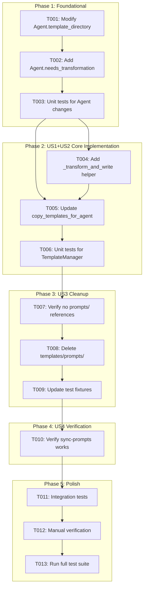
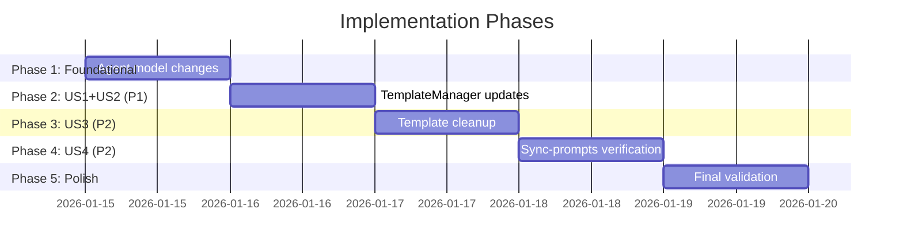

# Tasks: Unified Template Management

**Input**: Design documents from `/specs/024-unified-templates/`
**Prerequisites**: plan.md (required), spec.md (required), research.md, data-model.md, quickstart.md

**Tests**: Tests are included where existing test files need updates.

**Organization**: Tasks are grouped by user story to enable independent implementation and testing of each story.

## Task Dependencies

<!-- BEGIN:AUTO-GENERATED section="task-dependencies" -->

<!-- END:AUTO-GENERATED -->

## Phase Timeline

<!-- BEGIN:AUTO-GENERATED section="phase-timeline" -->

<!-- END:AUTO-GENERATED -->

## Format: `[ID] [P?] [Story] Description`

- **[P]**: Can run in parallel (different files, no dependencies)
- **[Story]**: Which user story this task belongs to (e.g., US1, US2, US3)
- Include exact file paths in descriptions

---

## Phase 1: Foundational (Blocking Prerequisites)

**Purpose**: Core Agent model changes that MUST be complete before any user story implementation

**Why this is foundational**: Both US1 and US2 depend on the Agent model returning "commands" for all agents and having a `needs_transformation` property.

- [x] T001 Modify `Agent.template_directory` property to return "commands" for all agents in src/doit_cli/models/agent.py
- [x] T002 Add `Agent.needs_transformation` property returning True for COPILOT, False for CLAUDE in src/doit_cli/models/agent.py
- [x] T003 Add unit tests for new Agent properties in tests/unit/test_agent.py

**Checkpoint**: Agent model ready - TemplateManager work can begin

---

## Phase 2: User Story 1 & 2 - Single Template Authoring + Automated Prompt Sync (Priority: P1)

**Goal**: Maintainers edit one template file; users get correct agent-specific files via `doit init`

**Why combined**: US1 and US2 are two perspectives on the same underlying change - dynamic prompt generation from command templates.

**Independent Test**: Run `doit init --agent copilot` and verify `.github/prompts/` contains transformed prompts matching previous content

### Implementation for User Stories 1 & 2

- [x] T004 [US1] Add `_transform_and_write_templates()` helper method to TemplateManager in src/doit_cli/services/template_manager.py
- [x] T005 [US2] Update `copy_templates_for_agent()` to call transform when `agent.needs_transformation` is True in src/doit_cli/services/template_manager.py
- [x] T006 [US1] Update unit tests for TemplateManager dynamic generation in tests/unit/test_template_manager.py

**Checkpoint**: At this point, `doit init` should work correctly for both agents using single source

---

## Phase 3: User Story 3 - Template Source Elimination (Priority: P2)

**Goal**: Remove `templates/prompts/` directory entirely to eliminate any possibility of drift

**Independent Test**: Verify `templates/prompts/` does not exist and all tests pass

### Implementation for User Story 3

- [x] T007 [US3] Verify no code references `templates/prompts/` using grep search across src/ directory
- [x] T008 [US3] Delete `templates/prompts/` directory and all 11 prompt files
- [x] T009 [US3] Update any test fixtures that reference `templates/prompts/` in tests/

**Checkpoint**: Single source of truth is now the only source

---

## Phase 4: User Story 4 - On-Demand Prompt Generation (Priority: P2)

**Goal**: Verify `doit sync-prompts` generates prompts from command templates only

**Independent Test**: Run `doit sync-prompts --check` and verify it sources from `templates/commands/`

**From Research**: TemplateReader already reads from `templates/commands/` as primary source. No code changes expected.

### Verification for User Story 4

- [x] T010 [US4] Verify sync-prompts command works correctly after template elimination by running `doit sync-prompts --check`

**Checkpoint**: All user stories complete and independently testable

---

## Phase 5: Polish & Cross-Cutting Concerns

**Purpose**: Final validation and integration testing

- [x] T011 [P] Run integration tests for init command in tests/integration/test_init_command.py
- [x] T012 Manual verification following quickstart.md validation checklist
- [x] T013 Run full test suite with `pytest -v` to ensure no regressions

---

## Dependencies & Execution Order

### Phase Dependencies

- **Foundational (Phase 1)**: No dependencies - start immediately
- **US1+US2 (Phase 2)**: Depends on Phase 1 completion
- **US3 (Phase 3)**: Depends on Phase 2 (must verify new code works before deleting old templates)
- **US4 (Phase 4)**: Depends on Phase 3 (verify sync-prompts after template elimination)
- **Polish (Phase 5)**: Depends on all user stories complete

### User Story Independence

- **US1 + US2 (P1)**: Core implementation - must complete first
- **US3 (P2)**: Cleanup - can only run after US1+US2 verified working
- **US4 (P2)**: Verification - confirms sync-prompts still works

### Parallel Opportunities

- T001 and T002 can be done in same edit session (same file)
- T011 can run in parallel with T012 (different verification methods)

---

## Parallel Example: Phase 1

```bash
# These tasks modify the same file - do sequentially:
Task T001: "Modify Agent.template_directory property"
Task T002: "Add Agent.needs_transformation property"
# Then:
Task T003: "Add unit tests for Agent properties"
```

---

## Implementation Strategy

### MVP First (Phase 1 + Phase 2 Only)

1. Complete Phase 1: Foundational (Agent model changes)
2. Complete Phase 2: US1+US2 (TemplateManager updates)
3. **STOP and VALIDATE**: Run existing tests, verify both agents work
4. If stable, can ship without cleanup (Phase 3+)

### Full Implementation

1. Complete Phases 1-2 → Core functionality working
2. Complete Phase 3 → Single source of truth enforced
3. Complete Phase 4 → All commands verified
4. Complete Phase 5 → Full validation

### Risk Mitigation

- Phase 3 (deletion) is easily reversible via git
- Each phase has clear checkpoint for validation
- No database migrations or external dependencies

---

## Task Summary

| Phase | Tasks | Description |
|-------|-------|-------------|
| 1 - Foundational | T001-T003 | Agent model changes |
| 2 - US1+US2 (P1) | T004-T006 | TemplateManager dynamic generation |
| 3 - US3 (P2) | T007-T009 | Template directory cleanup |
| 4 - US4 (P2) | T010 | Sync-prompts verification |
| 5 - Polish | T011-T013 | Final validation |

**Total Tasks**: 13
**Parallel Opportunities**: 2 (T011, T012 in Phase 5)
**MVP Scope**: Phases 1-2 (6 tasks)

---

## Notes

- [P] tasks = different files, no dependencies
- [Story] label maps task to specific user story for traceability
- Each user story should be independently completable and testable
- Commit after each task or logical group
- Stop at any checkpoint to validate story independently
