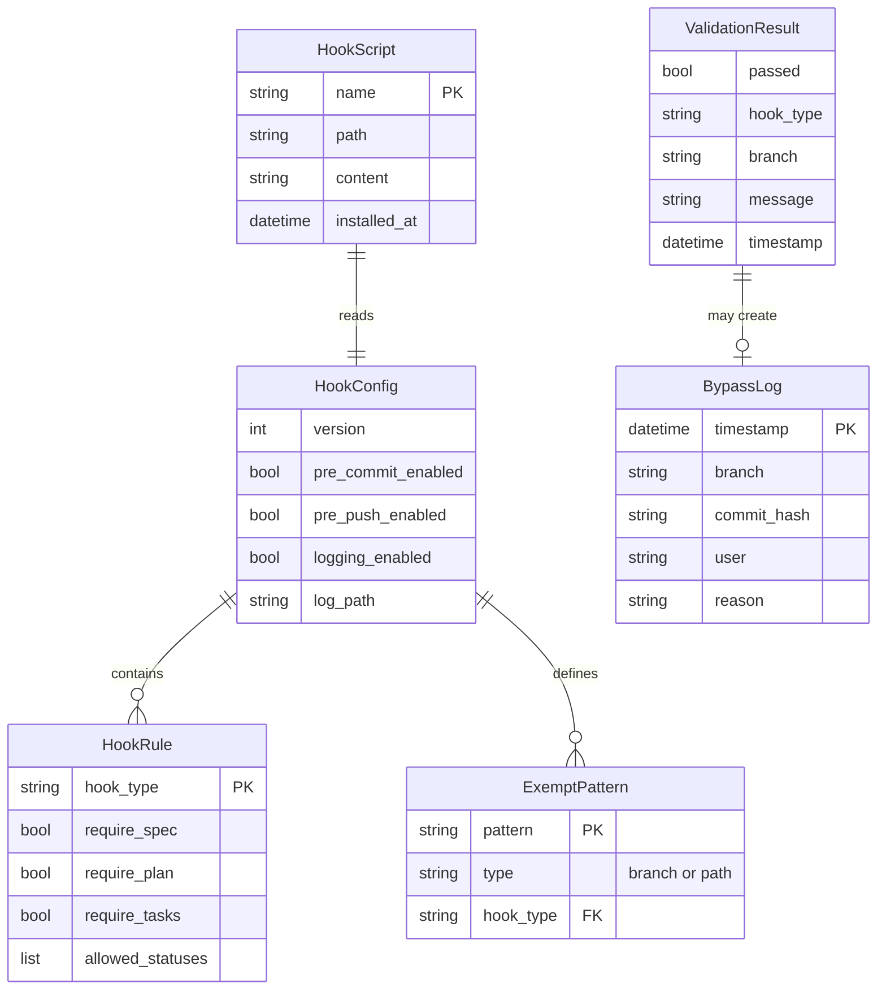
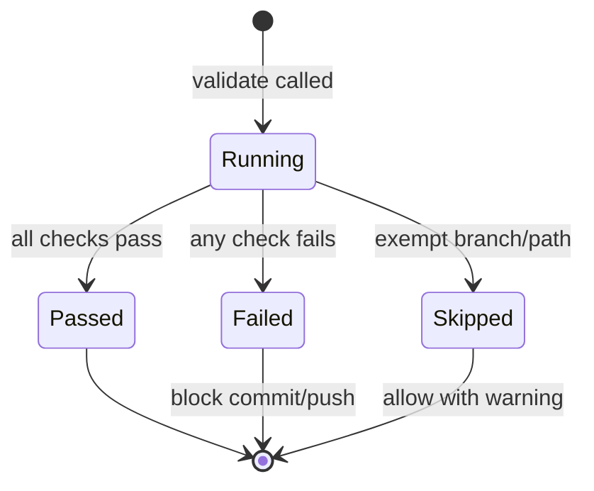
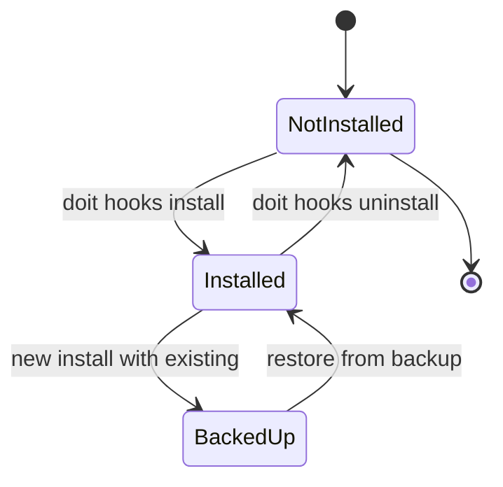

# Data Model: Git Hook Integration for Workflow Enforcement

**Feature**: 025-git-hooks-workflow
**Date**: 2026-01-15

## Entity Relationship Diagram

<!-- BEGIN:AUTO-GENERATED section="er-diagram" -->

<!-- END:AUTO-GENERATED -->

---

## Entities

### HookConfig

Configuration settings loaded from `.doit/config/hooks.yaml`.

| Field | Type | Required | Description |
|-------|------|----------|-------------|
| version | int | Yes | Configuration schema version (currently 1) |
| pre_commit | HookRule | No | Pre-commit hook configuration |
| pre_push | HookRule | No | Pre-push hook configuration |
| logging | LoggingConfig | No | Logging configuration |

**Default Values**:
- `version`: 1
- All hooks enabled by default
- All requirements enabled by default

---

### HookRule

Configuration for a specific hook type.

| Field | Type | Required | Default | Description |
|-------|------|----------|---------|-------------|
| enabled | bool | No | true | Whether this hook is active |
| require_spec | bool | No | true | Require spec.md exists |
| require_plan | bool | No | true | Require plan.md exists (pre-push only) |
| require_tasks | bool | No | false | Require tasks.md exists (pre-push only) |
| allowed_statuses | list[str] | No | ["In Progress", "Complete"] | Spec statuses that allow commits |
| exempt_branches | list[str] | No | ["main", "develop"] | Branch patterns to skip validation |
| exempt_paths | list[str] | No | [] | File patterns that don't require specs |

---

### ExemptPattern

Pattern for exempting branches or file paths from validation.

| Field | Type | Required | Description |
|-------|------|----------|-------------|
| pattern | str | Yes | Glob pattern (e.g., `hotfix/*`, `docs/**`) |
| type | str | Yes | Either "branch" or "path" |
| hook_type | str | Yes | Which hook this exemption applies to |

**Pattern Matching**:
- Uses fnmatch for glob-style patterns
- `*` matches any characters except `/`
- `**` matches any characters including `/`

---

### HookScript

Represents an installed Git hook script.

| Field | Type | Required | Description |
|-------|------|----------|-------------|
| name | str | Yes | Hook name (e.g., "pre-commit", "pre-push") |
| path | Path | Yes | Absolute path in `.git/hooks/` |
| content | str | Yes | Script content |
| installed_at | datetime | Yes | When the hook was installed |

---

### ValidationResult

Result of hook validation execution.

| Field | Type | Required | Description |
|-------|------|----------|-------------|
| passed | bool | Yes | Whether validation succeeded |
| hook_type | str | Yes | Type of hook that ran |
| branch | str | Yes | Current branch name |
| message | str | No | Error or warning message |
| timestamp | datetime | Yes | When validation ran |
| checks | list[CheckResult] | Yes | Individual check results |

---

### CheckResult

Result of a single validation check.

| Field | Type | Required | Description |
|-------|------|----------|-------------|
| check_name | str | Yes | Name of check (e.g., "spec_exists") |
| passed | bool | Yes | Whether check passed |
| message | str | No | Details about failure |
| suggestion | str | No | How to fix the issue |

---

### BypassLog

Audit log entry for hook bypasses.

| Field | Type | Required | Description |
|-------|------|----------|-------------|
| timestamp | datetime | Yes | When bypass occurred |
| branch | str | Yes | Branch where bypass happened |
| commit_hash | str | Yes | Commit created with bypass |
| user | str | No | Git user.name if available |
| reason | str | No | User-provided reason (future enhancement) |

---

## State Diagrams

### ValidationResult State Machine

### HookScript Lifecycle

---

## File Locations

| Entity | Storage Location | Format |
|--------|-----------------|--------|
| HookConfig | `.doit/config/hooks.yaml` | YAML |
| HookScript | `.git/hooks/{name}` | Shell script |
| BypassLog | `.doit/logs/hook-bypasses.log` | JSON Lines |
| Backup manifest | `.doit/backups/hooks/manifest.json` | JSON |
| Backed up hooks | `.doit/backups/hooks/{name}.{timestamp}.bak` | Shell script |

---

## Validation Rules

### Branch Name Validation
- Pattern: `^\d{3}-[a-z0-9-]+$` (e.g., `025-git-hooks-workflow`)
- Protected branches (`main`, `develop`) always exempt
- Non-matching branches trigger warning, not error

### Spec Status Validation
- Extracted from spec.md `**Status**:` field
- Must be in `allowed_statuses` list
- Default allowed: `["In Progress", "Complete", "Approved"]`

### Path Exemption Validation
- Compared against staged files in commit
- If ALL staged files match exempt patterns, validation skipped
- Uses fnmatch glob patterns
