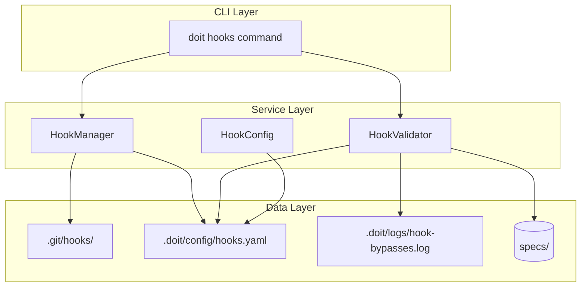

# Implementation Plan: Git Hook Integration for Workflow Enforcement

**Branch**: `025-git-hooks-workflow` | **Date**: 2026-01-15 | **Spec**: [spec.md](spec.md)
**Input**: Feature specification from `/specs/025-git-hooks-workflow/spec.md`

## Summary

Add Git hook integration to the doit CLI that enforces the spec-driven development workflow. The feature provides `doit hooks install/uninstall/status/restore` commands that manage pre-commit and pre-push hooks, validating that code changes are associated with properly documented specifications. Hooks read from a YAML configuration file and log bypass events for audit purposes.

## Technical Context

**Language/Version**: Python 3.11+ (per constitution)
**Primary Dependencies**: Typer (CLI), Rich (output), PyYAML (configuration)
**Storage**: File-based - `.doit/config/hooks.yaml` for configuration, `.doit/logs/hook-bypasses.log` for audit
**Testing**: pytest with mock filesystem and git operations
**Target Platform**: Cross-platform (macOS, Linux, Windows via Git Bash)
**Project Type**: single (CLI extension)
**Performance Goals**: Hook validation <500ms, installation <2s
**Constraints**: Must work with standard Git hooks interface, no external dependencies in hook scripts
**Scale/Scope**: Single developer to team workflows (1-50 developers)

## Architecture Overview

<!-- BEGIN:AUTO-GENERATED section="architecture" -->

<!-- END:AUTO-GENERATED -->

## Constitution Check

*GATE: Must pass before Phase 0 research. Re-check after Phase 1 design.*

| Principle | Compliance | Notes |
|-----------|------------|-------|
| I. Specification-First | PASS | Spec created before planning |
| II. Persistent Memory | PASS | Configuration stored in `.doit/config/`, logs in `.doit/logs/` |
| III. Auto-Generated Diagrams | PASS | Architecture diagram auto-generated |
| IV. Opinionated Workflow | PASS | Feature enforces the constitution workflow |
| V. AI-Native Design | PASS | Commands designed for AI assistant usage |
| Quality Standards | PASS | pytest tests required for all components |

**Tech Stack Alignment**:
- Python 3.11+ - ALIGNED
- Typer CLI - ALIGNED
- pytest testing - ALIGNED
- File-based storage - ALIGNED
- PyYAML addition - JUSTIFIED (standard YAML parsing, minimal dependency)

## Project Structure

### Documentation (this feature)

```text
specs/025-git-hooks-workflow/
├── spec.md              # Feature specification
├── plan.md              # This file
├── research.md          # Phase 0 output
├── data-model.md        # Phase 1 output
├── quickstart.md        # Phase 1 output
├── contracts/           # Phase 1 output (N/A - no API)
└── tasks.md             # Phase 2 output (/doit.taskit)
```

### Source Code (repository root)

```text
src/doit_cli/
├── cli/
│   └── hooks_command.py     # New: doit hooks subcommands
├── models/
│   └── hook_config.py       # New: HookConfig dataclass
├── services/
│   ├── hook_manager.py      # New: Install/uninstall/backup hooks
│   └── hook_validator.py    # New: Validate workflow compliance
└── templates/
    └── hooks/               # New: Hook script templates
        ├── pre-commit.sh
        └── pre-push.sh

tests/
├── unit/
│   ├── test_hook_config.py
│   ├── test_hook_manager.py
│   └── test_hook_validator.py
└── integration/
    └── test_hooks_command.py
```

**Structure Decision**: Single project structure, extending existing doit_cli with new `hooks` subcommand group. Hook scripts are shell templates that invoke `doit hooks validate` internally.

## Complexity Tracking

No complexity violations - feature follows constitution patterns exactly.
