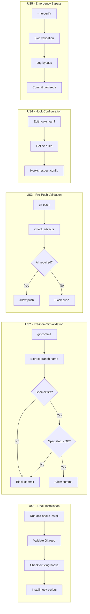

# Feature Specification: Git Hook Integration for Workflow Enforcement

**Feature Branch**: `025-git-hooks-workflow`
**Created**: 2026-01-15
**Status**: Complete
**Input**: User description: "Git hook integration for workflow enforcement. Rationale: Ensures team compliance with spec-first workflow via pre-commit/push hooks"

## Summary

Add Git hook integration to the doit CLI that enforces the spec-driven development workflow. Pre-commit and pre-push hooks validate that code changes are associated with properly documented specifications, ensuring team compliance with the spec-first methodology.

## User Scenarios & Testing *(mandatory)*

### User Story 1 - Hook Installation (Priority: P1)

As a team lead setting up a new project, I want to install workflow enforcement hooks with a single command so that all team members are automatically required to follow the spec-first workflow.

**Why this priority**: Without hook installation, no enforcement is possible. This is the foundation for all other functionality.

**Independent Test**: Can be fully tested by running `doit hooks install` and verifying that `.git/hooks/pre-commit` and `.git/hooks/pre-push` scripts are created with correct content.

**Acceptance Scenarios**:

1. **Given** a doit-initialized project with a `.git` directory, **When** the user runs `doit hooks install`, **Then** pre-commit and pre-push hooks are installed in `.git/hooks/`.
2. **Given** existing hooks already present in `.git/hooks/`, **When** the user runs `doit hooks install`, **Then** the system prompts for confirmation before overwriting and offers to backup existing hooks.
3. **Given** a project without Git initialized, **When** the user runs `doit hooks install`, **Then** the system displays an error message indicating Git must be initialized first.

---

### User Story 2 - Pre-Commit Validation (Priority: P1)

As a developer, I want commits to be blocked when my changes don't have an associated specification so that I'm reminded to follow the spec-first workflow before coding.

**Why this priority**: Pre-commit validation is the primary enforcement mechanism - it catches violations at the earliest point in the workflow.

**Independent Test**: Can be fully tested by attempting to commit changes on a feature branch without a corresponding spec file and verifying the commit is blocked with a helpful message.

**Acceptance Scenarios**:

1. **Given** a feature branch named `025-feature-name` without a matching spec at `specs/025-feature-name/spec.md`, **When** the developer attempts to commit, **Then** the commit is blocked with a message explaining the missing specification.
2. **Given** a feature branch with a valid specification file, **When** the developer commits code changes, **Then** the commit proceeds normally.
3. **Given** a commit on `main` or `develop` branch, **When** the developer commits, **Then** the hook allows the commit without spec validation (merge commits are exempt).
4. **Given** a feature branch with a spec in "Draft" status, **When** the developer attempts to commit implementation code (not spec changes), **Then** the commit is blocked with a message to finalize the spec first.

---

### User Story 3 - Pre-Push Validation (Priority: P2)

As a team lead, I want pushes to be validated against workflow progress so that incomplete features aren't pushed to shared branches without proper planning artifacts.

**Why this priority**: Pre-push provides a second layer of enforcement before code reaches the shared repository, catching issues missed at commit time.

**Independent Test**: Can be fully tested by attempting to push a feature branch without a plan.md and verifying the push is blocked with instructions to run `/doit.planit`.

**Acceptance Scenarios**:

1. **Given** a feature branch with spec.md but no plan.md, **When** the developer attempts to push, **Then** the push is blocked with a suggestion to run `/doit.planit` first.
2. **Given** a feature branch with all required artifacts (spec.md, plan.md, tasks.md), **When** the developer pushes, **Then** the push proceeds normally.
3. **Given** a push to `main` or `develop` (merge commits), **When** the push is initiated, **Then** validation is skipped (PRs handle this validation).

---

### User Story 4 - Hook Configuration (Priority: P2)

As a project maintainer, I want to configure which workflow stages are enforced so that I can adapt enforcement to my team's specific workflow needs.

**Why this priority**: Teams have different maturity levels and may need to gradually adopt strict enforcement or customize which checks apply.

**Independent Test**: Can be fully tested by modifying `.doit/config/hooks.yaml` settings and verifying that only configured validations are performed.

**Acceptance Scenarios**:

1. **Given** a hooks configuration with `require_spec: true` and `require_plan: false`, **When** the pre-push hook runs, **Then** only spec existence is validated (plan is not required).
2. **Given** a hooks configuration with `exempt_branches: [hotfix/*, bugfix/*]`, **When** committing on a `hotfix/urgent-fix` branch, **Then** workflow validation is skipped.
3. **Given** no hooks configuration file exists, **When** hooks are installed, **Then** default strict settings are applied.

---

### User Story 5 - Hook Bypass for Emergencies (Priority: P3)

As a developer handling an urgent production issue, I want the ability to bypass hooks when necessary so that emergency fixes aren't blocked by workflow requirements.

**Why this priority**: Real-world scenarios require escape hatches, but this should be auditable and discouraged for normal use.

**Independent Test**: Can be fully tested by running `git commit --no-verify` and verifying the commit succeeds while logging a bypass event.

**Acceptance Scenarios**:

1. **Given** a commit that would normally be blocked, **When** the developer uses `git commit --no-verify`, **Then** the commit proceeds and a warning is logged to `.doit/logs/hook-bypasses.log`.
2. **Given** the bypass log exists, **When** a team lead runs `doit hooks report`, **Then** a summary of all bypass events is displayed.
3. **Given** hooks configuration with `allow_bypass: false`, **When** `--no-verify` is used, **Then** a post-commit hook logs the bypass (cannot block, but can notify).

---

### Edge Cases

- What happens when the branch name doesn't follow the `###-feature-name` pattern?
  - System logs a warning but allows the commit, recommending the standard naming convention.
- What happens when spec.md exists but is malformed (missing required sections)?
  - Pre-commit validates spec structure and blocks if required sections are missing.
- How does the system handle commits with only documentation or test changes?
  - Configuration allows exempting certain file patterns (e.g., `docs/**`, `*.md`) from spec requirements.
- What happens in a detached HEAD state?
  - Hooks are skipped with a warning, as there's no branch context for validation.

## User Journey Visualization

<!-- BEGIN:AUTO-GENERATED section="user-journey" -->

<!-- END:AUTO-GENERATED -->

## Requirements *(mandatory)*

### Functional Requirements

- **FR-001**: System MUST provide a `doit hooks install` command that installs pre-commit and pre-push Git hooks
- **FR-002**: System MUST provide a `doit hooks uninstall` command that removes installed hooks
- **FR-003**: Pre-commit hook MUST validate that feature branches have a corresponding spec file at `specs/{branch-name}/spec.md`
- **FR-004**: Pre-commit hook MUST check that spec files are not in "Draft" status when committing implementation code
- **FR-005**: Pre-push hook MUST validate that feature branches have required workflow artifacts (configurable: spec.md, plan.md, tasks.md)
- **FR-006**: System MUST skip validation for protected branches (`main`, `develop`) and merge commits
- **FR-007**: System MUST support a configuration file (`.doit/config/hooks.yaml`) for customizing enforcement rules
- **FR-008**: System MUST backup existing hooks before overwriting and offer restoration via `doit hooks restore`
- **FR-009**: System MUST log all hook bypass events (`--no-verify`) to `.doit/logs/hook-bypasses.log`
- **FR-010**: System MUST provide a `doit hooks status` command showing current hook configuration and installation state
- **FR-011**: System MUST provide clear, actionable error messages when commits/pushes are blocked
- **FR-012**: System MUST support `exempt_branches` configuration for branches that bypass validation (e.g., `hotfix/*`)
- **FR-013**: System MUST support `exempt_paths` configuration for file patterns that don't require specs (e.g., `docs/**`)

### Key Entities

- **Hook Script**: Shell script installed in `.git/hooks/` that executes doit validation logic
- **Hook Configuration**: YAML file at `.doit/config/hooks.yaml` defining enforcement rules and exemptions
- **Bypass Log**: Append-only log file tracking all `--no-verify` usage for audit purposes
- **Workflow Artifact**: Spec, plan, or task file that must exist for workflow compliance

## Success Criteria *(mandatory)*

### Measurable Outcomes

- **SC-001**: `doit hooks install` successfully installs hooks in under 2 seconds
- **SC-002**: Pre-commit validation completes in under 500ms for typical repositories
- **SC-003**: 100% of feature branch commits are validated against spec requirements (unless bypassed)
- **SC-004**: Zero false positives - valid commits on properly documented branches always succeed
- **SC-005**: Bypass events are logged with 100% reliability for audit purposes
- **SC-006**: Existing hooks are never lost - backup/restore functionality works correctly

## Assumptions

- Projects using this feature have Git initialized and use feature branch workflows
- Branch names follow a pattern that can be mapped to spec directories (e.g., `###-feature-name`)
- Teams are willing to adopt the spec-first methodology and want enforcement assistance
- The `.doit/` directory structure is already established via `doit init`

## Out of Scope

- Integration with CI/CD pipelines (separate feature)
- Server-side Git hooks (this feature focuses on client-side hooks only)
- Automatic spec generation when missing (hooks only validate, not create)
- Git hosting provider webhooks (GitHub Actions, GitLab CI, etc.)
- Cross-repository validation
