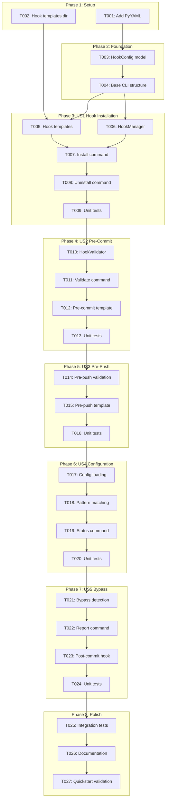
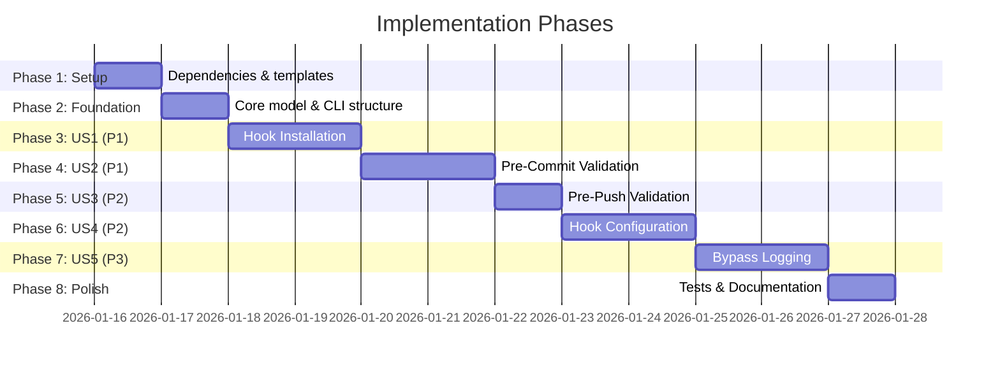

# Tasks: Git Hook Integration for Workflow Enforcement

**Input**: Design documents from `/specs/025-git-hooks-workflow/`
**Prerequisites**: plan.md, spec.md, research.md, data-model.md, quickstart.md

**Tests**: Unit and integration tests included per Quality Standards in constitution.

**Organization**: Tasks are grouped by user story to enable independent implementation and testing of each story.

## Task Dependencies

<!-- BEGIN:AUTO-GENERATED section="task-dependencies" -->

<!-- END:AUTO-GENERATED -->

## Phase Timeline

<!-- BEGIN:AUTO-GENERATED section="phase-timeline" -->

<!-- END:AUTO-GENERATED -->

## Format: `[ID] [P?] [Story] Description`

- **[P]**: Can run in parallel (different files, no dependencies)
- **[Story]**: Which user story this task belongs to (e.g., US1, US2, US3)
- Include exact file paths in descriptions

---

## Phase 1: Setup (Shared Infrastructure)

**Purpose**: Add dependencies and create directory structure

- [x] T001 Add PyYAML dependency to pyproject.toml
- [x] T002 [P] Create hook templates directory at src/doit_cli/templates/hooks/

---

## Phase 2: Foundational (Blocking Prerequisites)

**Purpose**: Core infrastructure that MUST be complete before ANY user story can be implemented

**CRITICAL**: No user story work can begin until this phase is complete

- [x] T003 Create HookConfig dataclass in src/doit_cli/models/hook_config.py
- [x] T004 Create hooks CLI command group skeleton in src/doit_cli/cli/hooks_command.py

**Checkpoint**: Foundation ready - user story implementation can now begin

---

## Phase 3: User Story 1 - Hook Installation (Priority: P1)

**Goal**: Install and manage Git hooks with a single command

**Independent Test**: Run `doit hooks install` and verify `.git/hooks/pre-commit` and `.git/hooks/pre-push` are created

### Implementation for User Story 1

- [x] T005 [P] [US1] Create pre-commit.sh template in src/doit_cli/templates/hooks/pre-commit.sh
- [x] T006 [US1] Implement HookManager service in src/doit_cli/services/hook_manager.py
- [x] T007 [US1] Implement `doit hooks install` command in src/doit_cli/cli/hooks_command.py
- [x] T008 [US1] Implement `doit hooks uninstall` command in src/doit_cli/cli/hooks_command.py
- [x] T009 [US1] Add unit tests for HookManager in tests/unit/test_hook_manager.py

**Checkpoint**: Hook installation should be fully functional and testable independently

---

## Phase 4: User Story 2 - Pre-Commit Validation (Priority: P1)

**Goal**: Block commits without associated specifications

**Independent Test**: Attempt commit on feature branch without spec.md and verify commit is blocked with helpful message

### Implementation for User Story 2

- [x] T010 [US2] Implement HookValidator service in src/doit_cli/services/hook_validator.py
- [x] T011 [US2] Implement `doit hooks validate pre-commit` command in src/doit_cli/cli/hooks_command.py
- [x] T012 [US2] Update pre-commit.sh template to call validation command
- [x] T013 [US2] Add unit tests for HookValidator in tests/unit/test_hook_validator.py

**Checkpoint**: Pre-commit validation should block missing specs and allow valid commits

---

## Phase 5: User Story 3 - Pre-Push Validation (Priority: P2)

**Goal**: Validate workflow artifacts before pushing

**Independent Test**: Attempt push on feature branch without plan.md and verify push is blocked with instructions

### Implementation for User Story 3

- [x] T014 [US3] Extend HookValidator with pre-push validation logic in src/doit_cli/services/hook_validator.py
- [x] T015 [P] [US3] Create pre-push.sh template in src/doit_cli/templates/hooks/pre-push.sh
- [x] T016 [US3] Add unit tests for pre-push validation in tests/unit/test_hook_validator.py

**Checkpoint**: Pre-push validation should check for plan.md and tasks.md

---

## Phase 6: User Story 4 - Hook Configuration (Priority: P2)

**Goal**: Customizable enforcement rules via configuration file

**Independent Test**: Modify `.doit/config/hooks.yaml` and verify hooks respect the configuration

### Implementation for User Story 4

- [x] T017 [US4] Implement YAML config file loading in src/doit_cli/models/hook_config.py
- [x] T018 [US4] Add exempt branch/path pattern matching in src/doit_cli/services/hook_validator.py
- [x] T019 [US4] Implement `doit hooks status` command in src/doit_cli/cli/hooks_command.py
- [x] T020 [US4] Add unit tests for config loading in tests/unit/test_hook_config.py

**Checkpoint**: Configuration should customize validation behavior

---

## Phase 7: User Story 5 - Hook Bypass for Emergencies (Priority: P3)

**Goal**: Audit trail for --no-verify usage

**Independent Test**: Use `git commit --no-verify` and verify bypass is logged

### Implementation for User Story 5

- [x] T021 [US5] Implement bypass detection and logging in src/doit_cli/services/hook_validator.py
- [x] T022 [US5] Implement `doit hooks report` command in src/doit_cli/cli/hooks_command.py
- [x] T023 [P] [US5] Create post-commit.sh template for bypass detection in src/doit_cli/templates/hooks/post-commit.sh
- [x] T024 [US5] Add unit tests for bypass logging in tests/unit/test_hook_validator.py

**Checkpoint**: All bypasses should be logged and reportable

---

## Phase 8: Polish & Cross-Cutting Concerns

**Purpose**: Integration testing and documentation

- [x] T025 Add integration tests for hooks command in tests/integration/test_hooks_command.py
- [x] T026 [P] Update CLAUDE.md with new technology (PyYAML, hooks)
- [x] T027 Run quickstart.md validation scenarios manually

---

## Dependencies & Execution Order

### Phase Dependencies

- **Setup (Phase 1)**: No dependencies - can start immediately
- **Foundational (Phase 2)**: Depends on Setup completion - BLOCKS all user stories
- **US1 (Phase 3)**: Depends on Foundational - MVP milestone
- **US2 (Phase 4)**: Depends on US1 (needs installed hooks to validate)
- **US3 (Phase 5)**: Depends on US2 (extends validation patterns)
- **US4 (Phase 6)**: Depends on US2 (configuration affects validation)
- **US5 (Phase 7)**: Depends on US4 (uses configuration for logging)
- **Polish (Phase 8)**: Depends on all user stories being complete

### User Story Dependencies

- **User Story 1 (P1)**: Can start after Foundational - Provides hook installation
- **User Story 2 (P1)**: Depends on US1 - Uses installed pre-commit hook
- **User Story 3 (P2)**: Depends on US2 - Extends HookValidator for pre-push
- **User Story 4 (P2)**: Depends on US2 - Configuration affects validation behavior
- **User Story 5 (P3)**: Depends on US4 - Uses config for logging settings

### Within Each User Story

- Models before services
- Services before CLI commands
- Core implementation before tests
- Story complete before moving to next priority

### Parallel Opportunities

- T001 and T002 can run in parallel (different files)
- T005 can run in parallel with other Phase 3 setup
- T015 can run in parallel (new template file)
- T023 and T026 can run in parallel with other tasks

---

## Parallel Example: User Story 1

```bash
# Launch template and manager development together:
Task: "Create pre-commit.sh template in src/doit_cli/templates/hooks/pre-commit.sh"
Task: "Implement HookManager service in src/doit_cli/services/hook_manager.py"
```

---

## Implementation Strategy

### MVP First (User Stories 1 + 2 Only)

1. Complete Phase 1: Setup
2. Complete Phase 2: Foundational
3. Complete Phase 3: US1 Hook Installation
4. Complete Phase 4: US2 Pre-Commit Validation
5. **STOP and VALIDATE**: Test hook installation and pre-commit blocking
6. Deploy/demo if ready - **Core workflow enforcement working!**

### Incremental Delivery

1. Setup + Foundational → Foundation ready
2. Add US1 Hook Installation → `doit hooks install` works
3. Add US2 Pre-Commit → Commits blocked without specs (MVP!)
4. Add US3 Pre-Push → Pushes blocked without plan
5. Add US4 Configuration → Custom rules supported
6. Add US5 Bypass Logging → Audit trail available
7. Each story adds value without breaking previous stories

---

## Notes

- [P] tasks = different files, no dependencies
- [Story] label maps task to specific user story for traceability
- Each user story should be independently completable and testable
- Commit after each task or logical group
- Stop at any checkpoint to validate story independently
- US1 + US2 together form the MVP for workflow enforcement
