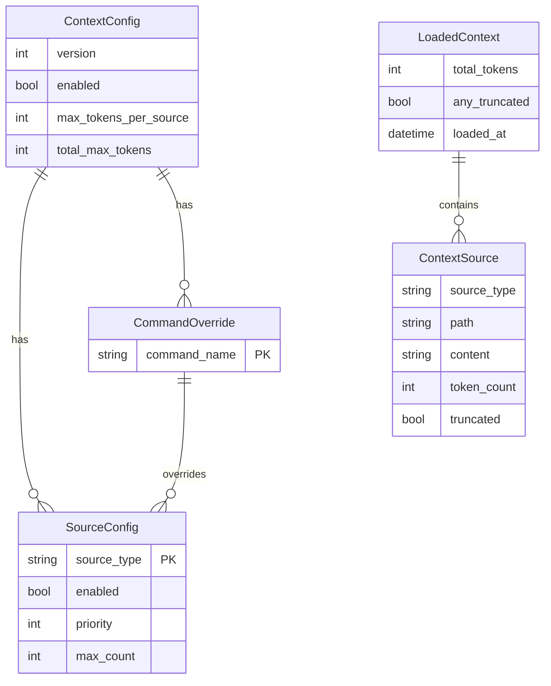
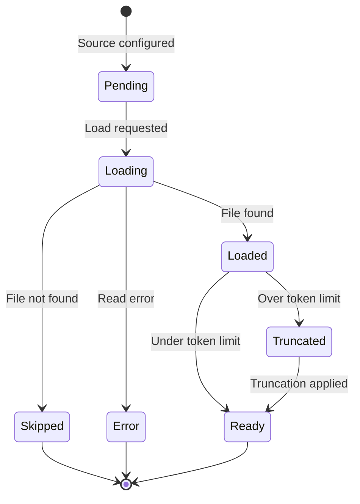

# Data Model: AI Context Injection

**Feature**: 026-ai-context-injection
**Date**: 2026-01-15

## Entity Relationship Diagram

<!-- BEGIN:AUTO-GENERATED section="er-diagram" -->

<!-- END:AUTO-GENERATED -->

---

## Entity Definitions

### ContextConfig

Configuration for context loading behavior. Loaded from `.doit/config/context.yaml`.

| Field | Type | Required | Default | Description |
|-------|------|----------|---------|-------------|
| version | int | Yes | 1 | Config schema version |
| enabled | bool | No | true | Master toggle for context loading |
| max_tokens_per_source | int | No | 4000 | Token limit per individual source |
| total_max_tokens | int | No | 16000 | Token limit for all context combined |
| sources | dict[str, SourceConfig] | No | defaults | Per-source configuration |
| commands | dict[str, CommandOverride] | No | {} | Per-command overrides |

**Validation Rules**:
- version must be 1 (current schema)
- max_tokens_per_source must be > 0
- total_max_tokens must be >= max_tokens_per_source

**Default Source Configuration**:
```python
{
    "constitution": SourceConfig(enabled=True, priority=1),
    "roadmap": SourceConfig(enabled=True, priority=2),
    "current_spec": SourceConfig(enabled=True, priority=3),
    "related_specs": SourceConfig(enabled=True, priority=4, max_count=3),
}
```

---

### SourceConfig

Configuration for an individual context source type.

| Field | Type | Required | Default | Description |
|-------|------|----------|---------|-------------|
| source_type | str | Yes | - | Type identifier (constitution, roadmap, etc.) |
| enabled | bool | No | true | Whether this source is loaded |
| priority | int | No | varies | Loading priority (lower = higher priority) |
| max_count | int | No | 1 | Max items for multi-item sources (related_specs) |

**Valid Source Types**:
- `constitution` - Project constitution from `.doit/memory/constitution.md`
- `roadmap` - Project roadmap from `.doit/memory/roadmap.md`
- `current_spec` - Current feature spec based on branch name
- `related_specs` - Specs related to current feature
- `custom` - User-defined additional sources

---

### CommandOverride

Per-command configuration overrides.

| Field | Type | Required | Default | Description |
|-------|------|----------|---------|-------------|
| command_name | str | Yes | - | Command to override (specit, planit, etc.) |
| sources | dict[str, SourceConfig] | No | {} | Source overrides for this command |

**Example**: Disable related_specs for specit (creating new spec doesn't need related):
```yaml
commands:
  specit:
    sources:
      related_specs:
        enabled: false
```

---

### ContextSource

A loaded context source ready for injection.

| Field | Type | Required | Default | Description |
|-------|------|----------|---------|-------------|
| source_type | str | Yes | - | Type of source (constitution, roadmap, etc.) |
| path | Path | Yes | - | File path that was loaded |
| content | str | Yes | - | Loaded content (possibly truncated) |
| token_count | int | Yes | - | Estimated token count |
| truncated | bool | No | false | Whether content was truncated |
| original_tokens | int | No | None | Original token count before truncation |

**State: Content Loading**



---

### LoadedContext

Aggregated context ready for injection into command prompt.

| Field | Type | Required | Default | Description |
|-------|------|----------|---------|-------------|
| sources | list[ContextSource] | Yes | [] | All loaded sources |
| total_tokens | int | Yes | 0 | Sum of all source token counts |
| any_truncated | bool | No | false | True if any source was truncated |
| loaded_at | datetime | Yes | - | Timestamp of loading |

**Methods**:
- `to_markdown()` - Format all sources as markdown for injection
- `get_source(type)` - Get specific source by type
- `has_source(type)` - Check if source type is loaded

---

## File Locations

| Entity | Storage | Path |
|--------|---------|------|
| ContextConfig | YAML file | `.doit/config/context.yaml` |
| SourceConfig | Embedded in ContextConfig | - |
| CommandOverride | Embedded in ContextConfig | - |
| ContextSource | In-memory only | - |
| LoadedContext | In-memory only | - |

---

## Configuration File Example

```yaml
# .doit/config/context.yaml
version: 1

# Global settings
enabled: true
max_tokens_per_source: 4000
total_max_tokens: 16000

# Source configuration
sources:
  constitution:
    enabled: true
    priority: 1
  roadmap:
    enabled: true
    priority: 2
  current_spec:
    enabled: true
    priority: 3
  related_specs:
    enabled: true
    priority: 4
    max_count: 3

# Per-command overrides
commands:
  specit:
    sources:
      related_specs:
        enabled: false
  roadmapit:
    sources:
      current_spec:
        enabled: false
```
