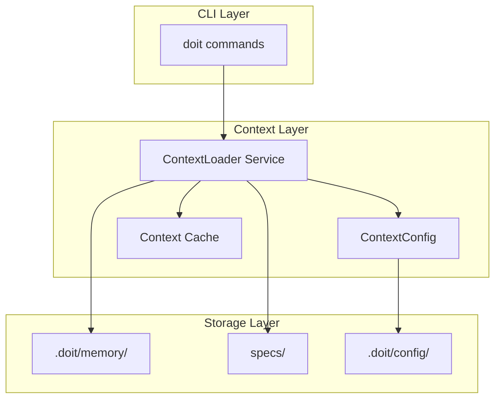

# Implementation Plan: AI Context Injection for Commands

**Branch**: `026-ai-context-injection` | **Date**: 2026-01-15 | **Spec**: [spec.md](spec.md)
**Input**: Feature specification from `/specs/026-ai-context-injection/spec.md`

## Summary

Enable doit commands to automatically load and inject relevant project context (constitution, roadmap, related specs) when executing. This provides AI assistants with comprehensive project understanding without manual context gathering, improving response quality by ensuring commands have access to project principles, current priorities, and related work.

**Technical Approach**: Create a `ContextLoader` service that reads markdown files from `.doit/memory/`, discovers related specs, and formats the aggregated context for AI consumption. Integration via a context injection layer that hooks into existing command execution.

## Technical Context

**Language/Version**: Python 3.11+ (per constitution)
**Primary Dependencies**: Typer, Rich, PyYAML (for configuration)
**Storage**: File-based (markdown in `.doit/memory/`)
**Testing**: pytest (per constitution)
**Target Platform**: Cross-platform CLI (macOS, Linux, Windows)
**Project Type**: single (CLI enhancement to existing project)
**Performance Goals**: Context loading < 500ms overhead (per SC-001)
**Constraints**: Max 4000 tokens per source by default, graceful degradation on missing files
**Scale/Scope**: Projects with up to 50 specs, typical context load of 3-5 files

## Architecture Overview

<!-- BEGIN:AUTO-GENERATED section="architecture" -->

<!-- END:AUTO-GENERATED -->

## Constitution Check

*GATE: Must pass before Phase 0 research. Re-check after Phase 1 design.*

| Principle | Status | Notes |
|-----------|--------|-------|
| I. Specification-First | PASS | Spec completed before planning |
| II. Persistent Memory | PASS | Uses `.doit/memory/` for context files, configuration in `.doit/config/` |
| III. Auto-Generated Diagrams | PASS | Diagrams auto-generated in spec and plan |
| IV. Opinionated Workflow | PASS | Following standard workflow (specit → planit) |
| V. AI-Native Design | PASS | Feature directly enhances AI command integration |
| Quality Standards | PENDING | Tests will be added during implementation |

**Gate Status**: PASS - Proceed to Phase 0

## Project Structure

### Documentation (this feature)

```text
specs/026-ai-context-injection/
├── spec.md              # Feature specification (completed)
├── plan.md              # This file
├── research.md          # Phase 0 output
├── data-model.md        # Phase 1 output
├── quickstart.md        # Phase 1 output
├── contracts/           # Phase 1 output (internal APIs)
└── tasks.md             # Phase 2 output (/doit.taskit)
```

### Source Code (repository root)

```text
src/doit_cli/
├── models/
│   ├── context_config.py    # NEW: ContextConfig, ContextSource dataclasses
│   └── ...existing models...
├── services/
│   ├── context_loader.py    # NEW: ContextLoader service
│   └── ...existing services...
├── __init__.py              # MODIFY: Add context injection to commands
└── ...

.doit/
├── config/
│   └── context.yaml         # NEW: Context configuration file
└── memory/
    ├── constitution.md      # Existing
    └── roadmap.md           # Existing

tests/
├── unit/
│   ├── test_context_config.py   # NEW
│   └── test_context_loader.py   # NEW
└── integration/
    └── test_context_injection.py # NEW
```

**Structure Decision**: Single project structure (CLI enhancement). New files integrate into existing `src/doit_cli/` structure following established patterns.

## Complexity Tracking

No constitution violations requiring justification. Implementation follows existing patterns.

---

## Phase 0: Research Summary

See [research.md](research.md) for detailed findings.

### Key Decisions

1. **Token Estimation**: Use tiktoken library for accurate token counting (same as OpenAI)
2. **Spec Discovery**: Keyword-based matching using TF-IDF similarity on titles/summaries
3. **Configuration Format**: YAML (consistent with existing hooks.yaml pattern)
4. **Caching Strategy**: In-memory cache per command execution (no persistence needed)

---

## Phase 1: Design Artifacts

- [data-model.md](data-model.md) - Entity definitions and state transitions
- [contracts/](contracts/) - Internal API contracts
- [quickstart.md](quickstart.md) - Developer setup guide
