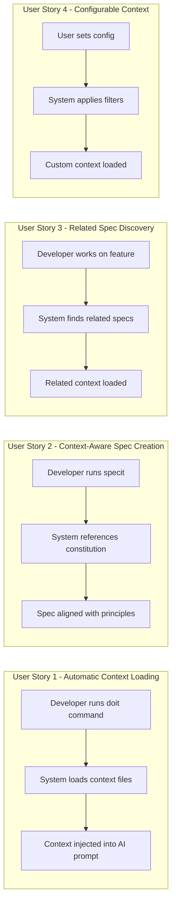
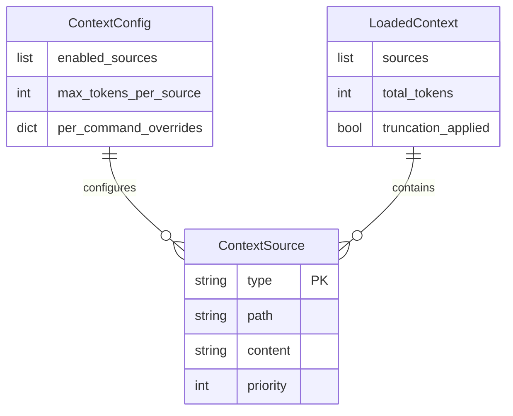

# Feature Specification: AI Context Injection for Commands

**Feature Branch**: `026-ai-context-injection`
**Created**: 2026-01-15
**Status**: Complete
**Input**: User description: "AI context injection for commands - Automatically inject relevant project context (constitution, roadmap, related specs) into command execution"

## Summary

Enable doit commands to automatically load and inject relevant project context (constitution, roadmap, related specifications) when executing, providing AI assistants with comprehensive project understanding without manual context gathering. This improves AI response quality by ensuring commands have access to project principles, current priorities, and related work.

## User Scenarios & Testing *(mandatory)*

### User Story 1 - Automatic Context Loading (Priority: P1)

A developer runs any doit command (specit, planit, taskit, etc.) and the system automatically loads relevant project context files without manual intervention. The AI assistant receives constitution principles, roadmap priorities, and related specs as part of the command execution context.

**Why this priority**: This is the core value proposition - eliminating the manual step of loading context files before each command. Every other feature depends on this foundation.

**Independent Test**: Can be fully tested by running `/doit.specit "test feature"` and verifying the output references constitution principles and roadmap context.

**Acceptance Scenarios**:

1. **Given** a project with a constitution.md file, **When** a developer runs any doit command, **Then** the constitution content is automatically included in the command context.
2. **Given** a project with a roadmap.md file, **When** a developer runs any doit command, **Then** relevant roadmap items are included in the command context.
3. **Given** a project without a constitution.md file, **When** a developer runs any doit command, **Then** the command executes successfully with a warning that constitution was not found.

---

### User Story 2 - Context-Aware Spec Creation (Priority: P2)

When creating specifications with `/doit.specit`, the system automatically references constitution principles to ensure alignment with project guidelines. Generated specs mention relevant principles and follow established patterns.

**Why this priority**: Ensures new work aligns with project vision, preventing architectural drift. Builds on US1 foundation.

**Independent Test**: Can be tested by running `/doit.specit` and verifying the generated spec explicitly references appropriate constitution principles.

**Acceptance Scenarios**:

1. **Given** a constitution with "Specification-First" principle, **When** a developer creates a new spec, **Then** the generated spec content reflects specification-first thinking.
2. **Given** a roadmap with related items, **When** a developer creates a spec for a related feature, **Then** the system identifies and references the related roadmap items.
3. **Given** existing specs in the project, **When** a developer creates a new spec with overlapping functionality, **Then** the system warns about potential overlap.

---

### User Story 3 - Related Spec Discovery (Priority: P2)

When working on a feature, the system identifies and loads specs that are related to the current work based on keywords, dependencies, or explicit references. This prevents duplicate work and ensures consistency.

**Why this priority**: Prevents architectural conflicts and duplicate effort by surfacing related work. Equal priority to US2 as both improve quality.

**Independent Test**: Can be tested by creating a spec that references an existing feature and verifying the related spec is loaded into context.

**Acceptance Scenarios**:

1. **Given** a spec referencing "authentication", **When** the developer runs planit, **Then** other specs mentioning authentication are included in context.
2. **Given** a spec with explicit dependency on feature 023, **When** the developer works on this spec, **Then** the 023 spec content is automatically loaded.
3. **Given** multiple related specs found, **When** context is loaded, **Then** the most relevant specs are prioritized (limit to 3 most relevant).

---

### User Story 4 - Configurable Context Sources (Priority: P3)

Users can configure which context sources to include or exclude, either globally or per-command. Some commands may only need constitution, while others need full context including all related specs.

**Why this priority**: Power-user feature for customization. Core functionality works without this.

**Independent Test**: Can be tested by setting a configuration to exclude roadmap and verifying roadmap content is not included in command context.

**Acceptance Scenarios**:

1. **Given** a configuration excluding roadmap, **When** a developer runs a doit command, **Then** roadmap content is not included in context.
2. **Given** a per-command override to include only constitution, **When** that specific command runs, **Then** only constitution is loaded regardless of global settings.
3. **Given** default configuration, **When** a developer runs a command, **Then** all standard context sources (constitution, roadmap, current spec) are included.

---

### Edge Cases

- What happens when context files are very large? System truncates to configurable limit with summary preserved.
- What happens when context files are malformed? System logs warning and continues with partial content.
- What happens when circular references exist between specs? System detects cycles and limits depth to 2 levels.
- What happens when no project context exists? Command executes normally with informational message.

## User Journey Visualization

<!-- BEGIN:AUTO-GENERATED section="user-journey" -->

<!-- END:AUTO-GENERATED -->

## Requirements *(mandatory)*

### Functional Requirements

- **FR-001**: System MUST automatically load `.doit/memory/constitution.md` when executing any doit command
- **FR-002**: System MUST automatically load `.doit/memory/roadmap.md` when executing any doit command
- **FR-003**: System MUST identify and load the current feature's spec.md based on branch name pattern (NNN-feature-name)
- **FR-004**: System MUST discover related specs based on keyword matching in titles and summaries
- **FR-005**: System MUST provide loaded context in a structured format suitable for AI assistant consumption
- **FR-006**: System MUST gracefully handle missing context files without failing command execution
- **FR-007**: System MUST truncate large context files to a configurable maximum size (default: 4000 tokens per source)
- **FR-008**: System MUST cache loaded context for the duration of a command execution to avoid repeated file reads
- **FR-009**: Users MUST be able to configure which context sources to include via `.doit/config/context.yaml`
- **FR-010**: System MUST support per-command context overrides via command-line flags
- **FR-011**: System MUST log which context sources were loaded for debugging purposes
- **FR-012**: System MUST detect and prevent circular reference loading between specs (max depth: 2)

### Key Entities *(include if feature involves data)*

- **ContextSource**: Represents a loadable context file (type: constitution/roadmap/spec/custom, path, content, priority)
- **ContextConfig**: Configuration for context loading (enabled_sources, max_tokens_per_source, per_command_overrides)
- **LoadedContext**: Aggregated context ready for injection (sources, total_tokens, truncation_applied)

## Entity Relationships *(include if Key Entities defined)*

<!-- BEGIN:AUTO-GENERATED section="entity-relationships" -->

<!-- END:AUTO-GENERATED -->

## Success Criteria *(mandatory)*

### Measurable Outcomes

- **SC-001**: Context loading adds less than 500ms overhead to command execution
- **SC-002**: Generated specs reference relevant constitution principles in 90% of cases when constitution exists
- **SC-003**: Users report improved AI response relevance (qualitative feedback in first month)
- **SC-004**: Zero command failures due to missing optional context files
- **SC-005**: Related spec discovery correctly identifies 80% of semantically related specifications
- **SC-006**: Context truncation preserves most important content (headers, summaries) when applied

## Assumptions

- AI assistants can consume markdown-formatted context effectively
- Project memory files follow the established `.doit/memory/` convention
- Branch names follow the `NNN-feature-name` pattern for feature detection
- Users have reasonable project sizes where context loading is practical (under 50 specs)
- Default token limits (4000 per source) provide sufficient context without overwhelming prompts

## Out of Scope

- Real-time context updates during long-running commands
- Cross-repository context loading
- Context versioning or history
- Automatic context summarization using AI (may be added later)
- Integration with external knowledge bases
