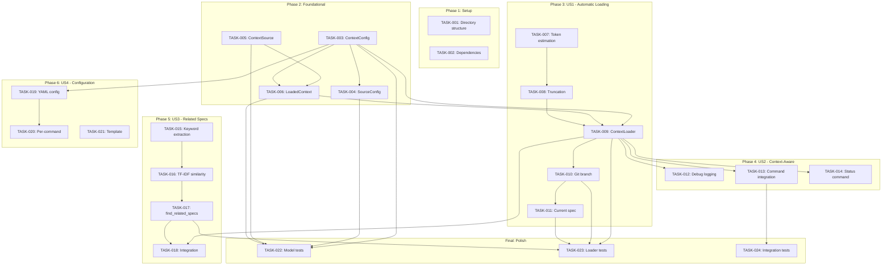
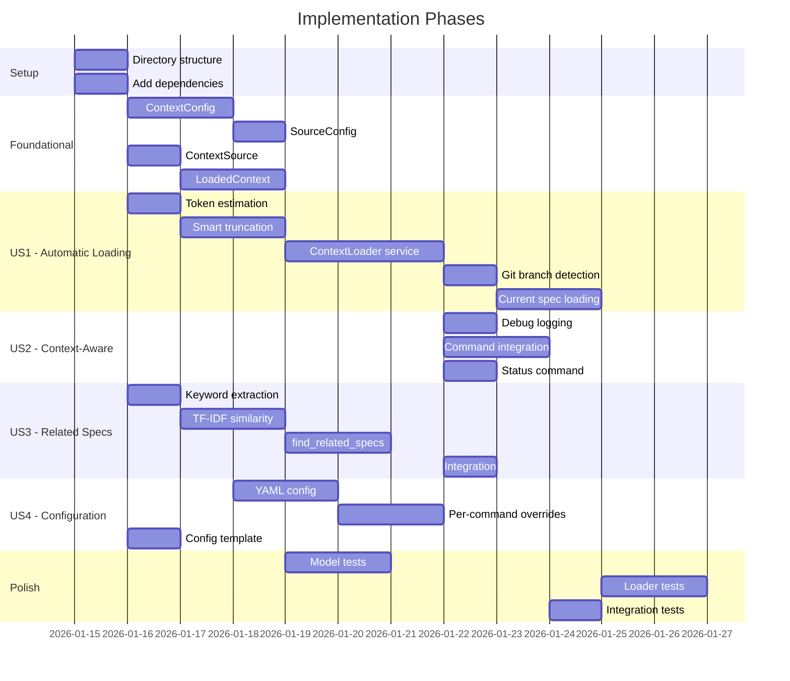

# Implementation Tasks: AI Context Injection

**Feature**: 026-ai-context-injection | **Generated**: 2026-01-15
**Spec**: [spec.md](spec.md) | **Plan**: [plan.md](plan.md)

## Task Summary

| Phase | Tasks | Story Points | Priority |
|-------|-------|--------------|----------|
| Setup | 2 | 2 | - |
| Foundational | 4 | 8 | - |
| US1 - Automatic Context Loading | 5 | 13 | P1 |
| US2 - Context-Aware Spec Creation | 3 | 5 | P2 |
| US3 - Related Spec Discovery | 4 | 8 | P2 |
| US4 - Configurable Context Sources | 3 | 5 | P3 |
| Polish | 3 | 5 | - |
| **Total** | **24** | **46** | - |

---

## Phase 1: Setup

### TASK-001: Create directory structure for context module

**Type**: Infrastructure | **Points**: 1 | **Blocking**: None

Create the directory structure for the new context loading module.

**Files to Create**:

- `src/doit_cli/models/__init__.py` (if not exists)
- `src/doit_cli/services/__init__.py` (if not exists)
- `tests/unit/__init__.py` (if not exists)
- `tests/integration/__init__.py` (if not exists)

**Acceptance**:

- [x] All directories exist
- [x] `__init__.py` files allow proper imports

---

### TASK-002: Add optional dependencies to pyproject.toml

**Type**: Infrastructure | **Points**: 1 | **Blocking**: None

Add tiktoken and scikit-learn as optional dependencies for advanced features.

**Files to Modify**:

- `pyproject.toml`

**Changes**:

```toml
[project.optional-dependencies]
advanced = [
    "tiktoken>=0.5.0",
    "scikit-learn>=1.3.0",
]
```

**Acceptance**:

- [x] `pip install -e ".[advanced]"` works
- [x] Base install works without advanced dependencies

---

## Phase 2: Foundational (Blocking Prerequisites)

### TASK-003: Implement ContextConfig dataclass

**Type**: Model | **Points**: 2 | **Blocking**: None | **FR**: FR-009

Create the configuration dataclass for context loading settings.

**File**: `src/doit_cli/models/context_config.py`

**Requirements** (from [data-model.md](data-model.md)):

- `version: int` - Config schema version (default: 1)
- `enabled: bool` - Master toggle (default: True)
- `max_tokens_per_source: int` - Token limit per source (default: 4000)
- `total_max_tokens: int` - Total token limit (default: 16000)
- `sources: dict[str, SourceConfig]` - Per-source configuration
- `commands: dict[str, CommandOverride]` - Per-command overrides

**Methods**:

- `from_yaml(path: Path) -> ContextConfig` - Load from YAML file
- `get_source_config(source_type: str, command: Optional[str]) -> SourceConfig` - Get effective config
- `default() -> ContextConfig` - Create default configuration

**Acceptance**:

- [x] Dataclass validates field constraints
- [x] Default configuration matches spec defaults
- [x] YAML loading handles malformed files gracefully

---

### TASK-004: Implement SourceConfig dataclass

**Type**: Model | **Points**: 1 | **Blocking**: TASK-003 | **FR**: FR-009

Create the source configuration dataclass.

**File**: `src/doit_cli/models/context_config.py`

**Requirements** (from [data-model.md](data-model.md)):

- `source_type: str` - Type identifier (constitution, roadmap, etc.)
- `enabled: bool` - Whether source is loaded (default: True)
- `priority: int` - Loading priority (lower = higher)
- `max_count: int` - Max items for multi-item sources (default: 1)

**Acceptance**:

- [x] Supports all source types: constitution, roadmap, current_spec, related_specs, custom
- [x] Default priorities match spec (constitution=1, roadmap=2, current_spec=3, related_specs=4)

---

### TASK-005: Implement ContextSource dataclass

**Type**: Model | **Points**: 2 | **Blocking**: None | **FR**: FR-005

Create the loaded context source dataclass.

**File**: `src/doit_cli/models/context_config.py`

**Requirements** (from [contracts/context_loader.md](contracts/context_loader.md)):

- `source_type: str` - Type of source
- `path: Path` - File path that was loaded
- `content: str` - Loaded content (possibly truncated)
- `token_count: int` - Estimated token count
- `truncated: bool` - Whether content was truncated (default: False)
- `original_tokens: Optional[int]` - Original tokens before truncation

**Acceptance**:

- [x] All fields accessible
- [x] Supports comparison for priority sorting

---

### TASK-006: Implement LoadedContext dataclass

**Type**: Model | **Points**: 3 | **Blocking**: TASK-005 | **FR**: FR-005

Create the aggregated context dataclass with formatting methods.

**File**: `src/doit_cli/models/context_config.py`

**Requirements** (from [contracts/context_loader.md](contracts/context_loader.md)):

- `sources: list[ContextSource]` - All loaded sources
- `total_tokens: int` - Sum of all source token counts
- `any_truncated: bool` - True if any source was truncated
- `loaded_at: datetime` - Timestamp of loading

**Methods**:

- `to_markdown() -> str` - Format all sources as markdown
- `get_source(source_type: str) -> Optional[ContextSource]` - Get specific source
- `has_source(source_type: str) -> bool` - Check if source loaded

**Output Format** (from contract):

```markdown
<!-- PROJECT CONTEXT - Auto-loaded by doit -->

## Constitution

[Content]

## Roadmap

[Content]

<!-- End of project context -->
```

**Acceptance**:

- [x] `to_markdown()` produces valid markdown
- [x] Sources ordered by priority in output
- [x] Truncation notice included when applicable

---

## Phase 3: US1 - Automatic Context Loading (P1)

### TASK-007: Implement token estimation utilities

**Type**: Service | **Points**: 2 | **Blocking**: None | **FR**: FR-007

Create token estimation functions with tiktoken and fallback.

**File**: `src/doit_cli/services/context_loader.py`

**Requirements** (from [research.md](research.md)):

- Use tiktoken `cl100k_base` encoding when available
- Fall back to `len(text) / 4` when tiktoken unavailable
- Target: < 10ms per estimation

**Functions**:

- `estimate_tokens(text: str) -> int` - Estimate token count
- `_has_tiktoken() -> bool` - Check if tiktoken is available

**Acceptance**:

- [x] Works with and without tiktoken installed
- [x] Performance < 10ms for typical file sizes

---

### TASK-008: Implement smart truncation algorithm

**Type**: Service | **Points**: 3 | **Blocking**: TASK-007 | **FR**: FR-007

Implement truncation that preserves markdown structure.

**File**: `src/doit_cli/services/context_loader.py`

**Requirements** (from [research.md](research.md)):

1. If file fits within limit - return full content
2. Extract and preserve:
   - Title (first H1)
   - All H2 headers with first paragraph under each
   - Any "Summary" or "Overview" sections in full
3. Add truncation notice: `<!-- Content truncated. Full file at: {path} -->`
4. Fill remaining tokens with content from top of file

**Functions**:

- `truncate_content(content: str, max_tokens: int, path: Path) -> tuple[str, bool]` - Returns (truncated_content, was_truncated)

**Acceptance**:

- [x] Preserves markdown headers and structure
- [x] Summary/Overview sections prioritized
- [x] Truncation notice included

---

### TASK-009: Implement ContextLoader service

**Type**: Service | **Points**: 3 | **Blocking**: TASK-003, TASK-006, TASK-008 | **FR**: FR-001, FR-002, FR-008

Create the main context loading service.

**File**: `src/doit_cli/services/context_loader.py`

**Requirements** (from [contracts/context_loader.md](contracts/context_loader.md)):

**Constructor**:

```python
def __init__(
    self,
    project_root: Path,
    config: Optional[ContextConfig] = None,
    command: Optional[str] = None,
)
```

**Methods**:

- `load() -> LoadedContext` - Load all configured sources
- `load_constitution() -> Optional[ContextSource]` - Load `.doit/memory/constitution.md`
- `load_roadmap() -> Optional[ContextSource]` - Load `.doit/memory/roadmap.md`

**Error Handling** (from contract):

| Scenario | Behavior |
|----------|----------|
| Config file missing | Use default configuration |
| Config file malformed | Log warning, use defaults |
| Context file missing | Skip source, continue loading |
| Context file unreadable | Log warning, skip source |

**Performance**: Full context load < 500ms

**Acceptance**:

- [x] Loads constitution.md when present
- [x] Loads roadmap.md when present
- [x] Gracefully handles missing files (FR-006)
- [x] Caches loaded content (FR-008)
- [x] Performance < 500ms (SC-001)

---

### TASK-010: Implement git branch detection

**Type**: Service | **Points**: 2 | **Blocking**: TASK-009 | **FR**: FR-003

Add methods to detect current branch and extract feature name.

**File**: `src/doit_cli/services/context_loader.py`

**Methods** (from contract):

- `get_current_branch() -> Optional[str]` - Get current git branch name
- `extract_feature_name(branch: str) -> Optional[str]` - Extract feature from `NNN-feature-name`

**Error Handling**:

| Scenario | Behavior |
|----------|----------|
| Git not available | Return None, skip branch detection |
| Not in git repo | Return None, skip branch detection |
| Branch doesn't match pattern | Return None |

**Acceptance**:

- [x] Correctly parses `026-ai-context-injection` pattern
- [x] Works without git installed
- [x] Works outside git repositories

---

### TASK-011: Implement current spec loading

**Type**: Service | **Points**: 3 | **Blocking**: TASK-010 | **FR**: FR-003

Load the current feature spec based on branch name.

**File**: `src/doit_cli/services/context_loader.py`

**Method**:

- `load_current_spec() -> Optional[ContextSource]` - Load current feature spec

**Logic**:

1. Get current branch name
2. Extract feature name (e.g., `026-ai-context-injection`)
3. Look for `specs/{feature_name}/spec.md`
4. Load and return as ContextSource

**Acceptance**:

- [x] Correctly locates spec based on branch pattern
- [x] Returns None when branch doesn't match pattern
- [x] Returns None when spec file doesn't exist

---

## Phase 4: US2 - Context-Aware Spec Creation (P2)

### TASK-012: Add context debug logging

**Type**: Feature | **Points**: 2 | **Blocking**: TASK-009 | **FR**: FR-011

Add logging to show which context sources were loaded.

**File**: `src/doit_cli/services/context_loader.py`

**Requirements**:

- Log each source loaded (type, path, token count)
- Log truncation when applied
- Log total context size
- Support `DOIT_DEBUG=1` or `--debug` flag

**Log Format**:

```
[context] Loaded constitution: 1234 tokens
[context] Loaded roadmap: 567 tokens
[context] Loaded current_spec (026-ai-context-injection): 890 tokens
[context] Total context: 2691 tokens
```

**Acceptance**:

- [x] Debug output shows all loaded sources
- [x] Token counts displayed
- [x] Truncation warnings shown

---

### TASK-013: Integrate context loading into command execution

**Type**: Integration | **Points**: 2 | **Blocking**: TASK-009 | **FR**: FR-001, FR-002

Hook context loading into doit command execution flow.

**File**: `src/doit_cli/__init__.py`

**Changes**:

- Add `ContextLoader` initialization before command execution
- Pass loaded context to command templates
- Add `--no-context` flag to disable context loading

**Acceptance**:

- [ ] All doit commands receive context automatically
- [ ] Context available in command execution
- [ ] `--no-context` flag disables loading

---

### TASK-014: Create context status command

**Type**: Feature | **Points**: 1 | **Blocking**: TASK-009 | **FR**: FR-011

Add command to show what context would be loaded.

**File**: `src/doit_cli/__init__.py`

**Commands**:

- `doit context show` - Show what context would be loaded
- `doit context show --command specit` - Show context for specific command

**Output Format**:

```
Context Sources:
  constitution: .doit/memory/constitution.md (1234 tokens)
  roadmap: .doit/memory/roadmap.md (567 tokens)
  current_spec: specs/026-ai-context-injection/spec.md (890 tokens)

Total: 2691 tokens
```

**Acceptance**:

- [x] Shows all configured sources
- [x] Shows which sources exist/missing
- [x] Shows token counts

---

## Phase 5: US3 - Related Spec Discovery (P2)

### TASK-015: Implement keyword extraction

**Type**: Service | **Points**: 2 | **Blocking**: None | **FR**: FR-004

Extract keywords from spec titles and summaries for matching.

**File**: `src/doit_cli/services/context_loader.py`

**Requirements** (from [research.md](research.md)):

- Extract keywords from title and first paragraph (summary)
- Normalize to lowercase
- Remove common stop words

**Function**:

- `extract_keywords(text: str) -> set[str]` - Extract meaningful keywords

**Acceptance**:

- [x] Extracts meaningful keywords
- [x] Removes stop words (the, a, is, etc.)
- [x] Case insensitive

---

### TASK-016: Implement TF-IDF similarity (optional)

**Type**: Service | **Points**: 3 | **Blocking**: TASK-015 | **FR**: FR-004

Implement TF-IDF-based similarity when scikit-learn available.

**File**: `src/doit_cli/services/context_loader.py`

**Requirements** (from [research.md](research.md)):

- Use scikit-learn TfidfVectorizer when available
- Compute cosine similarity between specs
- Threshold: 0.3 minimum similarity
- Fall back to keyword matching without scikit-learn

**Functions**:

- `compute_similarity_scores(current: str, candidates: list[str]) -> list[float]` - Compute similarity
- `_has_sklearn() -> bool` - Check if scikit-learn available

**Acceptance**:

- [x] Works with scikit-learn installed
- [x] Falls back to keyword matching without scikit-learn
- [x] Performance < 100ms for 50 specs

---

### TASK-017: Implement find_related_specs method

**Type**: Service | **Points**: 2 | **Blocking**: TASK-016 | **FR**: FR-004, FR-012

Find specs related to current feature.

**File**: `src/doit_cli/services/context_loader.py`

**Method** (from contract):

- `find_related_specs() -> list[ContextSource]` - Find and load related specs

**Requirements**:

- Return up to `max_count` related specs (default: 3)
- Sort by relevance score descending
- Exclude current spec from results
- Limit depth to 2 levels (FR-012)

**Acceptance**:

- [x] Returns most relevant specs first
- [x] Respects max_count limit
- [x] Current spec excluded
- [x] No circular references (SC-005)

---

### TASK-018: Add related specs to context loading

**Type**: Integration | **Points**: 1 | **Blocking**: TASK-017, TASK-009 | **FR**: FR-004

Include related specs in the main load() method.

**File**: `src/doit_cli/services/context_loader.py`

**Changes**:

- Add related specs loading to `load()` method
- Sort all sources by priority
- Respect total_max_tokens limit

**Acceptance**:

- [x] Related specs loaded when enabled
- [x] Proper priority ordering
- [x] Token limits respected

---

## Phase 6: US4 - Configurable Context Sources (P3)

### TASK-019: Implement YAML configuration loading

**Type**: Feature | **Points**: 2 | **Blocking**: TASK-003 | **FR**: FR-009

Load context configuration from YAML file.

**File**: `src/doit_cli/models/context_config.py`

**Config Location**: `.doit/config/context.yaml`

**Schema** (from [research.md](research.md)):

```yaml
version: 1
enabled: true
max_tokens_per_source: 4000
total_max_tokens: 16000
sources:
  constitution:
    enabled: true
    priority: 1
  roadmap:
    enabled: true
    priority: 2
  current_spec:
    enabled: true
    priority: 3
  related_specs:
    enabled: true
    priority: 4
    max_count: 3
commands:
  specit:
    sources:
      related_specs:
        enabled: false
```

**Acceptance**:

- [x] Loads configuration from correct path
- [x] Validates schema version
- [x] Falls back to defaults on missing/malformed file

---

### TASK-020: Implement per-command overrides

**Type**: Feature | **Points**: 2 | **Blocking**: TASK-019 | **FR**: FR-010

Support command-specific configuration overrides.

**File**: `src/doit_cli/models/context_config.py`

**Requirements**:

- `commands` section in YAML defines per-command overrides
- Override settings merge with global settings
- Support `--no-context` and `--context-only` flags

**Acceptance**:

- [x] Per-command config overrides global
- [x] Merge logic correct (override only specified fields)
- [x] CLI flags work correctly

---

### TASK-021: Create default context.yaml template

**Type**: Infrastructure | **Points**: 1 | **Blocking**: None | **FR**: FR-009

Add template for context configuration file.

**File**: `templates/config/context.yaml`

**Contents**: Full example configuration with comments explaining each option.

**Also update**: `doit init` to create `.doit/config/` directory

**Acceptance**:

- [x] Template is well-documented
- [x] All options explained
- [x] Created during `doit init`

---

## Final Phase: Polish & Cross-Cutting Concerns

### TASK-022: Add unit tests for models

**Type**: Test | **Points**: 2 | **Blocking**: TASK-003, TASK-004, TASK-005, TASK-006

Create comprehensive unit tests for all model classes.

**File**: `tests/unit/test_context_config.py`

**Test Cases**:

- ContextConfig default values
- ContextConfig YAML loading (valid, missing, malformed)
- SourceConfig validation
- ContextSource creation
- LoadedContext.to_markdown() formatting
- LoadedContext.get_source() and has_source()

**Coverage Target**: 90%+

**Acceptance**:

- [x] All model methods tested
- [x] Edge cases covered
- [x] Coverage > 90%

---

### TASK-023: Add unit tests for context loader

**Type**: Test | **Points**: 2 | **Blocking**: TASK-009, TASK-010, TASK-011, TASK-017

Create comprehensive unit tests for ContextLoader service.

**File**: `tests/unit/test_context_loader.py`

**Test Cases**:

- load() with all files present
- load() with missing files
- load_constitution() behavior
- load_roadmap() behavior
- load_current_spec() with valid branch
- load_current_spec() with invalid branch
- find_related_specs() matching
- Token estimation accuracy
- Truncation behavior

**Performance Tests**:

- Full load < 500ms
- Token estimation < 10ms

**Acceptance**:

- [x] All service methods tested
- [x] Performance requirements verified
- [x] Mock file system properly

---

### TASK-024: Add integration tests

**Type**: Test | **Points**: 1 | **Blocking**: TASK-013

Create integration tests for end-to-end context injection.

**File**: `tests/integration/test_context_injection.py`

**Test Cases**:

- Command execution with context loading
- Context appears in command output
- `--no-context` flag works
- `doit context show` output

**Acceptance**:

- [x] End-to-end flow verified
- [x] Real file system interactions
- [x] Command integration tested

---

## Dependency Graph

<!-- BEGIN:AUTO-GENERATED section="dependency-graph" -->

<!-- END:AUTO-GENERATED -->

## Phase Timeline

<!-- BEGIN:AUTO-GENERATED section="phase-timeline" -->

<!-- END:AUTO-GENERATED -->

## GitHub Issues Mapping

| Task | Issue | Title | Labels |
|------|-------|-------|--------|
| TASK-001 | [#229](https://github.com/seanbarlow/doit/issues/229) | Create directory structure for context module | task, phase-1 |
| TASK-002 | [#230](https://github.com/seanbarlow/doit/issues/230) | Add optional dependencies to pyproject.toml | task, phase-1 |
| TASK-003 | [#231](https://github.com/seanbarlow/doit/issues/231) | Implement ContextConfig dataclass | task, phase-2-foundation |
| TASK-004 | [#232](https://github.com/seanbarlow/doit/issues/232) | Implement SourceConfig dataclass | task, phase-2-foundation |
| TASK-005 | [#233](https://github.com/seanbarlow/doit/issues/233) | Implement ContextSource dataclass | task, phase-2-foundation |
| TASK-006 | [#234](https://github.com/seanbarlow/doit/issues/234) | Implement LoadedContext dataclass | task, phase-2-foundation |
| TASK-007 | [#235](https://github.com/seanbarlow/doit/issues/235) | Implement token estimation utilities | task, phase-3-us1, priority:P1 |
| TASK-008 | [#236](https://github.com/seanbarlow/doit/issues/236) | Implement smart truncation algorithm | task, phase-3-us1, priority:P1 |
| TASK-009 | [#237](https://github.com/seanbarlow/doit/issues/237) | Implement ContextLoader service | task, phase-3-us1, priority:P1 |
| TASK-010 | [#238](https://github.com/seanbarlow/doit/issues/238) | Implement git branch detection | task, phase-3-us1, priority:P1 |
| TASK-011 | [#239](https://github.com/seanbarlow/doit/issues/239) | Implement current spec loading | task, phase-3-us1, priority:P1 |
| TASK-012 | [#240](https://github.com/seanbarlow/doit/issues/240) | Add context debug logging | task, phase-4-us2, priority:P2 |
| TASK-013 | [#241](https://github.com/seanbarlow/doit/issues/241) | Integrate context loading into commands | task, phase-4-us2, priority:P2 |
| TASK-014 | [#242](https://github.com/seanbarlow/doit/issues/242) | Create context status command | task, phase-4-us2, priority:P2 |
| TASK-015 | [#243](https://github.com/seanbarlow/doit/issues/243) | Implement keyword extraction | task, phase-5-us3, priority:P2 |
| TASK-016 | [#244](https://github.com/seanbarlow/doit/issues/244) | Implement TF-IDF similarity | task, phase-5-us3, priority:P2 |
| TASK-017 | [#245](https://github.com/seanbarlow/doit/issues/245) | Implement find_related_specs method | task, phase-5-us3, priority:P2 |
| TASK-018 | [#246](https://github.com/seanbarlow/doit/issues/246) | Add related specs to context loading | task, phase-5-us3, priority:P2 |
| TASK-019 | [#247](https://github.com/seanbarlow/doit/issues/247) | Implement YAML configuration loading | task, priority:P3 |
| TASK-020 | [#248](https://github.com/seanbarlow/doit/issues/248) | Implement per-command overrides | task, priority:P3 |
| TASK-021 | [#249](https://github.com/seanbarlow/doit/issues/249) | Create default context.yaml template | task, priority:P3 |
| TASK-022 | [#250](https://github.com/seanbarlow/doit/issues/250) | Add unit tests for models | task, phase-6-polish |
| TASK-023 | [#251](https://github.com/seanbarlow/doit/issues/251) | Add unit tests for context loader | task, phase-6-polish |
| TASK-024 | [#252](https://github.com/seanbarlow/doit/issues/252) | Add integration tests | task, phase-6-polish |

---

## Success Criteria Mapping

| Criteria | Related Tasks |
|----------|---------------|
| SC-001: < 500ms overhead | TASK-009, TASK-023 |
| SC-002: 90% constitution references | TASK-013, TASK-024 |
| SC-004: Zero failures on missing files | TASK-009, TASK-023 |
| SC-005: 80% related spec accuracy | TASK-017, TASK-023 |
| SC-006: Truncation preserves structure | TASK-008, TASK-023 |
