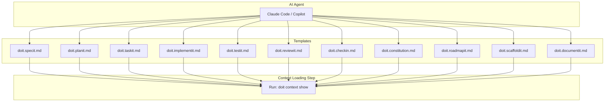

# Implementation Plan: Template Context Injection

**Branch**: `027-template-context-injection` | **Date**: 2026-01-15 | **Spec**: [spec.md](spec.md)
**Input**: Feature specification from `/specs/027-template-context-injection/spec.md`

## Summary

Add a context loading step to all 11 doit command templates that instructs AI agents to run `doit context show` before executing the main command logic. This bridges the context injection CLI infrastructure (feature 026) with actual command execution.

## Technical Context

**Language/Version**: Markdown (command templates are markdown files)
**Primary Dependencies**: None (template modifications only)
**Storage**: N/A (file-based templates in `templates/commands/`)
**Testing**: Manual verification - run commands and verify context is loaded
**Target Platform**: All platforms (templates are platform-agnostic)
**Project Type**: single
**Performance Goals**: Context loading adds <5 seconds to command execution
**Constraints**: Templates must remain compatible with Claude Code and GitHub Copilot
**Scale/Scope**: 11 command templates to modify

## Architecture Overview

<!-- BEGIN:AUTO-GENERATED section="architecture" -->

<!-- END:AUTO-GENERATED -->

## Constitution Check

*GATE: Must pass before Phase 0 research. Re-check after Phase 1 design.*

| Principle | Status | Notes |
|-----------|--------|-------|
| I. Specification-First | PASS | Spec created via /doit.specit |
| II. Persistent Memory | PASS | Templates stored in version control |
| III. Auto-Generated Diagrams | N/A | No diagrams generated from specs |
| IV. Opinionated Workflow | PASS | Following standard workflow |
| V. AI-Native Design | PASS | Templates designed for AI agents |

**Tech Stack Alignment**: This feature modifies markdown templates only - no Python code changes required. Aligns with existing template-based architecture.

## Project Structure

### Documentation (this feature)

```text
specs/027-template-context-injection/
├── spec.md              # Feature specification
├── plan.md              # This file
├── research.md          # Phase 0 output
├── quickstart.md        # Phase 1 output
└── checklists/
    └── requirements.md  # Spec validation checklist
```

### Source Code (repository root)

```text
templates/commands/
├── doit.checkin.md        # Add context loading step
├── doit.constitution.md   # Add context loading step
├── doit.documentit.md     # Add context loading step
├── doit.implementit.md    # Add context loading step
├── doit.planit.md         # Add context loading step
├── doit.reviewit.md       # Add context loading step
├── doit.roadmapit.md      # Add context loading step
├── doit.scaffoldit.md     # Add context loading step
├── doit.specit.md         # Add context loading step
├── doit.taskit.md         # Add context loading step
└── doit.testit.md         # Add context loading step

.claude/commands/          # Synced from templates/commands/
.github/prompts/           # Synced from templates/commands/
```

**Structure Decision**: No new directories needed. Modifications are made to existing template files in `templates/commands/`, then propagated to agent-specific locations via `doit sync-prompts`.

## Complexity Tracking

No constitution violations - this is a straightforward template modification task.

## Implementation Approach

### Context Loading Step Design

The context loading step will be added as a new section near the beginning of each template (after frontmatter, before main logic):

```markdown
## Load Project Context

Before proceeding, load the project context to ensure alignment with project principles:

```bash
doit context show
```

If the command fails or `doit` is not installed, continue without context but note that project alignment cannot be verified.

Use the loaded context to:
- Reference constitution principles when making decisions
- Align with roadmap priorities
- Consider related specifications
```

### Template-Specific Instructions

| Template | Additional Context Usage |
|----------|-------------------------|
| doit.specit | Reference constitution principles in generated specs |
| doit.planit | Use tech stack from constitution for architecture |
| doit.taskit | Consider related specs for task dependencies |
| doit.implementit | Follow coding standards from constitution |
| doit.reviewit | Validate against constitution principles |
| doit.checkin | Verify roadmap alignment |
| doit.constitution | N/A - creates the context itself |
| doit.roadmapit | Load existing roadmap for updates |
| doit.scaffoldit | Use constitution tech stack |
| doit.documentit | Reference project context for documentation |
| doit.testit | Consider test requirements from constitution |

### Propagation

After modifying templates in `templates/commands/`, run:
```bash
doit sync-prompts
```

This will propagate changes to:
- `.claude/commands/` (Claude Code)
- `.github/prompts/` (GitHub Copilot)
