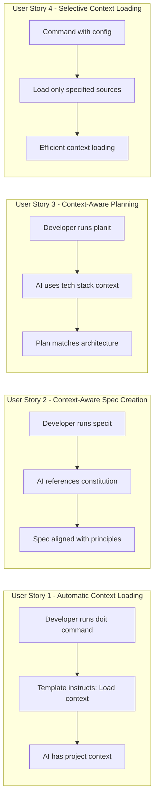

# Feature Specification: Template Context Injection

**Feature Branch**: `027-template-context-injection`
**Created**: 2026-01-15
**Status**: Complete
**Input**: User description: "Template context injection (command-level integration) - Add instructions to command templates to load project context via doit context show, completing the context injection workflow"

## Summary

Integrate the `doit context show` command into all doit command templates, enabling AI agents (Claude Code, GitHub Copilot) to automatically load project context before executing workflow commands. This completes the context injection workflow by bridging the CLI infrastructure (from feature 026-ai-context-injection) with the actual command templates that AI agents execute.

## User Scenarios & Testing *(mandatory)*

### User Story 1 - Automatic Context Loading in Commands (Priority: P1)

A developer runs any doit command (e.g., `/doit.specit`, `/doit.planit`) and the AI agent automatically loads project context (constitution, roadmap, related specs) before executing the command. The loaded context informs the AI's responses and ensures alignment with project principles.

**Why this priority**: This is the core value proposition - connecting the context loading infrastructure to actual command execution. Without this, the context injection feature (026) remains unused.

**Independent Test**: Can be tested by running `/doit.specit "test feature"` and verifying the AI references constitution principles and roadmap context in the generated spec.

**Acceptance Scenarios**:

1. **Given** a project with constitution.md and roadmap.md, **When** a developer runs any doit command, **Then** the command template instructs the AI to load context via `doit context show` before proceeding.
2. **Given** the context loading step in a template, **When** the AI executes the step, **Then** the loaded context is available for the remainder of the command execution.
3. **Given** a project without context files (no constitution/roadmap), **When** a developer runs a doit command, **Then** the command proceeds gracefully with a note that context was unavailable.

---

### User Story 2 - Context-Aware Spec Creation (Priority: P1)

When creating specifications with `/doit.specit`, the AI agent references constitution principles and roadmap items in its output, ensuring new work aligns with project vision and established patterns.

**Why this priority**: Spec creation is the entry point for all features - ensuring specs align with project principles prevents architectural drift from the start.

**Independent Test**: Can be tested by creating a spec and verifying it explicitly mentions relevant constitution principles.

**Acceptance Scenarios**:

1. **Given** a constitution with defined principles, **When** a developer creates a new spec, **Then** the generated spec content references appropriate principles.
2. **Given** a roadmap with related items, **When** a developer creates a spec for related functionality, **Then** the AI notes connections to existing roadmap items.
3. **Given** existing specs with overlapping functionality, **When** creating a new spec, **Then** the AI warns about potential overlap.

---

### User Story 3 - Context-Aware Planning (Priority: P2)

When creating implementation plans with `/doit.planit`, the AI uses loaded context to suggest appropriate technologies, patterns, and approaches that align with project architecture.

**Why this priority**: Planning builds on specs and requires context about existing architecture and decisions. Important but secondary to spec creation.

**Independent Test**: Can be tested by running planit and verifying the plan references project conventions and related specs.

**Acceptance Scenarios**:

1. **Given** loaded context with tech stack information, **When** creating a plan, **Then** the AI suggests compatible technologies.
2. **Given** related specs loaded in context, **When** planning implementation, **Then** the AI identifies integration points with existing features.

---

### User Story 4 - Selective Context Loading (Priority: P3)

Different commands may need different context sources. Some commands (like specit) benefit from full context, while others (like simple documentation tasks) may need minimal context for efficiency.

**Why this priority**: Optimization feature - the default full context works for all cases, but selective loading improves efficiency for simpler commands.

**Independent Test**: Can be tested by configuring per-command context settings and verifying only requested sources are loaded.

**Acceptance Scenarios**:

1. **Given** a command configured to load only constitution, **When** the command executes, **Then** only constitution context is loaded (not roadmap/specs).
2. **Given** default configuration, **When** any command executes, **Then** all standard context sources are loaded.

---

### Edge Cases

- What happens when `doit context show` fails? The command should proceed with a warning, not block execution.
- What happens when context is very large? The CLI truncates context, so templates don't need special handling.
- What happens when the user doesn't have doit CLI installed? Commands should still function (context step is optional enhancement).

## User Journey Visualization

<!-- BEGIN:AUTO-GENERATED section="user-journey" -->

<!-- END:AUTO-GENERATED -->

## Requirements *(mandatory)*

### Functional Requirements

- **FR-001**: All doit command templates MUST include a context loading step that instructs the AI to run `doit context show`
- **FR-002**: The context loading step MUST be positioned early in the template (before main command logic)
- **FR-003**: Templates MUST include instructions to gracefully handle context loading failures
- **FR-004**: The `/doit.specit` template MUST instruct the AI to reference constitution principles when generating specs
- **FR-005**: The `/doit.planit` template MUST instruct the AI to consider loaded context when suggesting technologies
- **FR-006**: The `/doit.taskit` template MUST instruct the AI to use context for task breakdown
- **FR-007**: Templates MUST include fallback behavior when `doit context show` is unavailable
- **FR-008**: Templates MUST NOT require the user to manually load context
- **FR-009**: The context loading instruction MUST be clear enough for any AI agent to execute
- **FR-010**: Templates MUST preserve existing functionality while adding context loading
- **FR-011**: The sync-prompts command MUST propagate context loading steps to all agent targets

## Success Criteria *(mandatory)*

### Measurable Outcomes

- **SC-001**: Generated specs reference constitution principles in 90% of cases when constitution exists
- **SC-002**: AI agents successfully execute context loading step in 95% of command runs
- **SC-003**: Command execution time increases by less than 5 seconds due to context loading
- **SC-004**: Users report improved AI response relevance (qualitative feedback)
- **SC-005**: Zero command failures caused by context loading step failures (graceful degradation)
- **SC-006**: All 11 doit command templates include context loading instructions

## Assumptions

- AI agents (Claude Code, GitHub Copilot) can execute shell commands when instructed
- The `doit context show` command is available in projects that have run `doit init`
- AI agents can process and utilize loaded context within their context windows
- Template instructions are followed consistently by supported AI agents
- Users have the doit CLI installed and accessible in their PATH

## Out of Scope

- Modifying the doit CLI context command itself (completed in 026)
- Adding new context sources beyond what 026 provides
- Creating agent-specific template variations (use sync-prompts for agent parity)
- Real-time context updates during long-running commands
- Automatic context summarization
