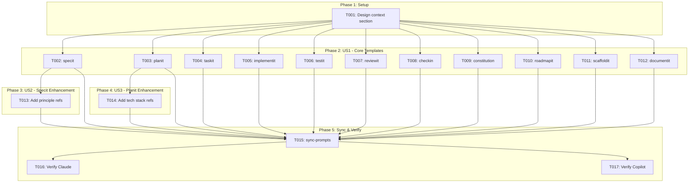
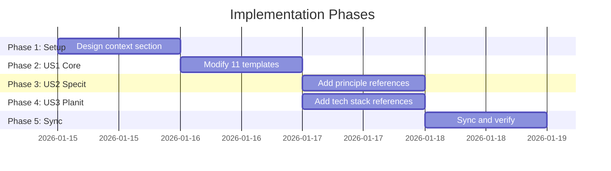

# Tasks: Template Context Injection

**Input**: Design documents from `/specs/027-template-context-injection/`
**Prerequisites**: plan.md (required), spec.md (required for user stories), research.md, quickstart.md

**Tests**: Manual verification only - no automated tests for template modifications.

**Organization**: Tasks are grouped by user story to enable independent implementation and testing of each story.

## Task Dependencies

<!-- BEGIN:AUTO-GENERATED section="task-dependencies" -->

<!-- END:AUTO-GENERATED -->

## Phase Timeline

<!-- BEGIN:AUTO-GENERATED section="phase-timeline" -->

<!-- END:AUTO-GENERATED -->

## Format: `[ID] [P?] [Story] Description`

- **[P]**: Can run in parallel (different files, no dependencies)
- **[Story]**: Which user story this task belongs to (e.g., US1, US2, US3)
- Include exact file paths in descriptions

## Path Conventions

- **Templates**: `templates/commands/` (source of truth)
- **Claude Commands**: `.claude/commands/` (synced target)
- **Copilot Prompts**: `.github/prompts/` (synced target)

---

## Phase 1: Setup (Design)

**Purpose**: Design the context loading section to be added to all templates

- [x] T001 Design the context loading markdown section per quickstart.md specification

**Context Loading Section**:
```markdown
## Load Project Context

Before proceeding, load the project context to inform your responses:

\`\`\`bash
doit context show
\`\`\`

**If the command fails or doit is not installed**: Continue without context, but note that alignment with project principles cannot be verified.

**Use loaded context to**:
- Reference constitution principles when making decisions
- Consider roadmap priorities
- Identify connections to related specifications
```

---

## Phase 2: User Story 1 - Automatic Context Loading (Priority: P1) 🎯 MVP

**Goal**: Add context loading step to all 11 doit command templates

**Independent Test**: Run any doit command and verify it instructs the AI to load context via `doit context show`

### Implementation for User Story 1

- [x] T002 [P] [US1] Add context loading section to templates/commands/doit.specit.md after User Input section
- [x] T003 [P] [US1] Add context loading section to templates/commands/doit.planit.md after User Input section
- [x] T004 [P] [US1] Add context loading section to templates/commands/doit.taskit.md after User Input section
- [x] T005 [P] [US1] Add context loading section to templates/commands/doit.implementit.md after User Input section
- [x] T006 [P] [US1] Add context loading section to templates/commands/doit.testit.md after User Input section
- [x] T007 [P] [US1] Add context loading section to templates/commands/doit.reviewit.md after User Input section
- [x] T008 [P] [US1] Add context loading section to templates/commands/doit.checkin.md after User Input section
- [x] T009 [P] [US1] Add context loading section to templates/commands/doit.constitution.md after User Input section
- [x] T010 [P] [US1] Add context loading section to templates/commands/doit.roadmapit.md after User Input section
- [x] T011 [P] [US1] Add context loading section to templates/commands/doit.scaffoldit.md after User Input section
- [x] T012 [P] [US1] Add context loading section to templates/commands/doit.documentit.md after User Input section

**Checkpoint**: All 11 templates now have context loading instructions

---

## Phase 3: User Story 2 - Context-Aware Spec Creation (Priority: P1)

**Goal**: Enhance specit template to instruct AI to reference constitution principles

**Independent Test**: Run `/doit.specit "test feature"` and verify generated spec references constitution principles

### Implementation for User Story 2

- [x] T013 [US2] Enhance templates/commands/doit.specit.md context section with specit-specific guidance to reference constitution principles in generated specs

**Template-specific guidance for specit**:
```markdown
**For this command specifically**:
- Reference constitution principles when defining requirements
- Align new features with roadmap priorities
- Check for overlap with existing specifications
```

**Checkpoint**: specit command now guides AI to reference constitution

---

## Phase 4: User Story 3 - Context-Aware Planning (Priority: P2)

**Goal**: Enhance planit template to instruct AI to use tech stack from constitution

**Independent Test**: Run `/doit.planit` and verify plan references constitution tech stack

### Implementation for User Story 3

- [x] T014 [US3] Enhance templates/commands/doit.planit.md context section with planit-specific guidance to use constitution tech stack for architecture decisions

**Template-specific guidance for planit**:
```markdown
**For this command specifically**:
- Use tech stack from constitution as baseline for architecture
- Flag any technology choices that deviate from constitution
- Reference related specifications for integration points
```

**Checkpoint**: planit command now guides AI to use constitution tech stack

---

## Phase 5: Sync & Verification

**Purpose**: Propagate changes and verify they work in all agent targets

- [x] T015 Run `doit sync-prompts` to propagate template changes to agent directories
- [x] T016 [P] Verify context loading section appears in .claude/commands/ files
- [x] T017 [P] Verify context loading section appears in .github/prompts/ files

**Checkpoint**: All changes propagated to Claude Code and GitHub Copilot

---

## Phase 6: Polish & Documentation

**Purpose**: Final documentation and validation

- [x] T018 Update spec.md status from Draft to Complete
- [x] T019 [P] Document selective context loading approach (US4) in quickstart.md for future implementation
- [x] T020 Run manual validation: execute `/doit.specit "test"` and verify context is loaded

---

## Dependencies & Execution Order

### Phase Dependencies

- **Setup (Phase 1)**: No dependencies - design the context section
- **US1 (Phase 2)**: Depends on Setup - all 11 template modifications can run in parallel
- **US2 (Phase 3)**: Depends on specit modification (T002) from US1
- **US3 (Phase 4)**: Depends on planit modification (T003) from US1
- **Sync (Phase 5)**: Depends on ALL template modifications
- **Polish (Phase 6)**: Depends on sync completion

### User Story Dependencies

- **User Story 1 (P1)**: Independent - core template modifications
- **User Story 2 (P1)**: Builds on US1 (specit template) - can be done in same edit
- **User Story 3 (P2)**: Builds on US1 (planit template) - can be done in same edit
- **User Story 4 (P3)**: Documentation only - handled in existing context.yaml config

### Parallel Opportunities

- All 11 template modifications in Phase 2 can run in parallel [P]
- Verification tasks T016 and T017 can run in parallel [P]
- US2 (T013) and US3 (T014) can run in parallel after their base templates are modified

---

## Parallel Example: Phase 2 Template Modifications

```bash
# Launch all template modifications together:
Task: "Add context loading section to templates/commands/doit.specit.md"
Task: "Add context loading section to templates/commands/doit.planit.md"
Task: "Add context loading section to templates/commands/doit.taskit.md"
Task: "Add context loading section to templates/commands/doit.implementit.md"
Task: "Add context loading section to templates/commands/doit.testit.md"
Task: "Add context loading section to templates/commands/doit.reviewit.md"
Task: "Add context loading section to templates/commands/doit.checkin.md"
Task: "Add context loading section to templates/commands/doit.constitution.md"
Task: "Add context loading section to templates/commands/doit.roadmapit.md"
Task: "Add context loading section to templates/commands/doit.scaffoldit.md"
Task: "Add context loading section to templates/commands/doit.documentit.md"
```

---

## Implementation Strategy

### MVP First (User Story 1 Only)

1. Complete Phase 1: Design context section
2. Complete Phase 2: Add context loading to all 11 templates
3. Complete Phase 5: Sync changes
4. **STOP and VALIDATE**: Test any doit command

### Incremental Delivery

1. US1: Context loading in all templates → Test → Baseline complete
2. US2: Enhanced specit guidance → Test specit specifically
3. US3: Enhanced planit guidance → Test planit specifically
4. US4: Document selective loading → Future enhancement documented

### Practical Approach

Since all templates are independent files, the entire Phase 2 can be completed in one editing session by modifying each template file sequentially or in parallel.

---

## Notes

- [P] tasks = different files, no dependencies
- [Story] label maps task to specific user story for traceability
- US4 (Selective Context Loading) is P3 and handled via existing context.yaml configuration
- No automated tests needed - manual verification only
- Commit after completing each phase
- Total estimated time: ~30 minutes (template modifications are straightforward)
