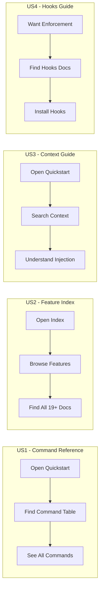

# Feature Specification: Documentation and Tutorial Refresh

**Feature Branch**: `028-docs-tutorial-refresh`
**Created**: 2026-01-15
**Status**: Draft
**Epic**: #268
**Feature**: #269
**Input**: User description: "We need to update the documentation and tutorials to match the current state with the new enhancements. Review all documentation, readmes, tutorials to ensure they reflect the current features including sync-prompts, context injection, git hooks workflow, and unified templates."

## User Scenarios & Testing *(mandatory)*

### User Story 1 - Complete Command Reference (Priority: P1) MVP

As a new user reading the Quick Start guide, I want to see **all available commands** in the documentation so that I can discover and use the full functionality of Do-It without missing important features.

**Why this priority**: Users following the quickstart are the primary onboarding path. Missing commands means users don't discover key functionality, leading to incomplete adoption.

**Independent Test**: Read docs/quickstart.md command reference table and verify all CLI commands (`sync-prompts`, `context`, `hooks`, `verify`) and slash commands are listed.

**Acceptance Scenarios**:

1. **Given** a user opens docs/quickstart.md, **When** they scroll to the command reference table, **Then** they see `sync-prompts`, `context`, `hooks`, and `verify` CLI commands documented
2. **Given** a user opens README.md, **When** they read the commands section, **Then** the command count matches actual available commands (not "11 commands" if more exist)
3. **Given** a user opens docs/installation.md, **When** they check verification steps, **Then** both slash commands AND CLI commands are listed for verification

---

### User Story 2 - Updated Feature Index (Priority: P1) MVP

As a documentation reader, I want the docs/index.md to show **all feature documentation** so that I can browse the complete history of what's been implemented.

**Why this priority**: The feature index is the primary navigation for understanding what Do-It can do. Missing 15+ features (015-027) means significant functionality is undiscoverable.

**Independent Test**: Open docs/index.md and verify the AUTO-GENERATED features section includes all `.md` files from docs/features/ directory.

**Acceptance Scenarios**:

1. **Given** a user opens docs/index.md, **When** they view the Features table, **Then** they see all 19+ feature docs including 023-027
2. **Given** the /doit.documentit command is run, **When** it completes, **Then** index.md includes links to all feature documentation files

---

### User Story 3 - Context Injection Guide (Priority: P1)

As a user of doit slash commands, I want documentation explaining the **context injection feature** so that I understand how project context (constitution, roadmap) is automatically loaded before commands execute.

**Why this priority**: Context injection is a key differentiator that makes AI responses more accurate. Without documentation, users don't understand why Do-It produces better results.

**Independent Test**: Read docs/quickstart.md and find clear explanation of `doit context show` command and automatic context loading in slash commands.

**Acceptance Scenarios**:

1. **Given** a user opens quickstart.md, **When** they search for "context", **Then** they find a dedicated section explaining context injection
2. **Given** a user wants to customize context loading, **When** they read the docs, **Then** they find information about context.yaml configuration
3. **Given** a user runs `doit context show`, **When** they compare to docs, **Then** the output matches documented format

---

### User Story 4 - Git Hooks Workflow Documentation (Priority: P2)

As a team lead enforcing spec-first development, I want documentation on the **git hooks workflow** so that I can set up and configure workflow enforcement for my team.

**Why this priority**: Git hooks are optional but valuable for team enforcement. Less critical than core features but important for enterprise adoption.

**Independent Test**: Find documentation that explains `doit hooks install`, `doit hooks validate`, configuration options, and bypass mechanism.

**Acceptance Scenarios**:

1. **Given** a team lead reads the documentation, **When** they follow the hooks setup guide, **Then** they can install hooks that enforce spec-first workflow
2. **Given** a developer needs emergency bypass, **When** they read the docs, **Then** they find the `--no-verify` bypass mechanism documented
3. **Given** a team wants custom validation rules, **When** they read the docs, **Then** they find hooks.yaml configuration documented

---

### User Story 5 - Tutorial Updates (Priority: P2)

As a new user following tutorials, I want the tutorials to mention **current features** so that I learn the complete modern workflow.

**Why this priority**: Tutorials are secondary to quickstart but important for deeper learning. Outdated tutorials create confusion.

**Independent Test**: Read tutorial 02 (existing project) and verify it mentions context injection and other new features.

**Acceptance Scenarios**:

1. **Given** a user follows tutorial 02, **When** they reach the workflow section, **Then** they see mention of automatic context loading
2. **Given** a user is setting up multi-agent development, **When** they read tutorials, **Then** they find sync-prompts mentioned for Copilot+Claude setups

---

### User Story 6 - CLI vs Slash Command Clarity (Priority: P2)

As a new user, I want clear distinction between **CLI commands** (run in terminal) and **slash commands** (run in AI agent) so that I know where to execute each command.

**Why this priority**: Confusion between command types is a common onboarding friction. Clarity improves user experience.

**Independent Test**: Read documentation and identify clear visual/textual separation between CLI and slash commands.

**Acceptance Scenarios**:

1. **Given** a user reads README.md, **When** they look at commands, **Then** CLI commands (doit ...) are clearly separated from slash commands (/doit.*)
2. **Given** a command reference table exists, **When** a user reads it, **Then** each command has a "Type" column (CLI/Slash)

---

### User Story 7 - Version Accuracy (Priority: P3)

As a user checking compatibility, I want the README to show **accurate version information** so that I can verify my installation matches documentation.

**Why this priority**: Version accuracy is important but low urgency - mainly affects troubleshooting.

**Independent Test**: Compare README.md version badge/text to pyproject.toml version field.

**Acceptance Scenarios**:

1. **Given** a user reads README.md Status section, **When** they check version, **Then** it matches pyproject.toml version
2. **Given** a user wants to see recent changes, **When** they read CHANGELOG.md, **Then** features 023-027 are documented

---

### Edge Cases

- What happens if a user has an older doit installation without new commands?
  - Docs should mention minimum version requirements for features
- How do docs handle features that require specific AI agent (Claude vs Copilot)?
  - Docs should indicate which features are agent-specific

## User Journey Visualization

<!-- BEGIN:AUTO-GENERATED section="user-journey" -->

<!-- END:AUTO-GENERATED -->

## Requirements *(mandatory)*

### Functional Requirements

- **FR-001**: quickstart.md command reference table MUST include `sync-prompts`, `context`, `hooks`, `verify` CLI commands
- **FR-002**: README.md MUST accurately reflect total number of available commands
- **FR-003**: installation.md verification section MUST list all slash commands AND CLI commands
- **FR-004**: docs/index.md MUST include all feature docs from docs/features/ (currently missing 015-027)
- **FR-005**: quickstart.md MUST include section explaining context injection and `doit context show`
- **FR-006**: Documentation MUST explain context.yaml configuration options
- **FR-007**: Documentation MUST include git hooks workflow guide (setup, validation, bypass)
- **FR-008**: Documentation MUST explain hooks.yaml configuration
- **FR-009**: Tutorial 02 MUST mention context injection where relevant to workflow
- **FR-010**: All command documentation MUST clearly indicate if command is CLI or Slash type
- **FR-011**: README.md version MUST match pyproject.toml version
- **FR-012**: CHANGELOG.md MUST document features 023-027

### Files to Update

| File | Changes Needed |
|------|---------------|
| README.md | Update command count, add CLI commands section, verify version |
| docs/quickstart.md | Add context section, update command table, add CLI vs Slash clarity |
| docs/installation.md | Add CLI commands to verification section |
| docs/index.md | Regenerate via /doit.documentit to include all features |
| docs/tutorials/02-existing-project-tutorial.md | Add context injection mentions |
| docs/templates/commands.md | Update with new commands |
| CHANGELOG.md | Document features 023-027 if missing |

### New CLI Commands to Document

| Command | Purpose | Type |
|---------|---------|------|
| `doit sync-prompts` | Sync templates to AI agent directories | CLI |
| `doit context show` | Display loaded project context | CLI |
| `doit hooks install` | Install git hooks for workflow enforcement | CLI |
| `doit hooks validate` | Validate current branch meets requirements | CLI |
| `doit verify` | Verify project structure | CLI |

## Success Criteria *(mandatory)*

### Measurable Outcomes

- **SC-001**: All 5 CLI commands documented in quickstart.md command reference
- **SC-002**: docs/index.md features table shows 19+ feature docs (all from docs/features/)
- **SC-003**: Context injection has dedicated documentation section with examples
- **SC-004**: Git hooks have complete documentation (install, configure, bypass)
- **SC-005**: No broken internal links in documentation (verify with link checker)
- **SC-006**: README.md version matches pyproject.toml within same patch version

### Out of Scope

- Code changes to the CLI or templates (documentation only)
- Creating new tutorials from scratch (only updating existing)
- Translating documentation to other languages
- Video tutorials or interactive content

---

## Revision History

| Date | Version | Author | Changes |
|------|---------|--------|---------|
| 2026-01-15 | 0.1 | Claude Code | Initial specification |
