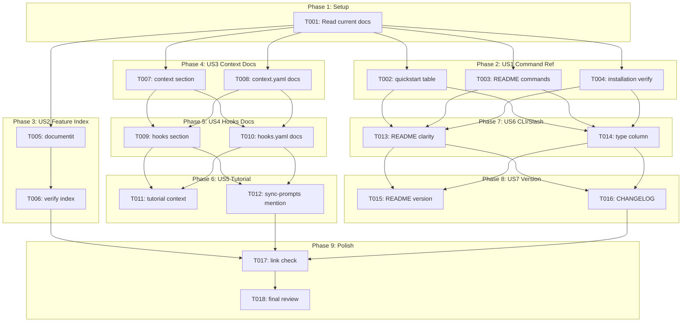
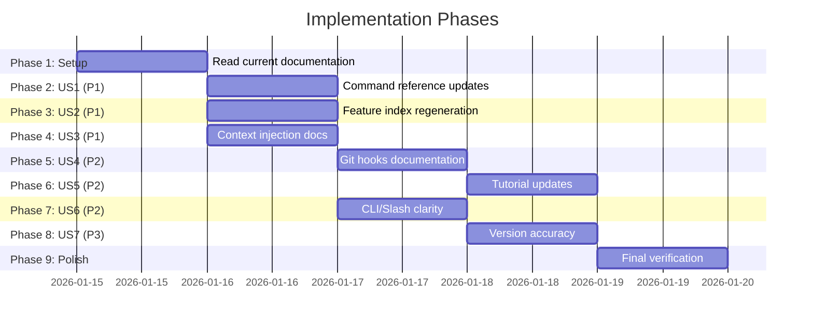

# Tasks: Documentation and Tutorial Refresh

**Input**: Design documents from `/specs/028-docs-tutorial-refresh/`
**Prerequisites**: plan.md (required), spec.md (required for user stories), research.md, quickstart.md

**Tests**: N/A - Documentation-only feature, manual verification only

**Organization**: Tasks are grouped by user story to enable independent implementation and testing of each story.

## Task Dependencies

<!-- BEGIN:AUTO-GENERATED section="task-dependencies" -->

<!-- END:AUTO-GENERATED -->

## Phase Timeline

<!-- BEGIN:AUTO-GENERATED section="phase-timeline" -->

<!-- END:AUTO-GENERATED -->

## Format: `[ID] [P?] [Story] Description`

- **[P]**: Can run in parallel (different files, no dependencies)
- **[Story]**: Which user story this task belongs to (e.g., US1, US2, US3)
- Include exact file paths in descriptions

## Path Conventions

- **Documentation**: `docs/` directory
- **Root docs**: `README.md`, `CHANGELOG.md` at repository root
- **Tutorials**: `docs/tutorials/`

---

## Phase 1: Setup

**Purpose**: Familiarize with current documentation state

- [x] T001 Read and verify current state of docs/quickstart.md, README.md, and docs/installation.md command tables

**Checkpoint**: Ready to begin documentation updates

---

## Phase 2: User Story 1 - Complete Command Reference (Priority: P1) 🎯 MVP

**Goal**: Add all missing CLI commands to documentation command tables

**Independent Test**: Open docs/quickstart.md and verify sync-prompts, context, hooks, verify commands are in table

### Implementation for User Story 1

- [x] T002 [P] [US1] Add `sync-prompts`, `context`, `hooks`, `verify` CLI commands to command table in docs/quickstart.md
- [x] T003 [P] [US1] Update "The 11 Commands" section header and add CLI commands subsection in README.md
- [x] T004 [P] [US1] Add CLI command verification steps (`doit --help`) to docs/installation.md

**Checkpoint**: All CLI commands now documented in command reference tables

---

## Phase 3: User Story 2 - Updated Feature Index (Priority: P1) 🎯 MVP

**Goal**: Regenerate docs/index.md to include all 19+ feature docs

**Independent Test**: Open docs/index.md and count feature entries - should show all features including 015-027

### Implementation for User Story 2

- [x] T005 [US2] Run `/doit.documentit` command to regenerate docs/index.md feature index
- [x] T006 [US2] Verify docs/index.md AUTO-GENERATED section shows all 19+ features from docs/features/

**Checkpoint**: Feature index now shows complete list of implemented features

---

## Phase 4: User Story 3 - Context Injection Guide (Priority: P1)

**Goal**: Add documentation explaining context injection and `doit context show` command

**Independent Test**: Search docs/quickstart.md for "context" and find dedicated section with examples

### Implementation for User Story 3

- [x] T007 [US3] Add "Project Context" section to docs/quickstart.md explaining context injection and `doit context show` usage
- [x] T008 [US3] Document context.yaml configuration options in docs/quickstart.md context section

**Checkpoint**: Users can now learn about context injection from documentation

---

## Phase 5: User Story 4 - Git Hooks Workflow Documentation (Priority: P2)

**Goal**: Add documentation for git hooks workflow enforcement

**Independent Test**: Find section in docs explaining `doit hooks install`, `doit hooks validate`, and bypass mechanism

### Implementation for User Story 4

- [x] T009 [US4] Add "Workflow Enforcement" section to docs/quickstart.md with hooks install/validate documentation
- [x] T010 [US4] Document hooks.yaml configuration and `--no-verify` bypass mechanism in hooks section

**Checkpoint**: Team leads can now set up workflow enforcement following documentation

---

## Phase 6: User Story 5 - Tutorial Updates (Priority: P2)

**Goal**: Update existing tutorials to mention new features

**Independent Test**: Read docs/tutorials/02-existing-project-tutorial.md and find context injection mention

### Implementation for User Story 5

- [x] T011 [P] [US5] Add context injection note to Section 3 of docs/tutorials/02-existing-project-tutorial.md
- [x] T012 [P] [US5] Add sync-prompts mention for multi-agent setups in docs/tutorials/02-existing-project-tutorial.md

**Checkpoint**: Tutorials now reference current features

---

## Phase 7: User Story 6 - CLI vs Slash Command Clarity (Priority: P2)

**Goal**: Clearly distinguish CLI commands from slash commands throughout documentation

**Independent Test**: Command tables have Type column showing CLI or Slash for each command

### Implementation for User Story 6

- [x] T013 [P] [US6] Restructure README.md commands section to clearly separate CLI commands from slash commands
- [x] T014 [P] [US6] Add "Type" column (CLI/Slash) to command reference table in docs/quickstart.md

**Checkpoint**: Users can easily identify which commands run in terminal vs AI agent

---

## Phase 8: User Story 7 - Version Accuracy (Priority: P3)

**Goal**: Ensure README version matches pyproject.toml and changelog is current

**Independent Test**: Compare README.md version to pyproject.toml version field - they should match

### Implementation for User Story 7

- [x] T015 [P] [US7] Update README.md Status section version to match pyproject.toml (currently 0.1.4)
- [x] T016 [P] [US7] Update CHANGELOG.md with entries for features 023-027

**Checkpoint**: Version information is accurate throughout documentation

---

## Phase 9: Polish & Verification

**Purpose**: Final quality checks across all documentation

- [x] T017 Verify all internal links work in updated documentation files
- [x] T018 Run `/doit.reviewit` to validate all documentation changes

---

## Dependencies & Execution Order

### Phase Dependencies

- **Setup (Phase 1)**: No dependencies - read current state
- **US1, US2, US3 (Phases 2-4)**: Depend on Setup - all P1 stories can run in parallel
- **US4 (Phase 5)**: Can start after US3 (context docs provide foundation for hooks docs)
- **US5 (Phase 6)**: Can start after US4 (hooks content informs tutorial updates)
- **US6 (Phase 7)**: Can start after US1 (command table updates provide structure for clarity)
- **US7 (Phase 8)**: Can start after US6 (README restructure before version update)
- **Polish (Phase 9)**: Depends on all user stories being complete

### User Story Dependencies

- **User Story 1 (P1)**: Independent - command reference updates
- **User Story 2 (P1)**: Independent - feature index regeneration
- **User Story 3 (P1)**: Independent - context documentation
- **User Story 4 (P2)**: Best after US3 (context → hooks flow)
- **User Story 5 (P2)**: Best after US4 (hooks → tutorial updates)
- **User Story 6 (P2)**: Best after US1 (command table → clarity improvements)
- **User Story 7 (P3)**: Last (final cleanup)

### Parallel Opportunities

- T002, T003, T004 can all run in parallel (different files)
- T007, T008 can run sequentially in same file
- T011, T012 can run in parallel (same file but different sections)
- T013, T014 can run in parallel (different files)
- T015, T016 can run in parallel (different files)

---

## Parallel Example: P1 User Stories

```bash
# Launch all P1 user stories together after Setup:
Task: "T002 - Add CLI commands to quickstart.md table"
Task: "T005 - Run /doit.documentit to regenerate index"
Task: "T007 - Add context section to quickstart.md"

# These can all proceed simultaneously since they target different sections/files
```

---

## Implementation Strategy

### MVP First (User Stories 1-3)

1. Complete Phase 1: Setup (read current docs)
2. Complete Phases 2-4: US1, US2, US3 (all P1 - can run in parallel)
3. **STOP and VALIDATE**: Verify command tables complete, index regenerated, context documented
4. Commit and push MVP

### Incremental Delivery

1. US1-3 (P1) → Commit → Core documentation complete
2. US4-6 (P2) → Commit → Enhanced documentation complete
3. US7 (P3) → Commit → Version accuracy
4. Polish → Final review → Done

### File Edit Order

For minimal context switching when working sequentially:

1. **docs/quickstart.md**: T002, T007, T008, T009, T010, T014 (most changes)
2. **README.md**: T003, T013, T015
3. **docs/installation.md**: T004
4. **docs/index.md**: T005, T006 (via documentit)
5. **docs/tutorials/02-existing-project-tutorial.md**: T011, T012
6. **CHANGELOG.md**: T016

---

## Notes

- [P] tasks = different files, no dependencies
- [Story] label maps task to specific user story for traceability
- Each user story should be independently completable and testable
- No automated tests - manual verification only
- Commit after completing each user story phase
- Total tasks: 18
- Parallel opportunities: 8 tasks marked [P]
