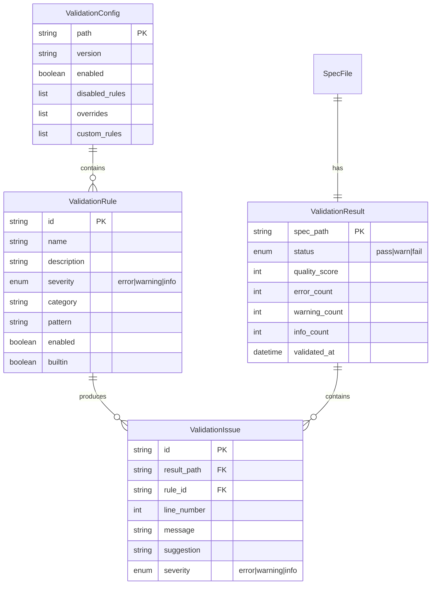
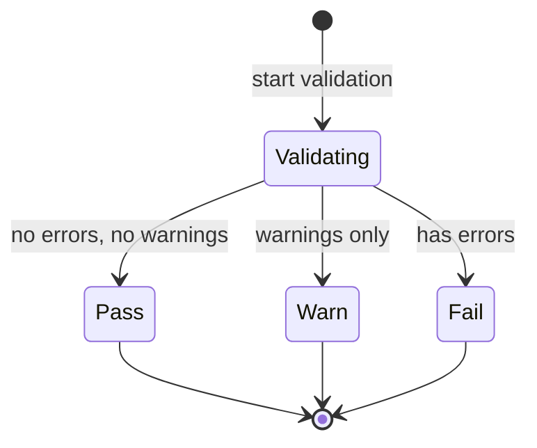

# Data Model: Spec Validation and Linting

**Feature**: 029-spec-validation-linting
**Date**: 2026-01-15

## Entity Relationship Diagram

<!-- BEGIN:AUTO-GENERATED section="er-diagram" -->

<!-- END:AUTO-GENERATED -->

## Entity Definitions

### ValidationConfig

Represents project-level validation configuration loaded from `.doit/validation-rules.yaml`.

| Field | Type | Description |
|-------|------|-------------|
| path | string | Path to configuration file |
| version | string | Schema version (e.g., "1.0") |
| enabled | boolean | Whether validation is enabled |
| disabled_rules | list[string] | Rule IDs to skip |
| overrides | list[RuleOverride] | Severity overrides for built-in rules |
| custom_rules | list[CustomRule] | User-defined validation rules |

**Validation Rules**:
- `version` must match supported schema versions
- `disabled_rules` must reference valid rule IDs
- `overrides` can only modify existing built-in rules

### ValidationRule

Represents a single validation check that can be applied to spec files.

| Field | Type | Description |
|-------|------|-------------|
| id | string | Unique identifier (e.g., "missing-requirements") |
| name | string | Human-readable name |
| description | string | What this rule checks |
| severity | enum | error, warning, or info |
| category | string | Group (structure, requirements, acceptance, clarity, naming) |
| pattern | string | Regex pattern for matching (if applicable) |
| enabled | boolean | Whether rule is active |
| builtin | boolean | True for default rules, false for custom |

**Validation Rules**:
- `id` must be unique across all rules (builtin + custom)
- `severity` determines exit code impact (only errors cause non-zero)
- `pattern` must be valid regex if provided

### ValidationResult

Aggregate result of validating a single spec file.

| Field | Type | Description |
|-------|------|-------------|
| spec_path | string | Path to validated spec file |
| status | enum | pass (no errors), warn (warnings only), fail (has errors) |
| quality_score | int | 0-100 score based on weighted issues |
| error_count | int | Number of error-severity issues |
| warning_count | int | Number of warning-severity issues |
| info_count | int | Number of info-severity issues |
| validated_at | datetime | Timestamp of validation |

**Validation Rules**:
- `quality_score` is deterministic (same input = same output)
- `status` is derived: fail if error_count > 0, warn if warning_count > 0, else pass

<!-- BEGIN:AUTO-GENERATED section="state-machine-status" -->

<!-- END:AUTO-GENERATED -->

### ValidationIssue

Individual problem found during validation.

| Field | Type | Description |
|-------|------|-------------|
| id | string | Unique identifier for this issue instance |
| result_path | string | FK to parent ValidationResult |
| rule_id | string | FK to ValidationRule that triggered |
| line_number | int | Line in spec where issue found (0 if N/A) |
| message | string | Human-readable description of problem |
| suggestion | string | How to fix the issue (optional) |
| severity | enum | Copied from triggering rule |

**Validation Rules**:
- `line_number` is 1-indexed, 0 means "whole file" issue
- `suggestion` should be actionable when provided

## Supporting Types

### RuleOverride

Used in ValidationConfig to modify built-in rule behavior.

```python
@dataclass
class RuleOverride:
    rule: str          # Rule ID to override
    severity: str      # New severity level
```

### CustomRule

User-defined rule in ValidationConfig.

```python
@dataclass
class CustomRule:
    name: str          # Unique name (becomes ID)
    description: str   # What this checks
    pattern: str       # Regex to match (required or absent sections)
    severity: str      # error, warning, or info
    category: str      # Logical grouping
    check: str = "present"  # "present" (must match) or "absent" (must not match) or "count"
    max: int = None    # For check="count", maximum occurrences
```

## File Locations

| Entity | Storage | Format |
|--------|---------|--------|
| ValidationConfig | `.doit/validation-rules.yaml` | YAML |
| ValidationRule (builtin) | `src/doit_cli/rules/builtin_rules.py` | Python |
| ValidationResult | In-memory (not persisted) | Python object |
| ValidationIssue | In-memory (not persisted) | Python object |

## Notes

- Results are not persisted to disk; they're generated on-demand
- Configuration file is optional; defaults used if missing
- Custom rules extend but cannot replace builtin rules (use `disabled` for that)
