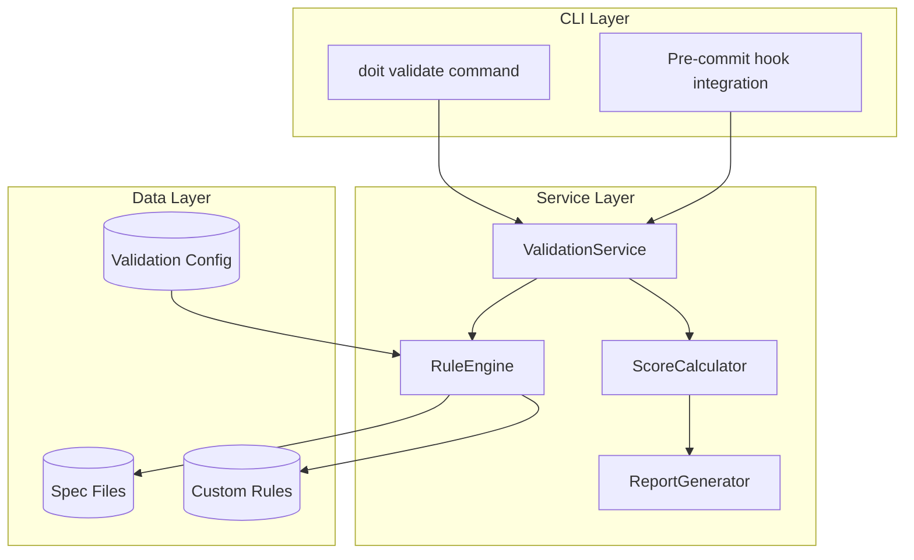

# Implementation Plan: Spec Validation and Linting

**Branch**: `029-spec-validation-linting` | **Date**: 2026-01-15 | **Spec**: [spec.md](./spec.md)
**Input**: Feature specification from `/specs/029-spec-validation-linting/spec.md`

## Summary

Implement a spec validation and linting system that catches specification errors before implementation and enforces quality standards. The system provides a `doit validate` CLI command that checks spec files against required sections, naming conventions, and custom rules, outputting quality scores and detailed issue reports.

## Technical Context

**Language/Version**: Python 3.11+ (per constitution)
**Primary Dependencies**: Typer (CLI), Rich (output formatting), PyYAML (custom rules configuration)
**Storage**: File-based (markdown specs in `specs/` directory)
**Testing**: pytest (per constitution)
**Target Platform**: CLI - all platforms via Python (PyPI distribution)
**Project Type**: single - extends existing doit CLI
**Performance Goals**: <500ms for single spec validation, <10s for batch validation of 50 specs
**Constraints**: Pre-commit hook adds <1s overhead, deterministic quality scores
**Scale/Scope**: Validate any project with doit specs, typically 10-50 spec files

## Architecture Overview

<!-- BEGIN:AUTO-GENERATED section="architecture" -->

<!-- END:AUTO-GENERATED -->

## Constitution Check

*GATE: Must pass before Phase 0 research. Re-check after Phase 1 design.*

| Principle | Compliance | Notes |
|-----------|------------|-------|
| I. Specification-First | PASS | This feature has a complete spec before implementation |
| II. Persistent Memory | PASS | Validation config stored in `.doit/validation-rules.yaml` |
| III. Auto-Generated Diagrams | N/A | This feature validates specs, doesn't generate diagrams |
| IV. Opinionated Workflow | PASS | Enforces spec quality as part of workflow |
| V. AI-Native Design | PASS | CLI command works with AI assistants |
| Tech Stack Alignment | PASS | Uses Python 3.11+, Typer, Rich, pytest per constitution |
| Quality Standards | PASS | Will include comprehensive test suite |

**Gate Status**: PASS - No violations requiring justification

## Project Structure

### Documentation (this feature)

```text
specs/029-spec-validation-linting/
├── plan.md              # This file
├── research.md          # Phase 0 output
├── data-model.md        # Phase 1 output
├── quickstart.md        # Phase 1 output
├── contracts/           # Phase 1 output (internal API contracts)
└── tasks.md             # Phase 2 output (/doit.taskit)
```

### Source Code (repository root)

```text
src/doit_cli/
├── models/
│   └── validation_models.py    # ValidationRule, ValidationResult, ValidationIssue
├── services/
│   ├── validation_service.py   # Core validation orchestration
│   ├── rule_engine.py          # Rule matching and evaluation
│   ├── score_calculator.py     # Quality score calculation
│   └── report_generator.py     # Human/JSON output formatting
├── cli/
│   └── validate_command.py     # doit validate CLI command
└── rules/
    └── builtin_rules.py        # Default validation rules

tests/
├── unit/
│   ├── test_validation_models.py
│   ├── test_rule_engine.py
│   └── test_score_calculator.py
├── integration/
│   └── test_validate_command.py
└── fixtures/
    └── sample_specs/           # Valid and invalid spec fixtures
```

**Structure Decision**: Single project extending existing `doit_cli` package. New `rules/` directory for rule definitions. Models follow existing pattern in `models/`. Services follow existing pattern in `services/`.
