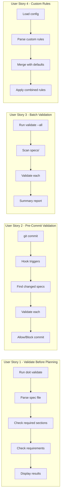
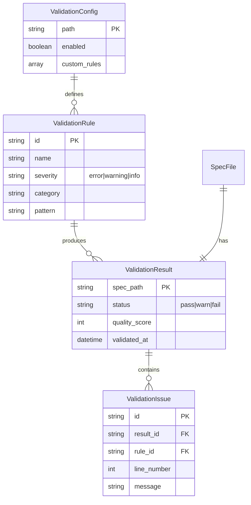

# Feature Specification: Spec Validation and Linting

**Feature Branch**: `029-spec-validation-linting`
**Created**: 2026-01-15
**Status**: Complete
**Input**: User description: "Spec validation and linting - Rationale: Catches specification errors before implementation, enforces quality standards"

## User Scenarios & Testing *(mandatory)*

### User Story 1 - Validate Before Planning (Priority: P1)

As a developer, I want to validate my specification before running `/doit.planit` so that I catch structural issues and missing requirements early, before investing time in implementation planning.

**Why this priority**: This is the core value proposition - catching errors early prevents wasted effort. A developer who catches a missing user story before planning saves hours of rework.

**Independent Test**: Can be fully tested by running `doit validate specs/029-spec-validation-linting/spec.md` and delivers immediate feedback on spec quality.

**Acceptance Scenarios**:

1. **Given** a spec file with missing required sections, **When** I run `doit validate <spec-path>`, **Then** I see errors listing each missing section
2. **Given** a spec file with ambiguous requirements (marked [NEEDS CLARIFICATION]), **When** I run `doit validate <spec-path>`, **Then** I see warnings for each unresolved ambiguity
3. **Given** a valid spec file with all sections complete, **When** I run `doit validate <spec-path>`, **Then** I see a success message with quality score

---

### User Story 2 - Pre-Commit Validation (Priority: P2)

As a team lead, I want specification validation to run automatically on pre-commit so that incomplete or malformed specs never enter the repository.

**Why this priority**: Automation prevents human oversight. Once validation works manually (P1), integrating with git hooks multiplies the value across the entire team.

**Independent Test**: Can be tested by attempting to commit a spec file with validation errors and verifying the commit is blocked.

**Acceptance Scenarios**:

1. **Given** a pre-commit hook is configured, **When** I commit a spec file with errors, **Then** the commit is blocked with validation output
2. **Given** a pre-commit hook is configured, **When** I commit a valid spec file, **Then** the commit proceeds normally
3. **Given** a pre-commit hook is configured, **When** I commit non-spec files, **Then** validation is skipped and commit proceeds

---

### User Story 3 - Batch Validation (Priority: P2)

As a project maintainer, I want to validate all specifications in my project at once so that I can assess overall documentation quality and find specs needing attention.

**Why this priority**: Same priority as P2 (pre-commit) since both extend the core validation capability. Batch validation enables project-wide quality dashboards.

**Independent Test**: Can be tested by running `doit validate --all` and receiving a summary report across all specs.

**Acceptance Scenarios**:

1. **Given** multiple spec files in specs/ directory, **When** I run `doit validate --all`, **Then** I see a summary table with pass/warn/fail counts per spec
2. **Given** specs with varying quality levels, **When** I run `doit validate --all --format=json`, **Then** I receive machine-readable output for CI integration
3. **Given** no spec files exist, **When** I run `doit validate --all`, **Then** I see a message indicating no specs found

---

### User Story 4 - Custom Validation Rules (Priority: P3)

As an organization, I want to define custom validation rules for our specifications so that we can enforce organization-specific standards beyond the default rules.

**Why this priority**: Custom rules are an advanced feature. The default validation (P1) provides 80% of the value; custom rules serve power users and enterprise teams.

**Independent Test**: Can be tested by creating a `.doit/validation-rules.yaml` with a custom rule and verifying it's applied during validation.

**Acceptance Scenarios**:

1. **Given** a custom rule requiring "Security Considerations" section, **When** I validate a spec without that section, **Then** I see a custom rule violation
2. **Given** custom rules with different severity levels, **When** I validate, **Then** errors block while warnings only inform
3. **Given** no custom rules file, **When** I validate, **Then** only built-in rules are applied

---

### Edge Cases

- What happens when a spec file contains invalid Markdown syntax?
  - System should report Markdown parsing errors separately from content validation
- How does validation handle specs in draft vs. approved status?
  - Draft specs may have [NEEDS CLARIFICATION] markers; approved specs should not
- What happens when spec file is empty or contains only comments?
  - System should report as critical error with helpful guidance
- How does validation handle referenced files that don't exist?
  - System should warn about broken internal references

## User Journey Visualization

<!-- BEGIN:AUTO-GENERATED section="user-journey" -->

<!-- END:AUTO-GENERATED -->

## Entity Relationships *(include if Key Entities defined)*

<!-- BEGIN:AUTO-GENERATED section="entity-relationships" -->

<!-- END:AUTO-GENERATED -->

## Requirements *(mandatory)*

### Functional Requirements

#### Core Validation

- **FR-001**: System MUST validate spec files against required sections (User Scenarios, Requirements, Success Criteria)
- **FR-002**: System MUST check for unresolved ambiguities marked with [NEEDS CLARIFICATION]
- **FR-003**: System MUST verify all user stories have acceptance scenarios
- **FR-004**: System MUST verify all functional requirements follow FR-XXX naming convention
- **FR-005**: System MUST verify all success criteria follow SC-XXX naming convention

#### Validation Reporting

- **FR-006**: System MUST output validation results in human-readable format by default
- **FR-007**: System MUST support `--format=json` for machine-readable output
- **FR-008**: System MUST calculate and display a quality score (0-100) for each spec
- **FR-009**: System MUST categorize issues by severity (error, warning, info)
- **FR-010**: System MUST include line numbers in issue reports

#### Integration

- **FR-011**: System MUST provide a `doit validate <path>` CLI command
- **FR-012**: System MUST support validating single files or directories
- **FR-013**: System MUST support `--all` flag to validate all specs in specs/ directory
- **FR-014**: System MUST integrate with existing pre-commit hook infrastructure
- **FR-015**: System MUST exit with non-zero code when errors are found

#### Configuration

- **FR-016**: System MUST load validation configuration from `.doit/validation-rules.yaml` if present
- **FR-017**: System MUST allow custom rules with configurable severity levels
- **FR-018**: System MUST allow disabling specific built-in rules
- **FR-019**: System MUST support rule categories for organizing validation logic

#### Built-in Rules

- **FR-020**: System MUST check for missing User Scenarios section (error)
- **FR-021**: System MUST check for missing Requirements section (error)
- **FR-022**: System MUST check for missing Success Criteria section (error)
- **FR-023**: System MUST check for user stories without acceptance scenarios (warning)
- **FR-024**: System MUST check for TODO/FIXME markers in approved specs (warning)

### Key Entities

- **ValidationRule**: Defines a single validation check with name, pattern, severity, and category
- **ValidationResult**: Aggregate result for a single spec file including quality score and all issues
- **ValidationIssue**: Individual problem found during validation with location and suggested fix
- **ValidationConfig**: Project-level configuration for custom rules and rule overrides

## Success Criteria *(mandatory)*

### Measurable Outcomes

- **SC-001**: Validation of a single spec file completes in under 500ms
- **SC-002**: All built-in rules documented with examples in CLI help
- **SC-003**: Batch validation of 50 specs completes in under 10 seconds
- **SC-004**: 100% of specs in doit repository pass validation after implementation
- **SC-005**: Pre-commit hook adds less than 1 second to commit time for spec files
- **SC-006**: Quality score calculation is deterministic (same spec = same score)
