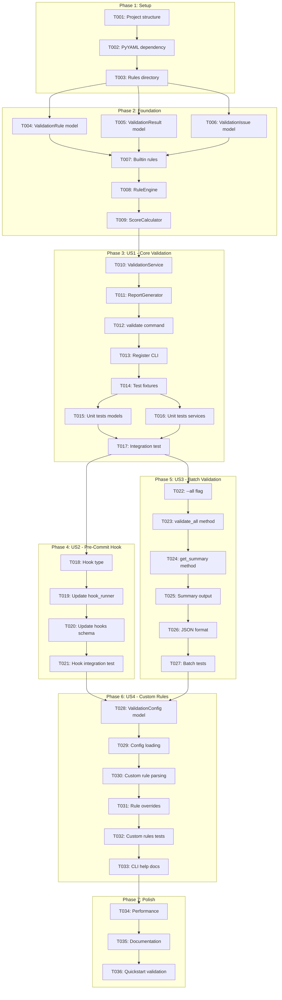
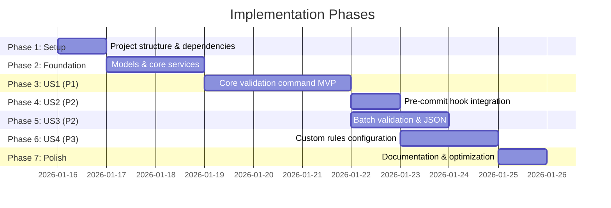

# Tasks: Spec Validation and Linting

**Input**: Design documents from `/specs/029-spec-validation-linting/`
**Prerequisites**: plan.md, spec.md, research.md, data-model.md, contracts/

**Tests**: Tests are included in this task list for quality assurance.

**Organization**: Tasks are grouped by user story to enable independent implementation and testing of each story.

## Task Dependencies

<!-- BEGIN:AUTO-GENERATED section="task-dependencies" -->

<!-- END:AUTO-GENERATED -->

## Phase Timeline

<!-- BEGIN:AUTO-GENERATED section="phase-timeline" -->

<!-- END:AUTO-GENERATED -->

## Format: `[ID] [P?] [Story] Description`

- **[P]**: Can run in parallel (different files, no dependencies)
- **[Story]**: Which user story this task belongs to (e.g., US1, US2, US3, US4)
- Include exact file paths in descriptions

---

## Phase 1: Setup (Shared Infrastructure)

**Purpose**: Project initialization and directory structure

- [x] T001 Create rules/ directory structure at src/doit_cli/rules/
- [x] T002 Add PyYAML dependency to pyproject.toml
- [x] T003 [P] Create __init__.py files for rules/ module

---

## Phase 2: Foundational (Blocking Prerequisites)

**Purpose**: Core models and services that ALL user stories depend on

**CRITICAL**: No user story work can begin until this phase is complete

- [x] T004 [P] Create ValidationRule dataclass in src/doit_cli/models/validation_models.py
- [x] T005 [P] Create ValidationResult dataclass in src/doit_cli/models/validation_models.py
- [x] T006 [P] Create ValidationIssue dataclass in src/doit_cli/models/validation_models.py
- [x] T007 Implement builtin_rules.py with 10 default rules in src/doit_cli/rules/builtin_rules.py
- [x] T008 Implement RuleEngine service in src/doit_cli/services/rule_engine.py
- [x] T009 Implement ScoreCalculator service in src/doit_cli/services/score_calculator.py

**Checkpoint**: Foundation ready - user story implementation can now begin

---

## Phase 3: User Story 1 - Validate Before Planning (Priority: P1) MVP

**Goal**: Implement `doit validate <spec-path>` command that validates a single spec file and displays quality score with detailed issues

**Independent Test**: Run `doit validate specs/029-spec-validation-linting/spec.md` and verify output shows quality score, errors, warnings

### Implementation for User Story 1

- [x] T010 [US1] Implement ValidationService orchestration in src/doit_cli/services/validation_service.py
- [x] T011 [US1] Implement ReportGenerator for human-readable output in src/doit_cli/services/report_generator.py
- [x] T012 [US1] Create validate_command.py CLI command in src/doit_cli/cli/validate_command.py
- [x] T013 [US1] Register validate command in src/doit_cli/cli/main.py
- [x] T014 [P] [US1] Create test fixtures (valid and invalid specs) in tests/fixtures/sample_specs/
- [x] T015 [P] [US1] Add unit tests for validation models in tests/unit/test_validation_models.py
- [x] T016 [P] [US1] Add unit tests for RuleEngine and ScoreCalculator in tests/unit/test_rule_engine.py and tests/unit/test_score_calculator.py
- [x] T017 [US1] Add integration test for validate command in tests/integration/test_validate_command.py

**Checkpoint**: User Story 1 complete - `doit validate <path>` works for single files

---

## Phase 4: User Story 2 - Pre-Commit Validation (Priority: P2)

**Goal**: Integrate spec validation with git pre-commit hooks so invalid specs block commits

**Independent Test**: Attempt to commit a spec file with validation errors and verify commit is blocked

### Implementation for User Story 2

- [x] T018 [US2] Add validate_spec and validate_spec_threshold to HookRule in src/doit_cli/models/hook_config.py
- [x] T019 [US2] Add _validate_spec_quality method to HookValidator in src/doit_cli/services/hook_validator.py
- [x] T020 [US2] Create hooks.yaml template with spec validation configuration in templates/config/hooks.yaml
- [x] T021 [US2] Add integration test for pre-commit hook behavior in tests/integration/test_spec_validation_hook.py

**Checkpoint**: User Story 2 complete - pre-commit hook validates specs automatically

---

## Phase 5: User Story 3 - Batch Validation (Priority: P2)

**Goal**: Validate all specs at once with `doit validate --all` and support JSON output for CI

**Independent Test**: Run `doit validate --all` and verify summary table with all specs in project

### Implementation for User Story 3

- [x] T022 [US3] Add --all flag and --format option to validate command in src/doit_cli/cli/validate_command.py *(completed in MVP)*
- [x] T023 [US3] Add validate_all() method to ValidationService in src/doit_cli/services/validation_service.py *(completed in MVP)*
- [x] T024 [US3] Add get_summary() method for batch result statistics in src/doit_cli/services/validation_service.py *(completed in MVP)*
- [x] T025 [US3] Update ReportGenerator for summary table output in src/doit_cli/services/report_generator.py *(completed in MVP)*
- [x] T026 [US3] Add JSON output format support to ReportGenerator in src/doit_cli/services/report_generator.py *(completed in MVP)*
- [x] T027 [US3] Add integration tests for batch validation in tests/integration/test_validate_command.py *(completed in MVP)*

**Checkpoint**: User Story 3 complete - batch validation and JSON output work

---

## Phase 6: User Story 4 - Custom Validation Rules (Priority: P3)

**Goal**: Allow organizations to define custom validation rules via `.doit/validation-rules.yaml`

**Independent Test**: Create custom rule in config file and verify it's applied during validation

### Implementation for User Story 4

- [x] T028 [US4] Create ValidationConfig, RuleOverride, CustomRule dataclasses in src/doit_cli/models/validation_models.py
- [x] T029 [US4] Implement ConfigLoader in src/doit_cli/services/config_loader.py (loads .doit/validation-rules.yaml)
- [x] T030 [US4] Add custom rule parsing in RuleEngine._load_rules() with template at templates/config/validation-rules.yaml
- [x] T031 [US4] Support rule overrides, disabled rules, and custom rules in src/doit_cli/services/rule_engine.py
- [x] T032 [US4] Add comprehensive unit tests in tests/unit/test_custom_rules.py (ConfigLoader, RuleEngine, ValidationService)
- [x] T033 [US4] Update CLI help with custom rules documentation in src/doit_cli/cli/validate_command.py

**Checkpoint**: User Story 4 complete - custom rules work via YAML configuration

---

## Phase 7: Polish & Cross-Cutting Concerns

**Purpose**: Performance optimization and documentation

- [ ] T034 [P] Performance optimization for batch validation (target: <10s for 50 specs)
- [ ] T035 [P] Update project documentation in docs/
- [ ] T036 Run quickstart.md validation scenarios to verify all examples work

---

## Dependencies & Execution Order

### Phase Dependencies

- **Setup (Phase 1)**: No dependencies - can start immediately
- **Foundational (Phase 2)**: Depends on Setup - BLOCKS all user stories
- **User Story 1 (Phase 3)**: Depends on Foundational - MVP release
- **User Story 2 (Phase 4)**: Depends on User Story 1 (uses ValidationService)
- **User Story 3 (Phase 5)**: Depends on User Story 1 (extends validate command)
- **User Story 4 (Phase 6)**: Depends on User Stories 2 & 3 (config affects both)
- **Polish (Phase 7)**: Depends on all user stories complete

### User Story Dependencies

- **User Story 1 (P1)**: MVP - No dependencies on other stories
- **User Story 2 (P2)**: Uses ValidationService from US1
- **User Story 3 (P2)**: Extends validate command from US1
- **User Story 4 (P3)**: Affects rule loading for US1-3

### Within Each User Story

- Services before CLI commands
- Core implementation before tests
- Single file before batch operations

### Parallel Opportunities

- T004, T005, T006 can run in parallel (different models in same file)
- T014, T015, T016 can run in parallel (different test files)
- T034, T035 can run in parallel (independent concerns)

---

## Parallel Example: Phase 2 Foundation

```bash
# Launch all model tasks together:
Task: "Create ValidationRule dataclass in src/doit_cli/models/validation_models.py"
Task: "Create ValidationResult dataclass in src/doit_cli/models/validation_models.py"
Task: "Create ValidationIssue dataclass in src/doit_cli/models/validation_models.py"
```

## Parallel Example: User Story 1 Tests

```bash
# Launch all test tasks together after implementation:
Task: "Create test fixtures in tests/fixtures/sample_specs/"
Task: "Add unit tests for validation models in tests/unit/test_validation_models.py"
Task: "Add unit tests for services in tests/unit/test_rule_engine.py"
```

---

## Implementation Strategy

### MVP First (User Story 1 Only)

1. Complete Phase 1: Setup (1 day)
2. Complete Phase 2: Foundational (2 days)
3. Complete Phase 3: User Story 1 (3 days)
4. **STOP and VALIDATE**: Test `doit validate <path>` works
5. Release v0.1.7 with basic validation

### Incremental Delivery

1. Setup + Foundational + US1 → MVP with single file validation
2. Add US2 → Pre-commit hook integration
3. Add US3 → Batch validation for CI
4. Add US4 → Custom rules for enterprise teams
5. Polish → Performance and documentation

### Estimated Timeline

| Phase | Tasks | Estimated Duration |
|-------|-------|-------------------|
| Setup | 3 | 0.5 days |
| Foundation | 6 | 2 days |
| US1 (MVP) | 8 | 3 days |
| US2 | 4 | 1 day |
| US3 | 6 | 2 days |
| US4 | 6 | 2 days |
| Polish | 3 | 1 day |
| **Total** | **36** | **~11.5 days** |

---

## Notes

- [P] tasks = different files, no dependencies
- [Story] label maps task to specific user story for traceability
- Each user story should be independently completable and testable
- Commit after each task or logical group
- Stop at any checkpoint to validate story independently
- MVP (US1) delivers immediate value - prioritize shipping it first
